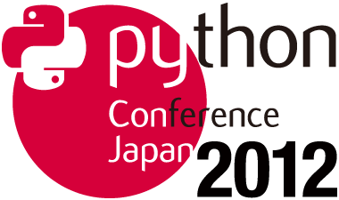

:date: 2014-6-17 14:30
:categories: ['Python', 'PyCon']
:body type: text/x-rst

============================================================
2014/6/17 自分が PyCon JP 2012 に提出した演題の内容
============================================================

*Category: 'Python', 'PyCon'*

.. figure:: pycon2014-logo.png
   :target: https://pycon.jp/2014/

   PyCon JP 2014 の演題募集を行っています！ふるってご応募ください！
   https://pycon.jp/2014/speaking/cfp/

ところで、去年まで自分がどんな演題を応募していたか、採用になったもの以外はあまり覚えてないので、出した内容をblogにメモっておきます。自分でも忘れてしまうので。とりあえず2012年のやつ。

BIO

* 氏名: Takayuki Shimizukawa
* サイト: http://清水川.jp/
* 略歴: BeProud所属。Sphinx-users.jp 副会長。訳書・著書「エキスパートPythonプログラミング」「Pythonプロフェッショナルプログラミング」。 運営・参加イベント「Python mini Hack-a-thon」「Sphinx+翻訳 Hack-a-thon」「エキスパートPythonプログラミング読書会2nd」

Python入門者のコードをリファクタリングしてみた
==============================================

**採用**

* タイトル: `Python入門者のコードをリファクタリングしてみた`__
* ビデオ: http://www.youtube.com/watch?v=DCOvwsBzuVc
* スライド: http://shimizukawa.bitbucket.org/refactoring-python-beginners-code/index.html
* 講演内容: C/C++やJavaの経験者がPythonコードを書くと、なにかPythonっぽくないコードができあがります。そのコード、Pythonっぽく書き換えませんか？
* 概要: Java(仮)のコードをPythonに移植して、段階的にPythonらしいコードに書き換えていきます。
  Pythonicな書き方でコードがどのように変わっていくのか、なぜそのように変更するのかを紹介しながら、コードをリファクタリングする課程を追っていきましょう。

  このセッションでは以下の要素について触れて行きます。

  * Zen of Python
  * if __name__ == '__main__':
  * docstring
  * doctest
  * def suite()

* 講演テーマ:

  * Pythonプログラム入門
  * パッケージング / Packaging Issues
  * ツール / Programming Tools

* 講演時間: 短め / Short(25 min)
* 対象者: 初心者 / beginning programmer
* 言語: 日本語 / Japanese

.. __: http://2012.pycon.jp/program/sessions.html#session-15-1455-room433-ja

今を生きるためのPythonパッケージ入門
=======================================

**不採用**

* タイトル: 今を生きるためのPythonパッケージ入門
* 講演内容: Pythonにはパッケージ作成のための方法が用意されていますが、組み合わせが多く、似たような用語がたくさん出てきます。distutils, setuptools, distribute, pip, buildout, virtualenv, … これらを整理して紹介します。
* 概要: 以下のツール類について紹介します。

  **今**

  :distutils: Python3.2までの標準
  :setuptools: 業界標準
  :distribute: setuptools上位互換
  :pip: setuptools/distributeを活用して使いやすいコマンドライン
  :buildout: setuptools/distributeを活用した環境構築ツール
  :virtualenv: Pythonのユーザーランド仮想環境作成ツール

  **未来の予定**

  :packaging: Python-3.3からの標準
  :Distutils2: packagingと同じものでPython2.4-3.2で使えるようにしたもの
  :pip?: packaging上で動くようになる？
  :pythonv: virtualenvをPython-3.3から標準でできるようにしたもの(別物)

  また、setup.pyで何が出来るのかを紹介します。

  * パッケージ作成
  * PyPIへのアップロード
  * packages.python.org へのドキュメントアップロード
  * テスト実行

* 講演テーマ:

  * ライブラリや拡張 / Python libraries and extensions
  * パッケージング / Packaging Issues
  * ツール / Programming Tools

* 講演時間: ふつう / Standard(45 min)
* 対象者: 初心者 / beginning programmer
* 言語: 日本語 / Japanese

.. warning:: 上記は2012年時点での内容です。packaging, Distutils2は消滅しました。

SphinxCon JP 2012
==================

PyCon JP 2012 と併設開催された、SphinxCon JP 2012 というイベントでも1つ発表を行いました。

**採用**

* タイトル: `Sphinxを使って本を書こう`__ 
* 講演内容: 私の過去2冊の翻訳・執筆した本の経験から、Sphinxを活用して執筆環境を自動化したときの手順とそのメリットなどを紹介します。
* 発表資料: http://www.slideshare.net/shimizukawa/sphinx-pyconjp-2012
* ビデオ:   http://www.youtube.com/watch?v=7VOJpFHnPWg&feature=plcp

.. __: http://sphinx-users.jp/event/20120916_sphinxconjp/#id5

