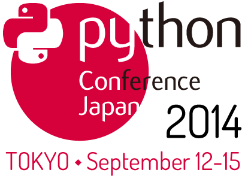
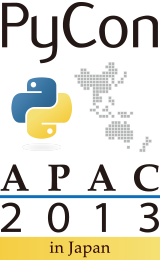

:date: 2014-6-17 14:30
:categories: ['Python', 'PyCon']
:body type: text/x-rst

============================================================
2014/6/19 自分が PyCon JP 2013 に提出した演題の内容
============================================================

*Category: 'Python', 'PyCon'*

   PyCon JP 2014 の演題募集は6月20日(金)までです！ふるってご応募ください！
   https://pycon.jp/2014/speaking/cfp/

前回の :doc:`../pyconjp2012-proposals/index` に引き続き、PyCon APAC 2013 in Japan に応募した演題の内容をblogにメモります。

BIO

* 氏名: Takayuki Shimizukawa
* サイト: http://清水川.jp/
* 所属: 株式会社BePROUD
* 略歴:

  About Me:

  * http://about.me/shimizukawa

  Books

  * Expert Python Programming (translate into Japanese), 2010.
  * Python Professional Programming (chapter 4, 7), 2012.

  Activity

  * Sphinx-users.jp principal
  * Sphinx co-committer
  * Pillow "the successor of PIL" win32/64 egg maintainer
  * PyCon JP 2012 vice-chairman
  * Python mini hack-a-thon steering member

Python2.5から3.3で動作するツールの作り方
========================================

**採用**

* タイトル: `Python2.5から3.3で動作するツールの作り方`__
* ビデオ: http://www.youtube.com/watch?v=U1CSxd-kklY
* スライド: http://shimizukawa.bitbucket.org/pyconapac2013-how-to-make-with-python2-to-3/index.html
* 講演内容:
  sphinx-intlを題材に、Python2.5からPython3.3までの環境で動作するプログラムの書き方について紹介します。

  sphinx-intlはSphinxの国際化機能を楽に使えるようにするためのサポートツールです。SphinxがPython2.5から3.3まで対応しているため、同じバージョン対応が必要でしたが、2to3でコード変換する方法ではテストなど手間がかかるので、sphinx-intlではPython2でも3でも同じソースコードで変換なしに動作するように実装しました。そのためにsixを利用しましたが、sixでもサポートしていない一部の非互換コードについては自分で互換性を保つように工夫しています。

* 概要:

  * sphinx-intlの紹介 5分

    sphinx-intlがどんなツールなのか紹介します。小さなツールですが、Python2,3両対応するにはそれなりに手間がかかりました。

  * Python2とPython3の違い 15分

    ライブラリや関数の違いを吸収するのは簡単ですが、文法の違いを吸収するのは手間がかかります。どこが違って、どうやって吸収するのかについて紹介します。

  * Python2,3両対応にする手法あれこれ 20分

    2to3を使ってコード変換する方法と、sixを使って共通コードで動作させる方法があります。一長一短ありますが、どのようなときにどちらを使うべきかなど紹介します。

  * パッケージングにおける課題 10分

    2013/7/1現在、Pythonのパッケージングは混乱しています。とりあえず今どうすると安定したパッケージ供給が出来るのか紹介します。

* 講演テーマ:

  * Core Python
  * Python 3k
  * Python libraries and extensions / ライブラリや拡張
  * Packaging Issues / パッケージング
  * Programming Tools / ツール

* 講演時間: Standard / ふつう (50 min)
* 対象者:

  * Intermediate programmer / 中級者
  * Advanced programmer / 上級者

* 言語: 日本語 / Japanese

.. __: http://apac-2013.pycon.jp/zh/program/sessions.html#session-15-1300-rooma0715-ja1-en

Introduction to documentation translation with Sphinx
======================================================

**不採用**

* タイトル: Introduction to documentation translation with Sphinx
* 講演内容:

  Sphinxを用いて翻訳ドキュメントを作成するためのドキュメントの書き方と、既存のSphinxドキュメントなどを用いて多言語翻訳するための環境構築や手順について紹介します。

  Sphinxには国際化機能があります。この国際化機能を使うと、ドキュメントをpoファイル化してgettextを使った多言語化対応が出来ます。しかし、標準の方法では多くのコマンドを実行する必要があり、poファイルの管理に非常に手間がかかります。従来の手順を紹介した後、sphinx-intlを使った簡単な手順について紹介します。

* 概要:

  * Sphinxの紹介 5分
  * Sphinxの国際化機能の概要 10分
  * Sphinxドキュメントの翻訳手法あれこれ 15分

    従来のドキュメントをコメントアウトして翻訳文を書き込んでいく方法、gettextでpoファイルとして翻訳する方法、poファイルを翻訳管理サービス上で翻訳する方法について紹介し、それぞれのメリット、デメリットについて紹介します。

  * Sphinx-1.2とsphinx-intl、transifex、drone.ioを併用した最強翻訳手順 20分

    sphinx-users.jpで使用している手法について紹介します。この方法は、ドキュメントの更新があれば自動的にpoファイルを更新してくれるし、翻訳文を更新すれば自動的にサイトを更新してくれる全自動の手法です。この手法の中核にあるのがsphinx-intlです。

* 講演テーマ:

  * Python libraries and extensions / ライブラリや拡張
  * Documentation / ドキュメント
  * Internationalization / 国際化

* 講演時間: ふつう / Standard(45 min)
* 対象者: 初心者 / beginning programmer
* 言語: 日本語 / Japanese

Introduction to Sphinx documentation generator
===============================================

**不採用**

* タイトル: Introduction to Sphinx documentation generator
* 講演内容:

  Sphinx is a tool that makes it easy to create intelligent and beautiful documentation. Sphinx generates various formats such as HTML, ePub, PDF from the documentation of reStructuredText(reST) markup like Wiki and/or Python source code. This presentation introduce the following topics; Introduction to the basic features of the Sphinx, demonstration of document generation, practical examples.

* 概要:

  Introduction

  * Introduces the Sphinx and comparison with other documentation tools.
  * Introduces reStructuredText and comparision with other markups.
  * Draw shapes by extensions.

  Demonstration

  * Semi-automatically generates documentation from Python source.
  * Document translation by multilingual capabilities.
  * HTML output with several design themes (default and 3rd-party).

  Case studies

  * references: Python reference manual, sphinx-doc.org
  * development manuals
  * Web sites: personal blog, corporate site, community site.

* 講演テーマ:

  * Documentation / ドキュメント
  * Internationalization / 国際化

* 講演時間: ふつう / Standard(45 min)
* 対象者: 初心者 / beginning programmer
* 言語: English / 英語

この内容は `PyCon TW 2013 での発表`__ と同じです。

.. __: https://tw.pycon.org/2013/ja/speaker/#speaker_id_11

