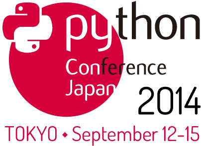

:date: 2014-7-16 21:30
:tags: Python, PyCon, PyCharm, Sphinx

================================================================================
2014/07/16 #pyconjp 2014 で "PyCharm活用術" の発表します  (＆落選プロポーザル)
================================================================================

   PyCon JP 2014 ポスターセッションの募集中です！ぜひご応募ください！
   https://pycon.jp/2014/speaking/cfp/#id6

PyCon JP 2014 で **PyCharm活用術** という演題で発表します。Djangoで実装されている `PyCon JP 2014サイト` の開発環境事例を通して、PyCharmの具体的な使い方を紹介します。

対象者は、PyCharmの機能を知りたい方、PyCharmで開発したい方、vimやemacsのカスタマイズに疲れた方、を想定しています。

PyCharm活用術
===============

* タイトル: PyCharm活用術
* 日時: 2014年9月13日(土曜日) 14:40 - 15:25
* URL: https://pycon.jp/2014/schedule/presentation/5/
* 説明:

  Pythonでの開発をサポートするエディタや統合環境はたくさんありますが、その中でもPyCharmは使いやすく必要十分な機能をカスタマイズなしに提供してくれるPythonのための統合開発環境です。PyCharmは特別目立つ機能があるわけでもなく、キャッチーなユーザー体験を提供してくれるわけでもありません。カスタマイズはあきらめた方が良いでしょう。しかし、使っていくとだんだんと良さが分かってきます。そんなPyCharmの機能の美味しいところを紹介します。

* 概要:

  Webアプリケーション開発に限らず、ソフトウェア開発を行う上で効率良く開発する手法やツールは数多くあります。しかし、そういったツールを知らなかったり、あるいはツールが多すぎて一度慣れたツールに多少の不満がありながらも新しい別のツールを試すなどせずに使い続けていることも多いのでは無いでしょうか。この講演で紹介するPyCharmの機能は、VimやEmacsでもできることがほとんどですが、PyCharmはカスタマイズせずに多くの便利な機能を提供してくれています。この講演ではPyCharmでできる事と、できない事、そして具体的な使いこなし例を紹介します。

  紹介のための題材として、PyCon JP 2014のサイトの開発環境を使用して以下の機能について紹介します： リポジトリ連携、コード整形、デバッグ、テスト実行、カバレッジ表示、リモートデバッグ、リモートデプロイ、Vagrant連携、データベース連携、ブラウザ連携、などを紹介します。

* アウトライン:

  * PyCharmで出来ること
  * PyCharmで出来ないこと
  * 最初にプロジェクト設定が必要
  * エディタの機能
  * デバッグ
  * テスト実行
  * Vagrant連携
  * リモートデバッグ
  * リモートデプロイ
  * データベース連携
  * ブラウザ連携

* カテゴリ: Other / その他
* 講演時間: 45分
* 対象者: Intermediate programmer / 中級者
* 言語: 日本語 / Japanese

BIO
  `http://清水川.jp/`_ BeProud所属。Sphinx-users.jp 副会長。 著書/訳書:「Sphinxをはじめよう」「Pythonプロフェッショナルプログラミング」「エキスパートPythonプログラミング」。 運営・参加イベント: Python mini Hack-a-thon 主催, Sphinx+翻訳 Hack-a-thon 主催, PyCon JP 2011-2014運営, 一般社団法人PyConJP理事。

.. _`http://清水川.jp/`: http://清水川.jp/

リジェクトされた演題
========================

ここから下は、私が PyCon JP 2014に応募して落選した演題です。

Sphinxによるドキュメント翻訳と処理の自動化
----------------------------------------------

**不採用**

* タイトル: Sphinxによるドキュメント翻訳と処理の自動化
* 講演テーマ: Documentation / ドキュメンテーション
* 対象者:

  Sphinxで作成されたドキュメントの翻訳を行いたい方。翻訳の仕組みを提供して翻訳に集中したい方。
* Pythonレベル: 初級
* 目的:

  Sphinxを用いて翻訳ドキュメントを作成するためのドキュメントの書き方と、既存のSphinxドキュメントなどを用いて多言語翻訳するための環境構築や手順について紹介します。

* 説明:

  Sphinxには国際化機能があります。この国際化機能を使うと、ドキュメントをpoファイル化してgettextを使った多言語化対応が出来ます。しかし、標準の方法では多くのコマンドを実行する必要があり、poファイルの管理に非常に手間がかかります。従来の手順を紹介した後、sphinx-intlを使った簡単な手順について紹介します。

* 概要:

  Sphinxドキュメントの翻訳手法をいくつか紹介します。従来のドキュメントをコメントアウトして翻訳文を書き込んでいく方法、gettextでpoファイルとして翻訳する方法、poファイルを翻訳管理サービス上で翻訳する方法について紹介し、それぞれのメリット、デメリットについて紹介します。

  Sphinx-1.2とsphinx-intl、transifex、drone.ioを併用して、翻訳した内容を自動的に適用して公開するまでの流れを紹介します。これはsphinx-users.jpで使用している手法です。この方法は、ドキュメントの更新があれば自動的にpoファイルを更新してくれるし、翻訳文を更新すれば自動的にサイトを更新してくれる全自動の手法です。

* アウトライン:

  * Sphinxの紹介 5分

    * Sphinxとは
    * 利用例
    * Sphinxの翻訳機能を使っているサイトの例

  * Sphinxの国際化機能の概要 10分

    * make gettextでpotを生成しよう
    * potを翻訳してpoを用意
    * 注意、翻訳文面にreSTが含まれることもある
    * ターゲット名を翻訳できないこともある

  * Sphinxドキュメントの翻訳手法あれこれ 15分

    * Sphinxの国際化機能を使う前はどうしていたか
    * poファイルをどうやって翻訳する？
    * sphinx-intlは便利だね
    * transifexなどの便利なサービスで複数人で並行作業しよう
    * 翻訳したpoファイルをコミットするか

  * Sphinx-1.2とsphinx-intl、transifex、drone.ioを併用した最強翻訳手順 10分

    * drone.ioの紹介
    * transifexからpoを取得してmake htmlした結果をupload
    * ついでにmake gettextした内容でtransifexを更新

  * まとめと課題 5分

    * 翻訳機能の注意点
    * バージョニングの課題
    * 翻訳協力者募集中

* 講演時間: 希望なし
* 言語: 日本語 / Japanese

Sphinxの自動ドキュメンテーション機能を活用して分かりやすいドキュメントを作ろう
--------------------------------------------------------------------------------

**不採用**

* タイトル: Sphinxの自動ドキュメンテーション機能を活用して分かりやすいドキュメントを作ろう
* カテゴリ: Documentation / ドキュメント
* 講演内容:

  Sphinxでドキュメントを書くことはPython界隈以外にも広まっています。Pythonのプログラムについてのドキュメントを書くとき、Sphinxの機能によってドキュメントを更に充実したものにできます。この発表では、Sphinxのautodoc, autosummaryを利用したドキュメンテーションの方法について紹介し、また、ドキュメント全体の構成をどのようにしたら読みやすくなるかについて紹介します。

* 対象者: ドキュメントの作成に苦労しているPythonプログラマー
* Pythonレベル: 中級

* 目的:

  docstringにドキュメントを書けることは知られていますが、あまり知られていないSphinxのautodoc, autosummaryを利用することで、docstringを活用してドキュメントを充実させることができます。autodoc, autosummaryの機能について紹介します。

* 詳細な説明:

  Sphinxを使ってドキュメントを書いたことがない人でも、Sphinxのautodoc, autosummary機能なら、APIドキュメントを手軽に作成することができます。また、Sphinxの出力を見ることで、docstringに何を書くべきかがわかり、ドキュメント作成のモチベーションが上がります。

  この発表では、Sphinxを初めて使う人、Sphinxを使い慣れている人、双方を対象に、Sphinxのautodoc, autosummary機能を利用して、分かりやすいPythonのAPIドキュメントを作る方法をデモを交えながら紹介します。docstringにドキュメントを書けることは知られていますが、docstringをうまく活用している例はあまり多くありません。Sphinxのautodoc, autosummary機能によってdocstringを活用して、ドキュメントを充実させることができます。また、autodocを利用した既存のドキュメントの悪い例、良い例をいくつか紹介し、良い例のようなドキュメントをどうやって作成するのか紹介します。（Sphinxのインストールから紹介しますが、Sphinxドキュメントを書く上で必須となるreStructuredText(reST)の文法は紹介しません。講演自体はこれらを知らなくても理解できるように構成する予定です）

* アウトライン:

  * はじめに(8分)

    * 自己紹介
    * ドキュメントを書くうえでの悩み: なにを書くべきか、どこに書くべきか
    * docstringを書くうえでの悩み: 書く必要があるのか、何を書くのか、定型はあるのか

  * Sphinxの始め方(7分)

    * Sphinxのインストール
    * Sphinxプロジェクトの始め方
    * Sphinx拡張 autodoc, autosummaryの設定準備

  * Sphinxドキュメントの事例紹介(5分)

    * Sphinxプロジェクト: Sphinxドキュメントの悪い例として
    * Pyramidプロジェクト: 説明的ドキュメントとリファレンスドキュメントの良い例として
    * Pandas (かSciPyかnumpy)プロジェクト: autosummary使い込み例として

  * autodocの使い方(10分)

    * ドキュメントの対象とするPythonコードの用意、docstringをとりあえず埋める
    * autodocでPythonコードからAPIドキュメントを自動生成
    * docstringとSphinxのreSTにそれぞれ何を書くか再考

  * autosummaryの使い方(10分)

    * autodoc自体の自動化とAPIの一覧化
    * docstringとSphinxのreSTにそれぞれ何を書くか再考

  * まとめ (3分)

* その他メモ:

  この発表では「Sphinxとは何か」については扱いませんが、インストールとプロジェクトの始め方をデモでさらっと流します。「reSTの文法」も詳しく説明しません。

* 講演時間: 希望なし
* 言語: 日本語 / Japanese

Sphinxの開発で心がけていること
--------------------------------

**不採用**

* タイトル: Sphinxの開発で心がけていること
* カテゴリ: Project Case-Studies / プロジェクト事例
* 講演内容:

  オープンソースのドキュメンテーションツールSphinxの開発に参加するにあたり、心がけていることがあります。開発参加当初は、ちょっとした機能でもニーズがあるなら付け加えていましたが、機能によっては余計なお世話だったり、メンテナンス性を低下させるなどの弊害もありました。開発に参加してから2年近くたち、継続可能なソフトウェア開発とは何か、ソフトウェアの機能の本質とは何かを考えるようになりました。この発表ではSphinx開発を通して得たポリシーのいくつかをご紹介します。

* 対象者: ある機能をプロダクトに追加していいかどうか判断に迷っている方。継続可能なソフトウェア開発について悩んでいる方
* Pythonレベル: 中級

* 目的:

  オープンソースのSphinxの開発を行う上でのバランスの取り方の一例を知ることができます。時間があれば、最後に議論などしたいと思います。

* 詳細な説明:

  オープンソースのドキュメンテーションツールSphinxの開発に参加するにあたり、心がけていることがあります。開発参加当初は、ちょっとした機能でもニーズがあるなら付け加えていましたが、機能によっては余計なお世話だったり、メンテナンス性を低下させるなどの弊害もありました。開発に参加してから2年近くたち、継続可能なソフトウェア開発とは何か、ソフトウェアの機能の本質とは何かを考えるようになりました。この発表ではSphinx開発を通して得たポリシーのいくつかをご紹介します。

* アウトライン:

  * 機能を増やす

    * 後方互換性はあるか？
    * 増やすのは簡単、でもメンテできる？
    * その機能はツールの本質的な目的に合っている？
    * リリースサイクルが強制されても良いか？

  * 安易に機能を取り込まない

    * よけいなお世話機能に注意！
    * ユーザーに退屈な作業をさせない
    * 見かけの便利さに惑わされない
    * 本質的な機能は取り込み、メンテナンスする

  * バグの修正

    * バグとSphinxの機能を知るために、テストを書く
    * 素早くテストするための環境を整える
    * 時間のかかる全バージョンテストはクラウドにまかせる
    * テスト実装を軽く保つ

  * 理解しやすいコードのために

    * コードの量を減らす
    * 機能を減らす

  * まとめ

    * 古いバージョンを切り捨てるとさっぱりする
    * 機能を増やしてコードを減らせた時は良い気分
    * 傲慢にならない

  * 質疑応答、参加者と議論

* 講演時間: 希望なし
* 言語: 日本語 / Japanese

IPython Notebookを使ったコーディングの試行錯誤とまとめ作成
------------------------------------------------------------

**不採用**

* タイトル: IPython Notebookを使ったコーディングの試行錯誤とまとめ作成
* カテゴリ: Other / その他
* 講演内容:

  IPython Notebook は科学技術計算の分野で多く使われています。おおまかに言うとPythonのコンソールの一種ですが、このコンソールは試行錯誤したり、情報を整理したり、メモを併記したりするこが出来る、いわゆる実験ノートのようなものです。

  このノートは、Pythonの初期の学習において、動作の確認などいろいろな試行錯誤をした内容をまとめて見直すと言った使い方にも向いています。

* 対象者: Pythonを使っていろいろ試行錯誤したりまとめたりする方
* Pythonレベル: 初級

* 目的: Pythonの対話コンソールの発展系、IPython notebookの便利な使い方について紹介します。

* 詳細な説明:

  * 試行錯誤の仕方

    * Pythonコンソール
    * IPythonコンソール
    * IPython Notebook

  * IPython Notebookは何向け？

    * 数値科学計算などでグラフ表示したい
    * コードと実行結果と補足文章を並べたい

  * IPython Notebookの配布

    * 受け取った人は実行しなくても見れる
    * 受け取った人が簡単に再実行
    * git -> nbviewerでの表示 http://nbviewer.ipython.org/

  * IPython Notebookと描画系の統合

    * matplotlib
    * blockdiag

  * Sphinxで表示するには？

* アウトライン: 詳細と同じ
* 講演時間: 希望なし
* 言語: 日本語 / Japanese

