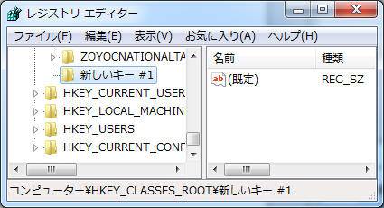

:date: 2013-12-19 8:00
:categories: ['Python', 'Sphinx']
:body type: text/x-rst

=============================================================================================================
2013/12/19 Python-2.7.6がWindows環境でmimetypes.init()に失敗する場合がありsetuptoolsがインストールできない話
=============================================================================================================

   regeditで日本語キーを追加したところ

.. note::

   この記事の元ネタは http://suzumizaki.blog6.fc2.com/?no=294 と
   http://www.python.jp/pipermail/python-ml-jp/2013-December/011155.html
   です。

   また、この記事は `Python JP ML で自分が投稿したメール`__ のblog版です。

.. __: http://www.python.jp/pipermail/python-ml-jp/2013-December/011156.html

Python-2.7.6 環境で特定の条件がそろうと ``mimetypes.init()`` がエラーになります、という話が http://bugs.python.org/issue9291 に出ていたようです（前述の元ネタページ参照）。

手元で確認したところ、エラーになる組み合わせは以下のようです。

1. Windows7 (他は試していません)
2. Python-2.7.6  (2.7.5では問題なし)
3. regeditでHKEY_CLASSES_ROOTに日本語のキーを作る
4. sys.getdefaultencoding() の結果が "cp932" 以外

この条件で mimetypes.init() がUnicodeDecodeError例外を出力します。

ここまでだと、「mimetypes.init()を使っているPythonプログラムは大変だなあ、自分は使ってないと思うけど。」という話なのですが、 setuptoolsが使ってました。

setuptools-0.8以降、インストール処理中にmimetypes.init() を呼ぶようになったため、上記条件の環境で、setuptoolsをインストールしようとするとエラーになります。これは、ez_setup.py を使わなくても、 pip install setuptools==0.8 でも再現しました。

ということで、チケットにあるとおりの挙動ではありますが、setuptoolsが影響を受けて
しまっているのは痛いですね・・。

回避策は前述の組み合わせを崩せば良いので、以下のどれか。

1. Windowsを使わない
2. Python-2.7.6を使わない（かmimetypes.pyを書き換える）
3. HKEY_CLASES_ROOT以下の非ASCII文字列なキーを削除する （可能なら）
4. sys.setdefaultencoding('cp932')する （…これはあり得ないですね）
5. setuptools-0.7.8 を使う （setuptoolsだけの問題ならこれもあり）

個人的には HKEY_CLASSES_ROOTには日本語のキーが無かったので(3)の条件を回避して影響無しでした。

具体的にどんなソフトがHKEY_CLASSES_ROOTに日本語のキーを作るのか興味があります。
将来的にPython-2.7.6利用者は増えるでしょうから、日本語キーを作るソフトの普及率が高ければ、その分このバグの影響を受ける率が高くなりそうです。

.. note::

   2014/5/5追記

   Python本家のバグチケット( http://bugs.python.org/issue9291 )がクローズされたようです。
   http://hg.python.org/cpython/rev/18cfc2a42772 にある差分（か http://hg.python.org/cpython/raw-file/18cfc2a42772/Lib/mimetypes.py のファイル) をPython-2.7.6に適用したところ、問題が再現しなくなりました。

