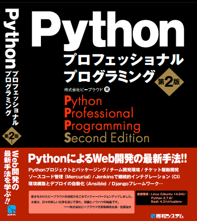

:date: 2015-05-21 14:00:00
:categories: ['book', 'Python', 'beproud', 'work']
:body type: text/x-rst

=====================================================================================
2015/05/21 #PyPro2 の電子書籍が出ます - Pythonプロフェッショナルプログラミング第2版
=====================================================================================

*Category: 'book', 'Python', 'beproud', 'work', 'sphinx'*

電子書籍が出ます！

:doc:`../python-professional-programming-2nd/index` で出版について書きましたが、そのときは紙の本のみでした。今回、あらためて電子書籍版が出ます。

   電子書籍版 Pythonプロフェッショナルプログラミング 第2版

   * `楽天Kobo電子書籍ストア: Pythonプロフェッショナルプログラミング 第2版 - 株式会社ビープラウド - 6324798043159`_
   * `Pythonプロフェッショナルプログラミング 第2版 - 株式会社ビープラウド - 電子書籍ストア BookLive!`_

   * 金額: 税抜き 2,520円、税込み 2,721円
   * 発売日: 2015/5/22(金)
   * 出版社: `秀和システム <http://www.shuwasystem.co.jp/products/7980html/4315.html>`__
   * ISBN: 479804315X,  978-4798043159

.. _`楽天Kobo電子書籍ストア: Pythonプロフェッショナルプログラミング 第2版 - 株式会社ビープラウド - 6324798043159`: http://books.rakuten.co.jp/rk/a62ceb7e47a53bdda151b43e1114b8e2/
.. _`Pythonプロフェッショナルプログラミング 第2版 - 株式会社ビープラウド - 電子書籍ストア BookLive!`: http://booklive.jp/product/index/title_id/315753/vol_no/001

本書の読みどころなどは、前のエントリ :doc:`../python-professional-programming-2nd/index` を参照してください。

BPStudy #93 で紹介します
===============================
`BPStudy #93`_ で、 「PyPro2の読みどころ紹介：Python開発の過去と現在」、というタイトルで本の読みどころなどを紹介します。

第1版から第2版までの間に、どのような変化があったのか。なぜ今回の改訂が必要だったのか。 PyPro2の読みどころ紹介を通して、Pythonの新しいツールの登場、外部環境の変化、トレンドの変化などの観点で紹介します。

* なぜPythonプロフェッショナルプログラミングの第2版を書いたのか
* PyPro1以降の開発環境の変化
* PyPro2の読みどころ
* Python2とPython3 どっちを使うべきか
* Pythonの今後はどうなる？
* おまけ: PyPro2執筆を支える技術

単に、本の読みどころとしてではなく、Pythonの変化という視点で紹介していきたいと思います。

PyPro2執筆を支える技術、は別の機会に時間をもらってじっくりやりたいくらいの内容ですね。今回はおまけでちょっとだけ。

* 2015/5/29 19:00～ (PyPro2の話は20時頃から)
* 参加登録はこちら http://bpstudy.connpass.com/event/13348/

よろしくおねがいします！

.. _BPStudy #93: http://bpstudy.connpass.com/event/13348/

