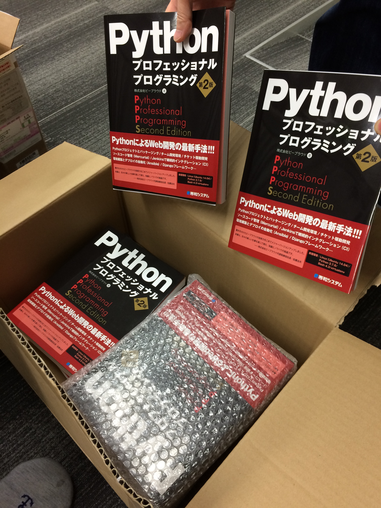
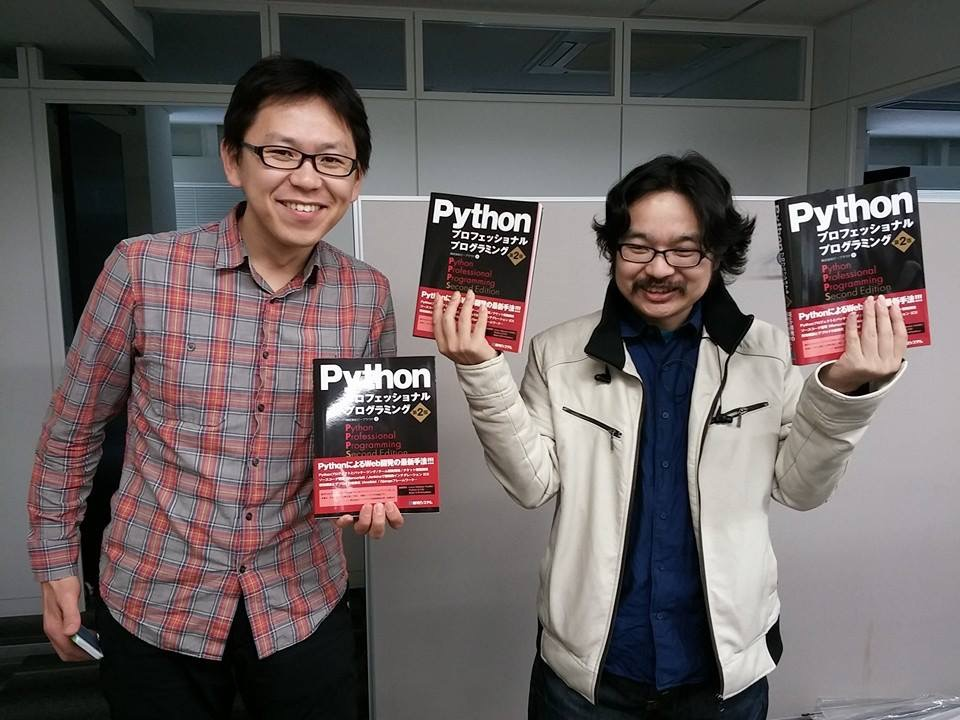

:date: 2015-02-25 7:20:00
:categories: ['book', 'Python', 'beproud', 'work']
:body type: text/x-rst

================================================================================
2015/02/25 #PyPro2 の見本誌が届いた -Pythonプロフェッショナルプログラミング第2版
================================================================================

ちょうど1週間前に :doc:`../python-professional-programming-2nd-toc/index` で、印刷開始したことと、本のみどころについて紹介しました。そして昨日、手元に見本誌が届きました！（6日で製本された実物が手元に届くとは...）

   著者11人分の見本誌

   見本誌をかかげる `@shimizukawa`_ と `@aodag`_

.. _@shimizukawa: https://twitter.com/shimizukawa
.. _@aodag: https://twitter.com/aodag

本の詳細な目次
================

出版社さんのサイトに本のページも出来ていて、そこに詳細な目次が掲載されていました。

* `Pythonプロフェッショナルプログラミング 第2版｜書籍情報｜秀和システム`__

参考にどうぞ。

.. __: http://www.shuwasystem.co.jp/products/7980html/4315.html

まとめ
========

書店では2/27(金)、Amazonでは2/28(土)から発売です。

   * 金額: 2,800円
   * ページ: 472ページ
   * 発売日: 2/27(金)
   * 出版社: `秀和システム <http://www.shuwasystem.co.jp/products/7980html/4315.html>`__
   * ISBN: 479804315X,  978-4798043159
   * Amazon: 

     .. raw:: html

        <iframe src="http://rcm-fe.amazon-adsystem.com/e/cm?lt1=_blank&bc1=000000&IS2=1&nou=1&bg1=FFFFFF&fc1=000000&lc1=0000FF&t=freiaweb-22&o=9&p=8&l=as4&m=amazon&f=ifr&ref=ss_til&asins=479804315X" style="width:120px;height:240px;" scrolling="no" marginwidth="0" marginheight="0" frameborder="0"></iframe>

