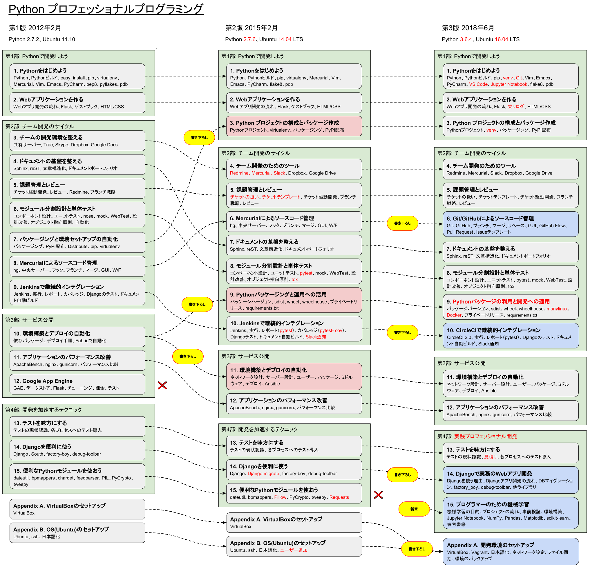

:date: 2018-06-10 23:50:00
:tags: book, Python, beproud, work

==============================================================================
『Pythonプロフェッショナルプログラミング 第3版』6/12発売 #pypro3
==============================================================================

Pythonプロフェッショナルプログラミングの第3版が2018年6月12日に発売されます！

.. raw:: html

   

<a href="http://www.amazon.co.jp/exec/obidos/ASIN/4798053821/freiaweb-22/ref=nosim/" name="amazletlink" target="_blank">Pythonプロフェッショナルプログラミング 第3版</a>
posted with <a href="http://www.amazlet.com/" title="amazlet" target="_blank">amazlet</a> at 18.06.10

株式会社ビープラウド  秀和システム  売り上げランキング: 22,183 

<a href="http://www.amazon.co.jp/exec/obidos/ASIN/4798053821/freiaweb-22/ref=nosim/" name="amazletlink" target="_blank">Amazon.co.jpで詳細を見る</a>

* 金額: 2,800円（+税）
* ページ: 488ページ
* 発売日: 2018/6/12(火)
* 出版社: `秀和システム <http://www.shuwasystem.co.jp/products/7980html/5382.html>`__
* Format: 紙, 電子版
* ISBN-13: 978-4-7980-5382-0

これまで :doc:`第1版 <../2012-03-27-python-professional-programming/index>` 、 :doc:`第2版 <../python-professional-programming-2nd/index>` と、3年間隔で版を重ねてきました。

本のコンセプトは前の版から変わらず、 **BPStyle** 。「Pythonで仕事をしていく上でのBeProudでのノウハウ」を集めた本です。対象読者としては、Pythonを読み書きできて、実際の業務、特にWeb開発と機械学習の開発手法を学びたい人を想定しています。みなさんの仕事での参考になれば幸いです。

3版での改定部分
================

全体的にバージョンを更新し、現在のトレンドに合わせて書き直しました。また、BPの社内標準の現状にあわせて更新しています。改版毎の差異を図にまとめてみました。

   Pythonプロフェッショナルプログラミングの改訂差分

   画像の元データ: https://docs.google.com/drawings/d/1R6WAnEH6C_k5bRNZQrgTOUBok3YsTApw64VLMp6a4c4/edit

* 全体: Ubuntu 16.04, Python 3.6.4 をベースに更新
* 全体: virtualenv -> venv に変更
* 全体: Mercurial HG -> Git に変更
* 6章: （書き下ろし）バージョン管理システムはMercurialからGit/GitHubに変更
* 9章: manylinux wheelの作成を追加、これにDockerを利用
* 10章: （書き下ろし）CI(継続的インテグレーション)ツールはJenkinsからCircleCIに変更
* 第4部: 部タイトルを「実践プロフェッショナル開発」に変更
* 13章: テストの見積りについて追加
* 14章: （大幅改訂）Djangoの章を再構成、なぜDjangoか、Django開発の流れ
* 15章: （書き下ろし）機械学習プロジェクトの開発ノウハウの章を新設
* Appendix: （大幅改訂）環境構築方法をVagrantベースで再構成

第2版では「15章: 便利なPythonモジュールを使おう」でいくつかのライブラリを紹介していましたが、今後は、書籍  `Python ライブラリ厳選レシピ <https://amzn.to/2JxyqWo>`_ を参照してもらえればと思います。

.. raw:: html

   

<a href="http://www.amazon.co.jp/exec/obidos/ASIN/4774177075/freiaweb-22/ref=nosim/" name="amazletlink" target="_blank">Python ライブラリ厳選レシピ</a>
posted with <a href="http://www.amazlet.com/" title="amazlet" target="_blank">amazlet</a> at 18.06.10

池内 孝啓 鈴木 たかのり 石本 敦夫 小坂 健二郎 真嘉比 愛  技術評論社  売り上げランキング: 60,484 

<a href="http://www.amazon.co.jp/exec/obidos/ASIN/4774177075/freiaweb-22/ref=nosim/" name="amazletlink" target="_blank">Amazon.co.jpで詳細を見る</a>

SNSでの状況
============

見本が届いた!

.. raw:: html

   <blockquote class="twitter-tweet" data-lang="ja">
Pythonプロフェッショナル プログラミング 第3版の見本、届きました。6月12日くらいから発売開始です(さっき、写真付け忘れた) <a href="https://twitter.com/hashtag/pypro3?src=hash&amp;ref_src=twsrc%5Etfw">#pypro3</a> (@ 株式会社ビープラウド - <a href="https://twitter.com/beproud_jp?ref_src=twsrc%5Etfw">@beproud_jp</a> in 渋谷区, 東京都 w/ <a href="https://twitter.com/shimizukawa?ref_src=twsrc%5Etfw">@shimizukawa</a>) <a href="https://t.co/rBmYPLtI1q">https://t.co/rBmYPLtI1q</a> <a href="https://t.co/SoU8Jyz7CX">pic.twitter.com/SoU8Jyz7CX</a>
&mdash; Takanori Suzuki (@takanory) <a href="https://twitter.com/takanory/status/1004173999864188930?ref_src=twsrc%5Etfw">2018年6月6日</a></blockquote>
   

早くも読書会開催が計画されてます

.. raw:: html

   <blockquote class="twitter-tweet" data-lang="ja">
【Python】【Web】【機械学習】「Pythonプロフェッショナルプログラミング 第3版」読書会 を公開しました！ <a href="https://t.co/ya4fR6VUga">https://t.co/ya4fR6VUga</a>
&mdash; susumuis (@susumuis) <a href="https://twitter.com/susumuis/status/1004697874968424449?ref_src=twsrc%5Etfw">2018年6月7日</a></blockquote>
   

書泉ブックタワーでの先行販売

.. raw:: html

   <blockquote class="twitter-tweet" data-lang="ja">
6/6先行販売『Pythonプロフェッショナルプログラミング 第３版』秀和システム（978-4-7980-5382-0）株式会社ビープラウド　著 入荷◆「フェア」「Python」棚にて展開中！2015年2月発刊の第2版を全面改訂しました。また、Web開発に限らず、機械学習プロジェクトの開発ノウハウの章を新設しました。 <a href="https://t.co/qopq7bIEJy">pic.twitter.com/qopq7bIEJy</a>
&mdash; 書泉ブックタワーコンピュータ書売り場 (@shosen_bt_pc) <a href="https://twitter.com/shosen_bt_pc/status/1004218184767901696?ref_src=twsrc%5Etfw">2018年6月6日</a></blockquote>
   

   <blockquote class="twitter-tweet" data-lang="ja">
【書泉ブックタワーコンピュータ書ベスト】6/3-6/9付 1位「ソフトウェアデザイン　総集編　２０１３－２０１７」技術評論社 2位「ＰｙｔｈｏｎＤｊａｎｇｏ超入門」秀和システム　3位「Ｐｙｔｈｏｎプロフェッショナルプログラミング　３版」秀和システム <a href="https://t.co/YT8mJKrPDG">pic.twitter.com/YT8mJKrPDG</a>
&mdash; 書泉ブックタワーコンピュータ書売り場 (@shosen_bt_pc) <a href="https://twitter.com/shosen_bt_pc/status/1005646188916273153?ref_src=twsrc%5Etfw">2018年6月10日</a></blockquote>
   

パッケージング章を読んだ読者の反応

.. raw:: html

   <blockquote class="twitter-tweet" data-lang="ja">
なにか質問があるたびに、(今日持ってきてある <a href="https://twitter.com/hashtag/pypro3?src=hash&amp;ref_src=twsrc%5Etfw">#pypro3</a> に)書いてあるから！と言われるのすごい <a href="https://twitter.com/hashtag/pyhack?src=hash&amp;ref_src=twsrc%5Etfw">#pyhack</a>
&mdash; かしゅー (@kashew_nuts) <a href="https://twitter.com/kashew_nuts/status/1005358752147501056?ref_src=twsrc%5Etfw">2018年6月9日</a></blockquote>
   

   <blockquote class="twitter-tweet" data-lang="ja">
Pythonプロフェッショナルプログラミング 第3版、パッケージ周りだけでも買う価値がありそう
&mdash; driller/どりらん (@patraqushe) <a href="https://twitter.com/patraqushe/status/1005352665751085056?ref_src=twsrc%5Etfw">2018年6月9日</a></blockquote>
   

   <blockquote class="twitter-tweet" data-lang="ja">
どうも、パッケージ周りの著者です <a href="https://twitter.com/hashtag/pypro3?src=hash&amp;ref_src=twsrc%5Etfw">#pypro3</a> 『Pythonプロフェッショナルプログラミング 第3版』 <a href="https://t.co/lwrPmSykCr">https://t.co/lwrPmSykCr</a>
&mdash; Takayuki Shimizukawa (@shimizukawa) <a href="https://twitter.com/shimizukawa/status/1005367851354447872?ref_src=twsrc%5Etfw">2018年6月9日</a></blockquote>
   

まとめ
========

Pythonプロフェッショナルプログラミング 第3版は、開発現場で必要とされる実践的な知識をまとめた本です。全てのページが2018年に即した内容に更新されました。すでに2版を持っている人も、ぜひ一度手に取って見てみてください。その内容はBeProudのメンバーだけでなく多くの人の役に立つはずです。

ハッシュタグは `#pypro3`_ です。

.. _#pypro3: https://twitter.com/hashtag/pypro3?f=realtime&src=hash

.. raw:: html

   

<a href="http://www.amazon.co.jp/exec/obidos/ASIN/4798053821/freiaweb-22/ref=nosim/" name="amazletlink" target="_blank">Pythonプロフェッショナルプログラミング 第3版</a>
posted with <a href="http://www.amazlet.com/" title="amazlet" target="_blank">amazlet</a> at 18.06.10

株式会社ビープラウド  秀和システム  売り上げランキング: 22,183 

<a href="http://www.amazon.co.jp/exec/obidos/ASIN/4798053821/freiaweb-22/ref=nosim/" name="amazletlink" target="_blank">Amazon.co.jpで詳細を見る</a>

   書影: Pythonプロフェッショナルプログラミング 第3版

