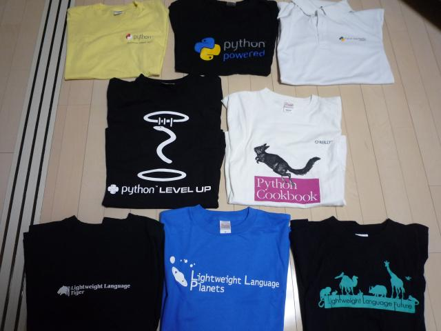
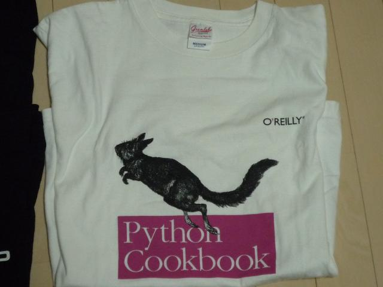
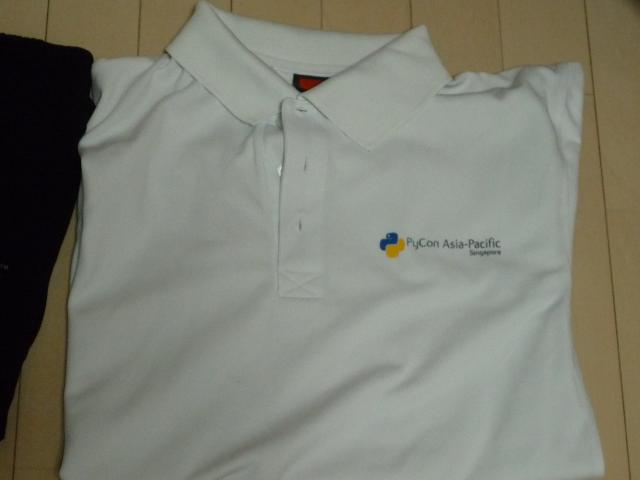
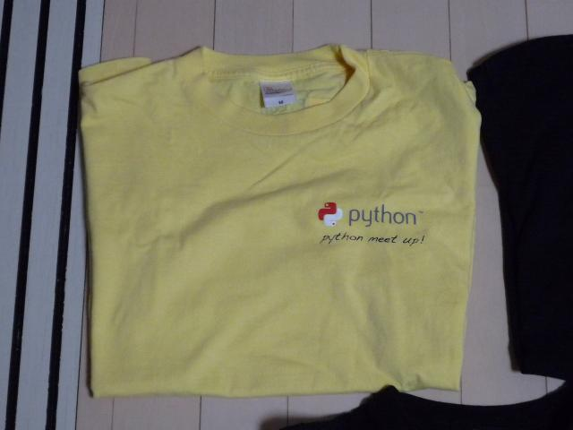
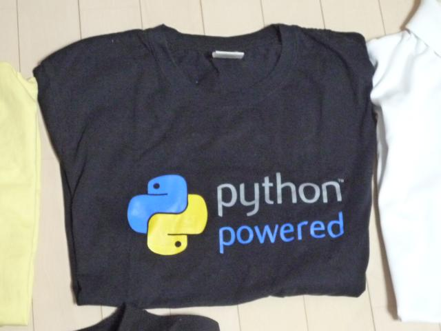
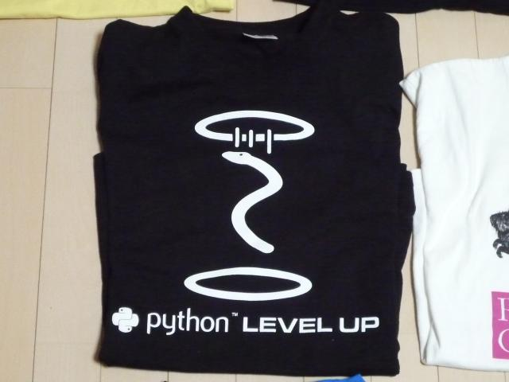
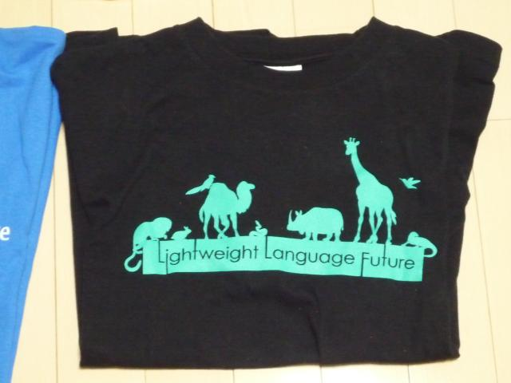
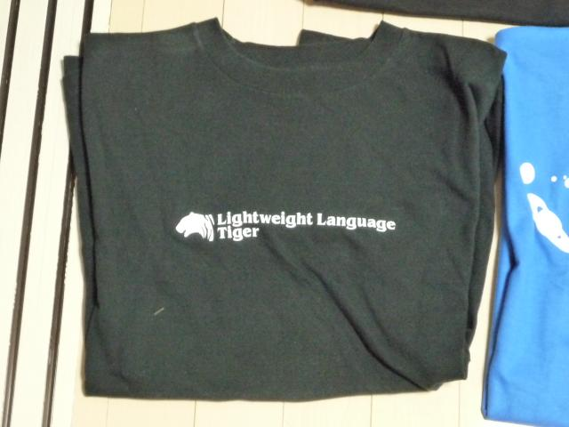
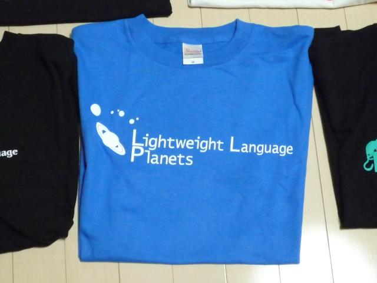

:date: 2012-07-10 23:58:00
:categories: ['python']
:body type: text/x-rst

====================================
2012/07/10 手持ちのPython Tシャツ
====================================

*'python'*

   手持ちの、Python & LL系 Tシャツ

今日の `エキスパートPythonプログラミング読書会 第二期 08`_ に@t2yからもらった PyConUS2011_ 土産のPython Tシャツを着ていったら、 ``Pythonが落ちてきてる`` とか、 ``Pythonが昇天してしまった`` とか言われました。ちがうよ！ **Level UP** だよ！

ということで、えちょっと気になったので、他に手持ちのPythonとLLのTシャツは何があるかなと思って押し入れから引っ張り出してみました。

Python系
=============

   O'reilly さんの書籍 `Python Cookbook`_ のTシャツ。前の会社で同僚にもらいました。2006年頃かな。

   Python Asia Pacific のTシャツ。Python温泉(#pyspa)でもらいました。2010年冬。

   PyCon JP 2011 のスタッフTシャツです。スタッフだったので当日着てました。2011年8月。

   Euro Python 2011に参加した @tk0miya からもらいました。2011年6月。

   @t2y のPyConUS2012お土産。2012年4月。絵柄は、昇天でも落下でもなく、もちろん温泉マークの湯気が足りないのでもありません。誰が見てもPython Level UPですね。

こうして見るとほとんどもらい物ですね...。

LLイベント
================

   LL Future (2008年) でTシャツ付きチケットを買ったものの、仕事が忙しくて中野ZEROまで行ってTシャツだけもらって職場へ。

   LL Tiger (2010年)。Tシャツ付きチケットでもらいました。虎ノ門。

   LL Planets (2011年)。Tシャツ付きチケットでもらいました。文教シビックホール。名前の由来は何？

.. _`エキスパートPythonプログラミング読書会 第二期 08`: http://connpass.com/event/622/
.. _PyConUS2011: https://us.pycon.org/2012/
.. _`Python Cookbook`: http://www.oreilly.co.jp/books/9784873112763/

