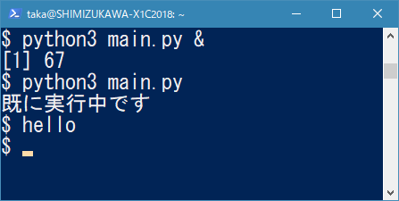

.. :date: 2018-12-12 7:00
.. :tags: BeProud, UNIXドメインソケット

===============================================================
UNIXドメインソケットの抽象名前空間を使った多重実行防止 #beproud
===============================================================

これは `BeProud Advent Calendar 2018`_ 12日目の記事です。
昨日は `@hajime_nakagami`_ の `動く疑似コードとしての Python`_ でした。

.. _BeProud Advent Calendar 2018: https://adventar.org/calendars/3338
.. _@hajime_nakagami: https://twitter.com/hajime_nakagami
.. _動く疑似コードとしての Python: https://nakagami.blog.so-net.ne.jp/2018-12-11-1

動機
====

これは、某、売上集計（仮称）というプロジェクトで実際にあった話なんですが、
1回の実行に数分かかるプログラムを10分毎に実行するようなシーンがあります。

こういうバッチ処理は多重実行されると困ることがあります。例えば、外部のWeb APIからデータを取り込む処理は、時々データ量が多かったりAPIの応答が遅かったりで時間がかかることがあります。だからといって、前の取り込みバッチが終了してないのに次のバッチ時刻に新しく取り込みが始まってしまうと、取り込んだデータが2重になってしまったり、APIに余計な負荷がかかったりするので、避けなければいけません。

バッチの多重実行を避けるためのジョブスケジューラーも色々ありますが、今回はPythonプログラム側で多重実行されないようにガードする方法を紹介します。

多重実行防止の方法
==================

プログラムの多重実行を避ける代表的な方法のうち、Pythonから操作しやすい方法をいくつか紹介します。他にもいくつもあると思います。

* 自分と同じコマンド名が起動中か確認

  * Pythonからの確認が簡単じゃないので説明略

* mutex (ミューテックス), semaphore (セマフォ) を使う

  * Pythonの文脈だと同一プロセス上での排他制御として登場するので、今回は使えない

* `multiprocessing.Lock`_ を使う

  * lockオブジェクトをプロセス間で共有していれば使える
  * 今回のバッチのように、実行プロセス同士でlockオブジェクトを共有していない場合は使えない

* ロックファイル

  * ``/var/run/sales.lock`` のようなファイルをプログラム起動時に作成
  * もし次のプログラム起動時に ``/var/run/sales.lock`` がもうあれば、自プログラムを終了（多重起動防止）
  * ``/var/run/sales.lock`` を作成したプログラムは、終了時にこのファイルを削除
  * コードの見た目も仕組みも分かりやすい方法
  * プログラムが異常終了したとき、 ``/var/run/sales.lock`` が取り残されて次の起動ができなくなる場合がある

* ソケット利用 (address, port)

  * 起動時にソケットを開く（例: ``localhost:9999`` ）
  * 多重起動したプログラムが同じソケットを開こうとして、 ``Address already in use`` エラーになることで、多重起動を防止する
  * プログラムがクラッシュしたら、ソケットは一定時間後に解放される、ファイルは無いのでゴミは残らない
  * たまたま9999ポートを利用するプログラムがあると競合してしまうため、環境にあわせてどのポートを使うか変更が必要

* UNIXドメインソケット

  * 起動時にソケットを開く（例: ``/var/run/sales.sock`` )
  * 期待する動作は、ソケット利用と同じ。ただし、こちらの方法だとファイルの存在が見える
  * ファイルパスは自由に決めて良いので、「たまたま別のプログラムと競合」はほぼない
  * プログラムがクラッシュしたら、ソケットは一定時間後に解放される、UNIXドメインソケットファイルはソケット解放で消滅する
  * ファイルパスへの書き込み権限が必要

* UNIXドメインソケットの抽象名前空間

  * 起動時にソケットを開く（例: ``\0sales.sock`` )
  * 期待する動作は、ソケット利用と同じ。ファイルは存在しない
  * 名前は自由に決めて良いので競合しない
  * ファイルが存在しないので書き込み権限も不要
  * プログラムがクラッシュしたら、ソケットは一定時間後に解放される
  * この「抽象名前空間」はLinuxでしか使えない

どの方法も、メリット、デメリットがあります。某売上集計プロジェクトはLinux(Ubuntu)環境なので、「UNIXドメインソケットの抽象名前空間」を利用しました。

.. _multiprocessing.Lock: https://docs.python.org/ja/3/library/multiprocessing.html#multiprocessing.Lock

抽象名前空間とは
================

こちらを参照どうぞ: https://scrapbox.io/shimizukawa/%E6%8A%BD%E8%B1%A1%E5%90%8D%E5%89%8D%E7%A9%BA%E9%96%93

UNIXドメインソケットによるロック処理
====================================

シンプルに実装すると以下のようになります。

.. code-block:: python

   import sys
   import socket

   def main():
       # UNIXドメインソケットを作成
       s = socket.socket(socket.AF_UNIX, socket.SOCK_STREAM)
       name = 'tekitou'
       try:
           # 抽象名前空間をbind
           s.bind('\0' + name)
       except socket.error:
           print("既に実行中です")
           sys.exit(-1)

       # 処理

       s.close()

   if __name__ == '__main__':
       main()

通常、UNIXドメインソケットをbindするには ``bind()`` メソッドにsocketファイルパスを指定しますが、抽象名前空間をbindするにはパスの先頭にnull文字 (``\0``) を付けます。

もう少し使いやすくするために、 ``with`` (context managerプロトコル)に対応してみます。

.. code-block:: python

   import sys
   import socket
   import time

   class critical_section:

       def __init__(self, name:str):
           self.name = name

       def __enter__(self):
           self.s = s = socket.socket(socket.AF_UNIX, socket.SOCK_STREAM)
           try:
               # 抽象名前空間をbind
               s.bind('\0' + self.name)
           except socket.error:
               print("既に実行中です")
               sys.exit(-1)

       def __exit__(self, exc_type, exc_val, exc_tb):
           self.s.close()

   def main():
       with critical_section('tekitou'):
           time.sleep(5)
           print('hello')

   if __name__ == '__main__':
       main()

   実行結果

デコレータにも使える版も書いてみました。

.. code-block:: python

   import sys
   import socket
   import functools
   import time

   class critical_section:

       def __init__(self, name:str):
           self.name = name

       def __enter__(self):
           self.s = s = socket.socket(socket.AF_UNIX, socket.SOCK_STREAM)
           try:
               # 抽象名前空間をbind
               s.bind('\0' + self.name)
           except socket.error:
               print("既に実行中です")
               sys.exit(-1)

       def __exit__(self, exc_type, exc_val, exc_tb):
           self.s.close()

       def __call__(self, func):
           @functools.wraps(func)
           def wrapper(*args, **kw):
               with self:
                   return func(*args, **kw)
           return wrapper

   @critical_section('tekitou')
   def main():
       time.sleep(5)
       print('hello')

   if __name__ == '__main__':
       main()

まとめ
======

某売上集計プロジェクトでは、print関数の代わりにloggerを使うといった細かい調整をしていますが、このコードで数年運用して特に問題は出ていません。

UNIXドメインソケットの抽象名前空間は、Linuxでしか使えないため、環境非依存なプログラムを書く場合には使えません。また、ソケットを使うロックの仕組みはサーバー毎のリソースのため、1サーバーならうまく動作しますが、複数サーバーでは期待通りには動作しません。複数サーバーの場合は多分バッチジョブスケジューラー側で同時実行しないように対処するのが良さそうです。

参考文献:

* https://docs.python.org/ja/3/library/socket.html
* https://linuxjm.osdn.jp/html/LDP_man-pages/man7/unix.7.html
* https://scrapbox.io/shimizukawa/%E6%8A%BD%E8%B1%A1%E5%90%8D%E5%89%8D%E7%A9%BA%E9%96%93
* https://scrapbox.io/shimizukawa/socket%E3%81%AEbind
