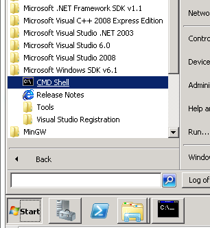
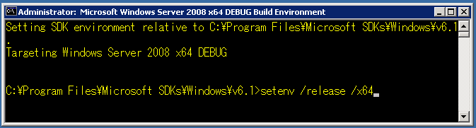
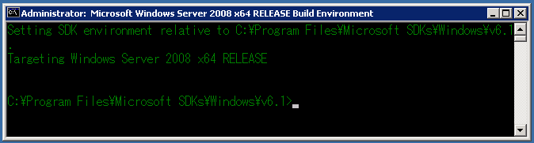

:date: 2013-02-24 18:40
:categories: ['Python', 'Win32', "x64", "distutils", "VisualStudio 2008 Express", "MinGW32-x64"]
:body type: text/x-rst

==================================================================================
2013/02/24 Python Win32 binary building and x64 cross compiling on 32bit platform
==================================================================================

Preparing Windows build environment
====================================

Build target system
--------------------

* Python-2.7 for windows x86, x64

(or Python-2.6)

Required Operating system
--------------------------

* Windows XP SP3 32bit version

Required installations
-----------------------

* Python-2.7.3 (x86) for windows
* `VisualC++ 2008 Express SP1`_ (VS2008SP1ENUX1512962.iso)
* `Windows SDK 2008`_ (6.0.6001.18000.367-KRMSDK_EN.iso)

Required extra library
------------------------

* Python-2.7 for amd64's ``libs`` directory for cross-link.

Install
=========

1. Install ``VisualC++ 2008 Express SP1``.
2. Install ``Windows SDK 2008``.
3. Install ``Python-2.7.3 x86`` into ``C:\Python27`` (or anywhere).
4. Place Python-2.7.3 amd64's ``libs`` into ``C:\Python27\libs-amd64``.

Sample code
=============

``C:\temp\setup.py``:

.. code-block:: python

   from distutils.core import setup, Extension

   setup(
     name='spam',
     version='0.1',
     ext_modules=[Extension('spam', ['spam.c'])],
   )

``C:\temp\spam.c``:

.. code-block:: c++

   #include <Python.h>

   static PyMethodDef spam_methods[] = {
       {NULL}  /* Sentinel */
   };

   PyMODINIT_FUNC
   initspam(void) 
   {
       PyObject* m;
       m = Py_InitModule("spam", spam_methods);
   }

Build python module
====================

for x86
----------

   Microsoft Windows SDK v6.1 CMD Shell

First, invoke Windows SDK's ``CMD Shell`` from ``Start -> Microsoft Windows SDK v6.1 -> CMD Shell`` and do following:

.. code-block:: bash

   C:\tmp> setenv /x86 /release
   C:\tmp> set libpath=dummy
   C:\tmp> python setup.py build

Finally, you get ``spam.pyd`` for x86 architecture in ``build\lib.win32-2.7``.

.. note::

   Python2.7 distutils requires the ``libpath`` environment variable (`msvc9compiler.py Line 255`_).
   But libpath is not used (`msvc9compiler.py Line 371`_).

for x64
----------

First, invoke ``CMD Shell`` and do following:

   Windows Server 2008 x64 DEBUG environment

   Windows Server 2008 x64 RELEASE environment

.. code-block:: bash

   C:\tmp> setenv /x64 /release
   C:\tmp> set libpath=dummy
   C:\tmp> python setup.py build --plat-name=win-amd64 build_ext --library_dirs=C:\Python27\libs-amd64

Finally, you get ``spam.pyd`` for x64 architecture in ``build\lib.win-amd64-2.7``.

.. note::

   If you have x64 OS and Python amd64 installed, you can use :command:`python setup.py build` command without options to build x64 binary.

References
============
* https://github.com/python-imaging/Pillow/issues/28

  This discussion gave me a important knowledge to making x64 build environment.
  Thanks adrianer_.

* `5.4. Cross-compiling on Windows`_ (`In Japanese`_)

  This article introduce "download Python source code and cross-compiling to get x64 libraries". I did not this, I copied ``libs`` directory from other operating system instead that was installed Python x64 version.

* `msvc9compiler.py: ValueError when trying to compile with VC Express`_

  This issue describe VisualStudio 2008 **Express** related problem. It was not reproduced on my environment (clean WinXP SP3 on virtual machine).

* `64BitCythonExtensionsOnWindows - Cython Wiki`_

  This article introduce `Microsoft Windows SDK for Windows 7 and .NET Framework 3.5 SP1` but it is not worked for me. Windows7 SDK install VC9 related directory and compilers that does not fit to Python2.7.

* `Preparing Windows build environment - PyWavelets Documentation`_

* `つまみぐいプログラミング MinGW64でPython拡張モジュールを64bit向けにビルドする`_

  This article introduce Python x64 binary building by using MinGW64. Indeed, I got a x64 (PIL's) pyd file but it did not work propery (cause bus error or else).

* `Re: How to receive a FILE* from Python under MinGW?`_

  This discussion describe:

  .. highlights::

     Problem is (AFAICT) that Python 2.4 uses a different version of the C
     runtime DLL (MSVCRT*.DLL) to that which MinGW links against.
     And it turns out that the different C
     runtime libraries have incompatible implementations of the FILE
     struct. And therefore if you try to pass a FILE* (fileno?) from Python
     to MinGW you will get a segfault.

  At the time I read this, I stop looking for ways to use MinGW for 64bit build.

.. _`VisualC++ 2008 Express SP1`: http://www.microsoft.com/en-us/download/details.aspx?id=13276
.. _`Windows SDK 2008`: http://www.microsoft.com/en-us/download/details.aspx?id=24826
.. _`msvc9compiler.py Line 255`: http://hg.python.org/cpython/file/96f08a22f562/Lib/distutils/msvc9compiler.py#l255
.. _`msvc9compiler.py Line 371`: http://hg.python.org/cpython/file/96f08a22f562/Lib/distutils/msvc9compiler.py#l371
.. _adrianer: https://github.com/adrianer
.. _`5.4. Cross-compiling on Windows`: http://docs.python.org/2/distutils/builtdist.html#cross-compiling-on-windows
.. _`In Japanese`: http://docs.python.jp/2/distutils/builtdist.html#cross-compile-windows
.. _`msvc9compiler.py: ValueError when trying to compile with VC Express`: http://bugs.python.org/issue7511
.. _`64BitCythonExtensionsOnWindows - Cython Wiki`: http://wiki.cython.org/64BitCythonExtensionsOnWindows
.. _`Preparing Windows build environment - PyWavelets Documentation`: http://www.pybytes.com/pywavelets/dev/preparing_windows_build_environment.html
.. _`つまみぐいプログラミング MinGW64でPython拡張モジュールを64bit向けにビルドする`: http://codeit.blog.fc2.com/blog-entry-3.html
.. _`Re: How to receive a FILE* from Python under MinGW?`: http://www.velocityreviews.com/forums/t485867-re-how-to-receive-a-file-from-python-under-mingw.html
