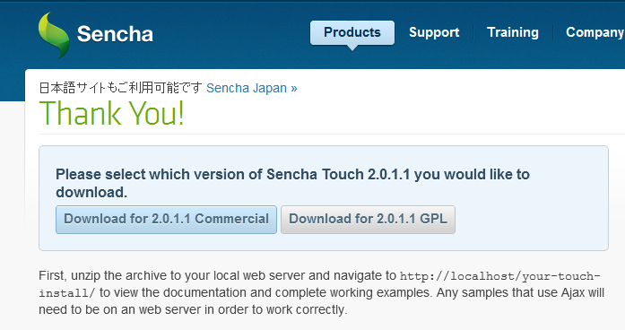
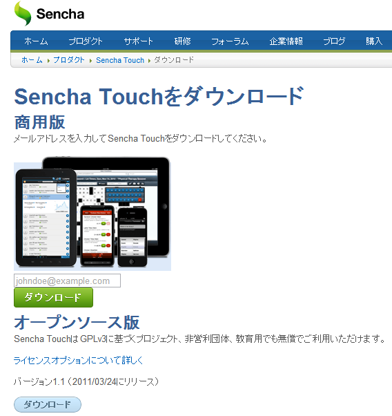

:date: 2012-07-05 23:50:00
:categories: ['JavaScript', 'SenchaTouch2', 'ExtJS']
:body type: text/x-rst

======================================================
2012/07/05 Sencha Touch 2 のライセンスとインストール
======================================================

*Category: 'JavaScript', 'SenchaTouch2', 'ExtJS'*

:doc:`sencha-touch-2-introduction/index` の続きです。インストールについて。

Sencha Touch 2 のダウンロード
================================

Sencha Touch 2 のライブラリは http://www.sencha.com/products/touch/download/ から行います。2012/7/5時点では `Sencha Touch 2.0.1.1` ですね。 `Free Commercial Version` と `Open Source Version` (GPLv3) がありますが、ダウンロードしたアーカイブの中身はライセンス条項以外に差異は無いようです。（SDK Tools Beta for Developersはまたあとでダウンロードします）

   GPL版のダウンロードリンクの先で、
   Commercial版とGPL版、どちらも制約無くダウンロードできます

もし、英語のページはやだなあぁ、と思っても、ページ左上にある ``日本語サイトもご利用可能です Sencha Japan`` のリンクからダウンロードページに移動してしまうと、日本語ページでは `バージョン1.1 （2011/03/24にリリース）` はありますがバージョン2系は無いようです。同様にドキュメントも日本語の方では1.1までしかありませんでした。残念。

   日本語サイトだと1.1を配布。
   Commercial版はメールアドレス入力が必要そう。

ライセンスについて
=====================

ライセンスの違いについては、 http://www.sencha.com/products/touch/license/ に以下のように記載があります(日本語訳しましたが正確さは保証しませんので原文も読んで下さいね）。

:Commercial Software License (無償):
   アプリケーションの利用者にソースコードを配布・共有せずに
   アプリケーションを配布する場合に適したライセンスです。
   このライセンスではアプリケーションを何種類作ってもかまいませんし、
   それらのアプリケーションは有償でも無償でもかまいません。

:Commercial Software License (組み込みデバイス):
   組み込み機器向けのアプリケーションをビルドする場合に適したライセンスです。
   このライセンスでは、年間5,000台未満の組み込み機器への配布は自由に行えます。
   それ以上の台数に配布する場合、個別のニーズに合わせてライセンスを調整します。
   このライセンスではアプリケーションを何種類作ってもかまいませんし、
   それらのアプリケーションは有償でも無償でもかまいません。

:Commercial OEM License (有償ライセンス):
   Sencha Touch をあなたの商用ライセンスSDKや、
   モバイルアプリケーションビルダーに組み込む場合に適したライセンスです。
   非常に多くのユースケースが考えられるため、このライセンスが
   適用される利用者個別の事情に合わせて調整します。

:Open Source License:
   Senchaはオープンソース・ソフトウェアの熱心な支持者です。
   あなたがGNU GPLライセンスv3と互換性のあるライセンスで
   オープンソースアプリケーションを作成するのであれば、
   このライセンスが適しています。

   GPLv3には多くの条項がありますが、最も重要なものは、
   アプリケーションの利用ユーザが各自のニーズに合わせて
   自由にあなたのアプリケーションを変更できるように、
   ソースコードを配布しなければならないということです。

ちなみに `Licensing FAQ <http://www.sencha.com/store/licensing-faq#sencha-touch>`_ によると、無償の商用ライセンスとオープンソースライセンスの違いは、前者が「開発ツールやアプリケーションビルダーへの組込、ネイティブ組み込みデバイスへの配布以外は自由」で、後者が「GPLv3なのでソースコード配布が必須」ということだそうです。

プロジェクトの作成
========================

プロジェクトの作成といっても、アーカイブを展開して必要なファイルをコピーするだけです。本当は SDK Tools を使うと楽なんですが、シンプルな構成で動かして理解するのが当初の目標なので、ここでは手でコピーしてやることにします。

以下のファイル、ディレクトリをコピーします。

::

   sencha-touch-2.0.1.1/
      +-- resources/
      |     +-- css-debug/
      |           +-- sencha-touch.css
      +-- sencha-touch-all-debug.js

ここでは以下のように置いておきます。

::

   projects/
      +-- css/
      |     +-- sencha-touch.css
      +-- js/
            +-- sencha-touch-all-debug.js

あとは `css/sencha-touch.css` と `js/sencha-touch-all-debug.js` を読み込むようなindex.htmlを作ってアプリを作っていきます。アプリ作成についてはまた次のSenchaエントリで書くことにします。

ここまでのまとめ
===================

この手順で進めていくと、扱っているファイル数が少ないので理解はしやすいのですが、後々面倒になってきます。総合的に楽をするにはドキュメントの初めの方にも書かれているように、SDK Toolsに含まれているsenchaコマンドを使えるようにした方がいいですね。

これについても、またあとで別のエントリに書くことにします。

