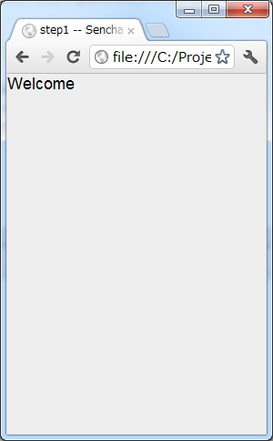
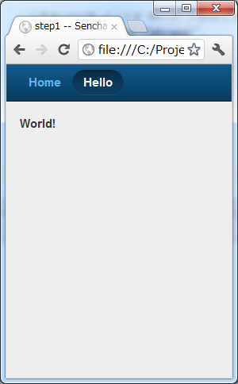
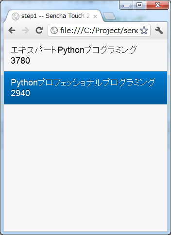
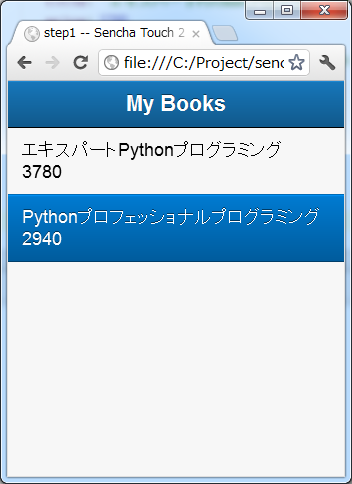
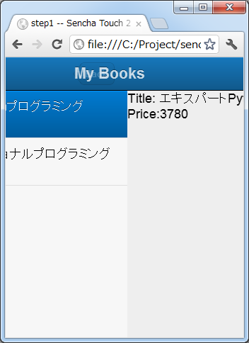
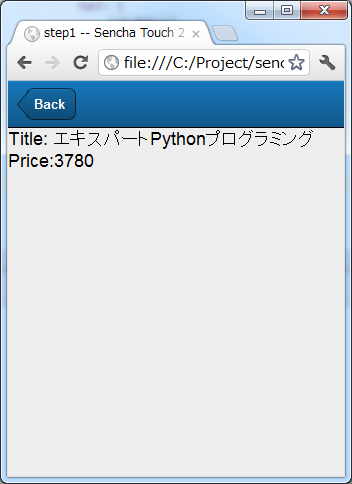

:date: 2012-07-06 23:00:00
:categories: ['JavaScript', 'SenchaTouch2', 'ExtJS']
:body type: text/x-rst

========================================================
2012/07/06 Sencha Touch 2 で小さなアプリを作る(step1)
========================================================

:doc:`../sencha-touch-2-install/index` の続きです。小さいアプリを作ります。

目標
=======

作るものは以下のようなアプリです。小さくて、実装することがほどほどありそうな感じで。

* 初期表示で、本のタイトル一覧が表示される
* 一覧から項目をタップすると詳細ページが表示される
* 戻るボタンで詳細ページから一覧ページに戻る
* 一覧表示する本のデータは適当にコード中に埋めて良いことにする
* 本の画像とかアイコンとかとりあえず考えない
* Chromeのウインドウサイズをスマートフォンくらいにして表示確認する
* ローカルファイルをChromeで閲覧するのでサーバーとか立てない

プロジェクトの作成
========================

`前のエントリ <../sencha-touch-2-install/index>`_ で書いたように、便利ツール(sencha コマンド)はしばらく使いません。

以下のディレクトリ構成から始めます。
今回をステップ１ということにして、 `step1` ディレクトリを追加して
index.htmlとアプリの実装を書くapp.jsを追加します。

::

   projects/
      +-- css/
      |     +-- sencha-touch.css
      +-- js/
      |     +-- sencha-touch-all-debug.js
      +-- step1/
            +-- app.js
            +-- index.html

index.html:

.. code-block:: html

   <!DOCTYPE html>
   <html lang="en">
       <head>
           <meta charset="UTF-8">
           <title>step1 -- Sencha Touch 2 Exercise</title>
           <meta name="viewport" content="width=device-width, initial-scale=1">
           <link rel="stylesheet" href="../css/sencha-touch.css" type="text/css">
           
           
       </head>
       <body>
       </body>
   </html>

app.js

.. code-block:: javascript

   Ext.application({
       name: 'App',

       launch: function() {
           Ext.create("Ext.Panel", {
               fullscreen: true,
               html: 'Welcome'
           });
       }
   });

このアプリをブラウザで確認してみます。

   step1-1. Welcome

これに手を加えていきます。

最初のコードを読む
==========================

まずはさきほどのapp.jsの実装内容を読んでいきます。

app.js:

.. code-block:: javascript

   // アプリケーションのインスタンスを作成する関数呼び出し
   Ext.application({
       // 引数にこのアプリケーションの設定を記載したObjectを渡す

       // 任意のアプリケーション名。名前空間として使われます
       name: 'App',

       // アプリインスタンスのlaunchをオーバーライド
       // launchはアプリの起動時に呼び出されます
       launch: function() {
           // Ext.createでExt.Panelクラスのインスタンスを作成しています。
           // 第2引数にはExt.Panelクラスのインスタンス化時に使う設定(config)を渡します。
           // 第2引数を省略した場合はExt.Panelのデフォルト値を使ってインスタンス化します。
           Ext.create("Ext.Panel", {
               // Ext.Panelコンポーネントをfullscreenで生成します。
               fullscreen: true,

               //HTMLパーツを'Welcome'に設定します。
               html: 'Welcome'

               //`html`にHTMLタグを書いてもエスケープされてそのまま表示されます。
               //`styleHtmlContent: true` を指定すればHTMLのまま解釈されます。
           });
       }
   });

   step1-2. Welcome (再掲)

Sencha Touch 2 はExt.Panelのようなコンポーネントを並べたり、子要素として持たせたりしてアプリケーションの画面を作っていきます。
Ext.Panelは他のコンポーネントに比べて特別な機能の無い1枚の板(パネル)で、よく使われます。DIVタグみたいなものですね。

上記のコードでは、アプリケーション起動時(ブラウザでindex.htmlにアクセスしたとき)にlaunch関数内に書かれているプログラムが実行されます。
Sencha Docs のサンプルコードではlaunch関数の中身だけを直接書いている例が多いですがそれでも動くみたいですね（よく分かってない）。

`Ext.create("Ext.Panel", {});` でfullscreen指定しているので、ブラウザの画面サイズいっぱいにpanelが表示されます。
Ext.Panelのconfigにfullscree,html以外に何を設定できるかは `Sencha DocsのExt.Panelのconfig項目`_ に書かれています。

書かれていますが、だいたいの設定値は単体では意味をなさない場合が多く、これを眺めていてもなにが出来るようになるのかよく分かりません。
`html` のところには以下のように書かれています。

   Optional HTML content to render inside this Component, or a reference to an existing element on the page.

   このコンポーネント内に描画するHTMLコンテンツか、ページ上の既存のエレメントへのリファレンスを設定しても良い。

HTMLコンテンツを書いていいというのはともかく、既存エレメントへのリファレンスってなんだろう？
とりあえず見なかったことにして次に進むことにします...。

.. _`Sencha DocsのExt.Panelのconfig項目`: http://docs.sencha.com/touch/2-0/#!/api/Ext.Panel-cfg-activeItem

.. config部分には、Ext.Panelのconfigで規定されていない設定値を書くことも出来ます。titleとか。

タブコンポーネントを使う
==========================

HTMLページが表示されているだけだとつまらないので、タブを追加して2画面を切り替えられるようにします。
さきほどのソースコードでは最上位にpanelコンポーネントがありましたが、今回はtabpanelコンポーネントを最上位にして、
その下にpanelコンポーネントを2つ置いてみます。

ところで、コンポーネントの種類にどんなものがあるのかは `Kitchen Sink Example`_ を見て把握してから、
`Using Components in Sencha Touch 2`_ を見てクラス(とxtype)に何が使えるのかを把握して、
それから個々のクラスのリファレンスページを読むと良いかもしれません。

.. _`Kitchen Sink Example`: http://docs.sencha.com/touch/2-0/#!/example/kitchen-sink

.. _`Using Components in Sencha Touch 2`: http://docs.sencha.com/touch/2-0/#!/guide/components-section-5

app.js:

.. code-block:: javascript

   Ext.application({
       name: 'App',

       launch: function() {
           // tabpanelコンポーネントのインスタンスを作成します。
           Ext.create("Ext.tab.Panel", {
               fullscreen: true,

               // タブ要素としてExt.Panelを2つitemsに列挙します。
               items: [
                   {
                       //itemsの1つめの子要素となるコンポーネント。
                       //xtypeにコンポーネント名を記載して、あとはそのコンポーネントの
                       //configを列挙します。

                       //panel = Ext.Panel のことです。
                       xtype: 'panel',

                       //子要素1のタイトルを'Home'に設定します。
                       //これはpanelのconfig値ではなくtabpanelがタブ名に使います。
                       title: 'Home',

                       //子要素1のHTMLパーツを'Welcome'に設定します。
                       html: 'Welcome'
                   },
                   {
                       //itemsの2つめの子要素となるコンポーネント。
                       //xtypeを省略すると暗黙的に'panel'が設定されます。

                       //子要素2のタイトルを'Hello'に設定します。
                       title: 'Hello',

                       //子要素2のHTMLパーツを'World!'に設定します。
                       html: '<strong>World!</strong>',

                       // HTMLをエスケープされないようにします。
                       styleHtmlContent: true
                   }
               ]
           });
       }
   });

   step1-3. タブが2つ表示されました。"World!" が強調表示されています。

これでタブが2つ表示されました。タブをタップすれば画面が切り替わって適切なpanelが表示されます。
もし表示にスクロールが必要な分量のHTMLを書いた場合、今のままではスクロールできないので、
panelのconfigに `scrollable: true` を追加します。Senchaで作ったアプリはスマートフォン向けの操作感を
HTMLで作り込んであるので、マウス操作する場合もドラッグしてスクロールさせる必要があります。

ちょっと寄り道しましたが、次はlistコンポーネントを使ってみます。

本の一覧を表示する
========================

listコンポーネント(Ext.dataview.List)を使って本の一覧を表示します。tabpanelの子要素にしてもいいですが、
とりあえず最上位コンポーネントにlistを使って作ってみます。

app.js:

.. code-block:: javascript

   Ext.application({
       name: 'App',

       launch: function() {
           // listコンポーネントのインスタンスを作成します。
           Ext.create('Ext.List', {
               fullscreen: true,

               // listの要素1項目毎のテンプレートを設定します。
               // テンプレートの仕様はExt.XTemplateクラスで規定されています。
               // 以下の例のように文字列のArrayを指定するか、または文字列で指定します。
               // Arrayの場合自動的にjoinされて1つの文字列になります。
               itemTpl: [
                   '
<strong>{title}</strong>
',
                   '
{price}
'
               ],

               // リストの要素となるデータを定義します。
               data: [{
                   title: 'エキスパートPythonプログラミング',
                   price: 3780
               },{
                   title: 'Pythonプロフェッショナルプログラミング',
                   price: 2940
               }]
           });
       }
   });

   step1-4. 本の一覧をlistコンポーネントで表示

dataの要素をこのコンポーネントの初期化時に設定することも出来ます。
あるいは、dataの代わりにstoreを指定すればlocalStrageやリモートサーバーからデータを取得することもできます。

storeはデータの格納先やソート、フィルタなどを行ってくれるモジュールで、storeが実際にどこにデータを取りに行っているかなどを表示用のコンポーネントから隠蔽します。上記のコードをstoreを使ったものに書き換えてみます。

app.js:

.. code-block:: javascript

   Ext.application({
       name: 'App',

       launch: function() {
           Ext.create('Ext.List', {
               fullscreen: true,

               itemTpl: [
                   '
<strong>{title}</strong>
',
                   '
{price}
'
               ],

               // リストの要素として表示するべきデータが格納されているstoreを指定します。
               // ここでは直接storeの定義を行っていますが、定義済みstore名を指定することも
               // 出来ます(最終的にはそっちの方が良い書き方です)。
               store: {
                   // storeが提供するデータのフィールド定義です。
                   // フィールド定義はmodelに追い出しても良い(最終的にはその方が良い)。
                   fields: ['title', 'price'],

                   // storeが提供するデータを定義します。
                   // 最終的にはWebAPI等から自動取得するよう、dataの代わりにproxyを
                   // 指定することになりますが、とりあえず直接書いておきます。
                   data: [{
                       title: 'エキスパートPythonプログラミング',
                       price: 3780
                   },{
                       title: 'Pythonプロフェッショナルプログラミング',
                       price: 2940
                   }]
               }
           });
       }
   });

   step1-5. 本の一覧を表示 (再掲)

これでリスト表示が出来ました。次は項目をタップしたら詳細画面を表示するようにします。

リストのタップで詳細画面を表示
===================================

リストをタップして画面を掘り進んでいく(iPhone的には右へスクロールしていく)ためにはどのコンポーネントを使えば良いか悩みます。
サンプルを見ると、NestedListが良さそうな気がしますがNestedListはあくまでリストを掘り進んでいくだけで、スクロールした先にパネルを表示することが出来ない気がします。別の方法として、Ext.navigation.Viewを使うことにします。

Ext.navigation.ViewはListの機能はありませんが、子要素をpush追加していくとスタック状に画面を積み重ねていってくれるうえに、タイトルバー部分にBackボタンも用意してくれます。これを利用して、以下の方針でコンポーネントを組み合わせてみます。

* Ext.navigation.Viewを最上位コンポーネントにする
* 最初の子要素としてlistコンポーネントを持たせて本の一覧を表示する
* リストの項目をタップしたらExt.navigation.Viewに詳細画面をpushする

この方針で組み替えたのが以下のコードです。

app.js:

.. code-block:: javascript

   Ext.application({
       name: 'App',

       launch: function() {
           // navigationviewコンポーネントのインスタンスを作成します。
           Ext.create('Ext.navigation.View', {
               fullscreen: true,

               // スタックするコンポーネントを指定します。
               // 最初は複数重ねる必要は無いのでitemsには1つだけ要素を持たせます。
               items: [{
                   // listコンポーネントをスタックします。
                   xtype: 'list',

                   // navigationviewのタイトルバー部分に表示される文字を指定します。
                   title: 'My Books',

                   itemTpl: [
                       '
<strong>{title}</strong>
',
                       '
{price}
'
                   ],
                   store: {
                       fields: ['title', 'price'],
                       data: [{
                           title: 'エキスパートPythonプログラミング',
                           price: 3780
                       },{
                           title: 'Pythonプロフェッショナルプログラミング',
                           price: 2940
                       }]
                   }
               }]
           });
       }
   });

   step1-6. navigationviewを使用。見た目はタイトルバーが付いただけですね。

`xtype: 'list'` 部分のconfigはほとんど前に出てきたリスト表示実装のままですがtitle指定を追加しています。
navigationviewはBackボタンの都合がありタイトルバーが標準で付いていますが、いままでのpanel等にもタイトルバーを付ける方法はあります（また別途紹介します）。

上記のコードのままでは、タップしたときに表示するpanelの定義がありませんし、タップ動作に対する処理も書かれていません。
そこで、以下のようにタップ操作に対する処理を追加します。

app.js:

.. code-block:: javascript

   Ext.application({
       name: 'App',

       launch: function() {
           Ext.create('Ext.navigation.View', {
               fullscreen: true,
               items: [{
                   xtype: 'list',
                   title: 'My Books',
                   itemTpl: [
                       '
<strong>{title}</strong>
',
                       '
{price}
'
                   ],
                   store: {
                       fields: ['title', 'price'],
                       data: [{
                           title: 'エキスパートPythonプログラミング',
                           price: 3780
                       },{
                           title: 'Pythonプロフェッショナルプログラミング',
                           price: 2940
                       }]
                   },

                   // イベントリスナーを設定します。
                   // xtype = list のconfigに設定するlistenerなので基本的には
                   // Ext.dataview.Listのイベントを捕まえることが出来ます。
                   listeners: {
                       // itemtapイベントのハンドラ関数を定義します。
                       // ハンドラ関数の引数はドキュメントで規定されています。
                       itemtap: function (list, index, item, record) {
                           // indexはリストの何個目をタップしたか
                           // recordはタップした項目のデータを保持しているレコード

                           // this(=list)の親コンポーネント(=navigationview)を取得して、
                           // push関数に新しいコンポーネントのconfigを渡します。
                           this.getParent().push({

                               // Ext.view.Panelをpushするコンポーネントとして使用します。
                               xtype: 'panel',

                               // storeから取り出されるのはrecordで、recordから生データを
                               // 取り出すのに record.getData() を呼び出しています。
                               data: record.getData(),

                               // htmlだとデータと組み合わせて動的な内容を表示することが
                               // 出来ません。htmlの代わりにtplを使うと、dataオブジェクトの
                               // 属性から表示内容に自動的に値を埋め込んでくれます。
                               tpl: [
                                   '<table>',
                                       '<tr>',
                                           '<th>Title:</th>',
                                           '<td>{title}</td>',
                                       '</tr>',
                                       '<tr>',
                                           '<th>Price:</th>',
                                           '<td>{price}</td>',
                                       '</tr>',
                                   '</table>'
                               ]
                           });
                       }
                   }
               }]
           });
       }
   });

   step1-7. タップしたときの様子

   step1-8. 詳細画面の表示と、navigationviewに自動的に用意されるBackボタン

これで、本の一覧と詳細表示を行うアプリケーションが実装出来ました。
新しい要素として、navigationviewのpushや、listener、recordが出てきました。

Listのlistenerで他にどのようなイベントを扱うことが出来るのかについてはSencha Docsの `Ext.dataview.List`_ のeventsの部分に記載されています。
itemtapイベントがどのような値を引数に渡してくるのか等も記載されています。

.. _`Ext.dataview.List`: http://docs.sencha.com/touch/2-0/#!/api/Ext.dataview.List-event-activate

最終的に
===========

以下のコードが出来ました。

app.js:

.. code-block:: javascript

   Ext.application({
       name: 'App',

       launch: function() {
           Ext.create('Ext.navigation.View', {
               fullscreen: true,
               items: [{
                   xtype: 'list',
                   title: 'My Books',
                   itemTpl: [
                       '
<strong>{title}</strong>
',
                       '
{price}
'
                   ],
                   store: {
                       fields: ['title', 'price'],
                       data: [{
                           title: 'エキスパートPythonプログラミング',
                           price: 3780
                       },{
                           title: 'Pythonプロフェッショナルプログラミング',
                           price: 2940
                       }]
                   },
                   listeners: {
                       itemtap: function (list, index, item, record) {
                           this.getParent().push({
                               xtype: 'panel',
                               data: record.getData(),
                               tpl: [
                                   '<table>',
                                       '<tr>',
                                           '<th>Title:</th>',
                                           '<td>{title}</td>',
                                       '</tr>',
                                       '<tr>',
                                           '<th>Price:</th>',
                                           '<td>{price}</td>',
                                       '</tr>',
                                   '</table>'
                               ]
                           });
                       }
                   }
               }]
           });
       }
   });

たったこれだけのコードでスマートフォン向けアプリっぽいものが作れる、と見るか、暗黙だらけで何をどう書いて良いか分からない、と見るかは意見の分かれるところだと思います。自分もここまで理解するのにけっこう時間がかかりました。このメモが理解の助けになるといいなと思います（特に、将来の自分の助けに..）。

ここまでのまとめ
===================

とりあえず、以下のさわりくらいは説明できたかなと思います。

* コンポーネントの階層構造
* コンポーネントの種類とxtype
* イベントリスナー
* panel, tabpanel, list, navigationview
* XTemplate
* store, record, data

なお、ソースコードは全て https://bitbucket.org/shimizukawa/sencha-touch2-exercise のstep1ディレクトリにあります。

また、スマートフォンから http://dlvr.it/1pyvt3 にアクセスすれば、ここで作ったアプリを実際に操作出来ます。

つぎは、この肥大化した階層構造を分解してこれ自体をコンポーネント化していこうと思います。
