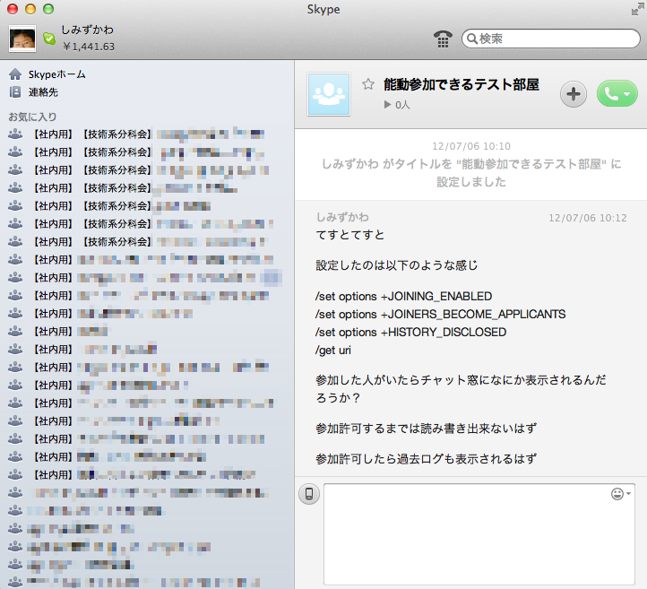
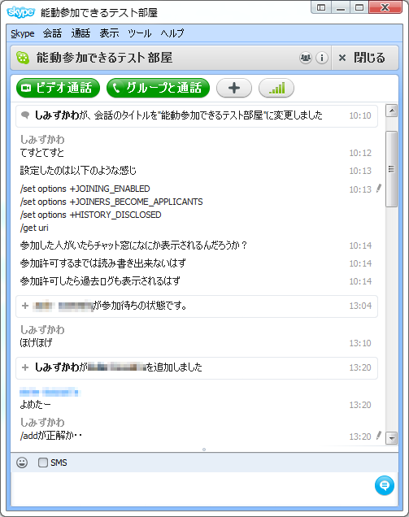
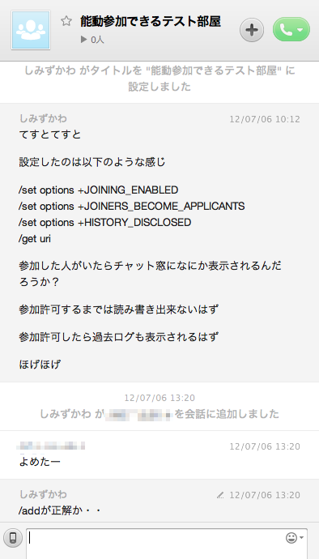

:date: 2012-07-07 12:30:00
:categories: ['skype']
:body type: text/x-rst

==========================================================
2012/07/07 Skypeのコマンドtipsと自由参加部屋の作成
==========================================================

*'skype'*

**# 7/8 0:30 経緯についてちょと追記**

**# 7/9 13:50 キャプチャ画像追加**

   BeProud関連のSkypeグループチャット（私は参加数が少ない方）

弊社 BeProud_ では多くのコミュニケーションに Skype_ のグループチャットを使っていますが、会話の入力欄に ``/`` で始まる特定のコマンドを書いて送るといろいろなことができる、というのは意外と知られていない（存在は知っててもコマンドそのものはよく分からないというパターンも含む）ようです。グループチャットする時に知っておくと便利なコマンドについて、ちょっとまとめておきます。

.. note::

   BeProudのSkype利用状態については以下のスライドや書籍で紹介されています。

   * `beproud-bot (BPStudy#36 Sep 29, 2010)`_
   * `Be cloud (BPStudy#43 Mar 25, 2011)`_
   * `Pythonプロフェッショナルプログラミング`_

Skypeのコマンド
====================

「Skype コマンド」で検索すると公式サイトが見つかります。

* `Skypeヘルプ – チャットのコマンドと役割を教えてください。`_

``/add [SKYPEID]`` とか ``/kick [SKYPEID]`` とかが紹介されてます。このあたりは分かりやすいですが、他はちょっとイメージしづらい気もします。

あと公式には公開されていないコマンドもいくつかあって以下のページにまとめられていました。

* `Skypeチャットコマンドまとめ Ver1.2 Release2`_

自分のSkypeコマンドあんちょこ
==================================

自分もイメージしづらかったので、たまに使う時に毎回調べていたコマンドについてメモを取っています。こんな感じ。

他の参加者を管理者に指定する:
   ``/setrole [SKYPEID] MASTER``
他の参加者の管理権限等を確認する:
   ``/whois [SKYPEID]``
自分の権限を確認する:
   ``/get role``
人をグループチャットに招待する:
   ``/add [SKYPEID]``
   ただし、contactにない人も追加出来ちゃうので気をつけて！
部屋のガイドラインを設定・表示:
   * 設定 ``/set guidelines 文字列``
   * 表示 ``/get guidelines``
   しかしこれ能動的に見に行かないと分からないので微妙
新規参加者が参加前のログを見る:
   ``/set options +HISTORY_DISCLOSED``
   400件以内とか制限があるみたい
参加者一覧と権限の表示:
   ``/showmembers``
   自分の権限とそのグループにいる他の人の権限を表示。WindowsクライアントだとIDと権限の列挙だけですが、Macクライアントだと各人の表示名や部屋の情報など色々と表示されます。
部屋のCREATORを表示:
   ``/get creator`` もし部屋のCREATORが居ないと/kick等のCREATOR権限が必要な事が出来なくなるので、 ``/goadmin`` コマンドでCREATORになりましょう。

公開チャット部屋を作る
==========================

先日 @richardx64 からチャット部屋を誰でも参加できるようにした、という話を聞いて便利そうだったので作り方を教えてもらいました。以下のコマンドの組み合わせで作れるそうです（昔のSkypeには、オープンチャットというものがあったらしいですが、ちょっと違うものみたいです。よく知りませんが）。

1. グループチャットを作る(既存のでもいい)
2. ``/set options +JOINING_ENABLED`` で誰でも参加できるようにする
3. ``/get uri`` で表示されるURLを配布する。リンクを踏めば部屋に参加出来る。

作成されるURLは skype:?chat&blob=91spNBvS8842pI...(もっと長い) という形式なので、環境によっては(skype:ハンドラがインストールされていないと)クリックしても何も起きないかも?

これを使えば社内向けの特定の話題に興味のある人向けの部屋を作っておいて、WikiにでもURLを列挙しておけば、いちいち管理権限のある人(CREATORかMASTER)を捕まえて追加してもらう必要が無くなるので楽かなーと思います。

ただし、URLが社外に知られると、 **知らない人もやってきます** 。

公開チャットだけど承認制するまで読み書き禁止
=================================================

公開チャット部屋はURLを知っている人なら誰でも参加出来てしまうので、ちょっと困る、以下のステップで参加できるようにしたい、という事もあります。

1. 参加したい人がURLをクリック
2. 部屋の管理者に「参加者きたよ」と通知
3. 管理者が承認して参加完了

そこで、先ほどの @richard から教えてもらった公開チャット部屋の話とうまく組み合わせて実現出来ないか色々と実験してみたところ、以下のようにオプションを設定すると希望した運用に近いところまでいけました。

1. グループチャットを作る(既存のでもいい)
2. ``/set options +JOINING_ENABLED`` で誰でも参加できるようにする
3. ``/set options +JOINERS_BECOME_APPLICANTS`` で承認するまで読み書き禁止
4. ``/get uri`` で表示されるURLを配布する。

このようにして作った部屋に新しい人がURLクリックで参加すると以下のようになります。

   URLでやってきた人が参加待ち状態と表示される(Windows Client Ver 5.10.0.115)

あとは ``/add [SKYPEID]`` でその人を追加してあげれば操作完了！

…しかし、ここでいくつもの問題があります。

   URLでやってきた人が参加待ち状態と表示されない(Mac Client Ver 5.8.0.865)

* MacクライアントだとWindowsクライアントにある「参加待ち」が表示されない
* Win/MacともSkypeの通知POPUPが出ない
* ``/add [SKYPEID]`` で追加許可しようにもIDがGUIには表示されない
* GUIの参加者一覧には未許可の人が表示されないからIDが分からない
* ``/showmembers`` で一覧表示して、APPLICANT権限の人を探して /add でやっと許可

これだと、Skype単体でうまく運用するのは無理ですねー。

@tk0miya に「BPにはSkypeBOTいるんだから自動的に承認したら？社員のSkypeIDリストとか使えばいいんじゃない？」というアドバイスをもらいましたが、社員のSkypeIDリスト、無いんですよね…。社員じゃないけど参加させて良いという場合もたまにあるので、自動承認だけだと困る場合もありそうです。

うまく運用するにはSkypeBOT作って(BPにはある)定期的にAPPLICANTな人がいるかチェックして、いたらSkypeに発言して通知するか、WhiteListが用意出来てるなら、掲載されている人については自動参加させる、といった仕組みを用意する必要がありそうです。

最後に
========

承認制公開チャット部屋作成の動作検証にお付き合い頂いた @takanory, @richardx64, @rokujyouhitoma, @tk0miya ありがとうございましたー。微妙にだめでしたー＞＜

Skypeクライアントもうちょっとがんばれ。最近のiPhoneクライアントはだいぶ良くなったので、次はMacクライアントを色々良くして下さい。

.. _BeProud: http://www.beproud.jp/
.. _Skype: http://www.skype.com/
.. _`Be cloud (BPStudy#43 Mar 25, 2011)`: http://www.slideshare.net/bpstudy/be-cloud
.. _`beproud-bot (BPStudy#36 Sep 29, 2010)`: http://www.slideshare.net/bpstudy/bpstudy36-beproudbot-5319457
.. _`Pythonプロフェッショナルプログラミング`: 
.. _`Skypeヘルプ – チャットのコマンドと役割を教えてください。`: https://support.skype.com/ja/faq/FA10042/chattonokomandoto-yi-gewo-jiaoetekudasai
.. _`Skypeチャットコマンドまとめ Ver1.2 Release2`: http://opoopo.client.jp/skype.html
