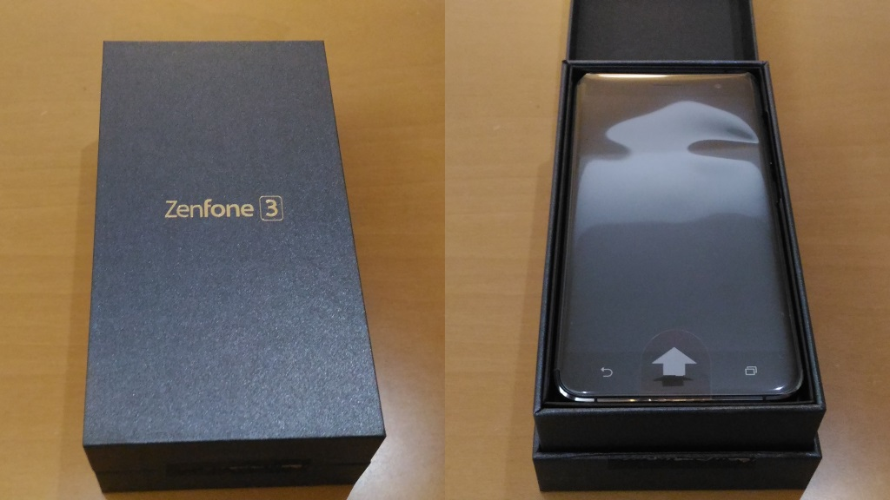
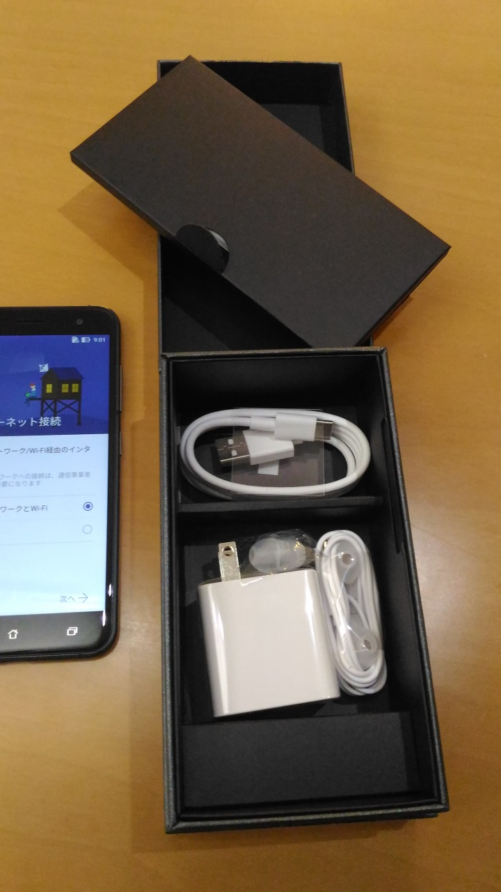

:date: 2017-10-29 10:00
:tags: SmartPhone, Zenfone

=========================================
Zenfone 2 Laser を Zenfone 3 に買い換えた
=========================================

`ASUS Zenfone 3 (ZE520KL)`_ に買い換えました。アプリもサクサク動くし、カメラ写りも綺麗になったので非常に快適です。

この2年間は同じASUSの `Zenfone 2 Laser`_ を使っていましたが、RAM 2GB, ストレージ 16GB ではもっさり感が厳しくて、、、。買った当初はそこまでひどくなかったので、OSをAndroid 5.0 -> 6.0 に上げたり、各アプリがメモリを使うようになったのが原因かなあ。iPhone 5s から乗り換えたときに、2年は使おう！と思って買ったけど、2ヶ月フライングで買い換えました。

.. _ASUS Zenfone 3 (ZE520KL): https://www.asus.com/jp/Phone/ZenFone-3-ZE520KL/
.. _Zenfone 2 Laser: https://www.asus.com/jp/Phone/ZenFone-2-Laser-ZE500KL/Features/

   Zenfone3 の箱

   Zenfone3 の箱の中身

スペック比較

.. csv-table:: 
  :header-rows: 1
  :stub-clumns: 1

Name, Zenfone 2 Laser, Zenfone 3
OS, Android 5.0.2, Android 6.0.1
CPU, Snapdragon 410 1.2GHz, Snapdragon 625 2.0GHz
RAM, 2GB, 3GB
Storage, 16GB, 32GB
Display: 1280x720 / 5inc, 1920x1080 / 5.2inch
USB: microUSB, USB Type-C

我が家にUSB Type-Cがやってきたぞ！（既存のUSBケーブル使いまわせない・・・）

今回買った Zenfone 3 は、Google Home miniのオマケで買ったようなもので、ビックカメラで11月末まで、対象商品を買うと Google Home miniが付いて来るというので、買いました。ちょうど買おうと思っていたので良いタイミング。
https://www.biccamera.com/bc/c/google/home/index.jsp?ref=toppage

ところで、ストレージのことをROMって書くの何なんでしょうね・・・。

参考

- `ZenFone 3 (ZE520KL) | スマートフォン | ASUS 日本 <https://www.asus.com/jp/Phone/ZenFone-3-ZE520KL/>`__
- `ZenFone 2 Laser (ZE500KL) | スマートフォン | ASUS 日本 <https://www.asus.com/jp/Phone/ZenFone-2-Laser-ZE500KL/>`__
- `格安SIMに最適な格安スマホの比較と評価：格安SIMと格安スマホの比較サイト <http://kakuyasu-sim.jp/kakuyasu-smartphone>`__
- `『ASUS ZenFone3 ZE520KL』のカメラを試してみた！－オート撮影モードのみ、カメラの実力は？ | モバイルドットコム <https://www.mobile-com.net/entry/asus-zenfone3-ze520kl-camera/>`__
- `Asus Zenfone 3 (ZE520KL)カメラテスト (比較Canon EOS M3, Sony Xperia Z1), RAW撮影も | spacewalker <https://www.spacewalker.jp/mt/spacewalker/archives/13991>`__

