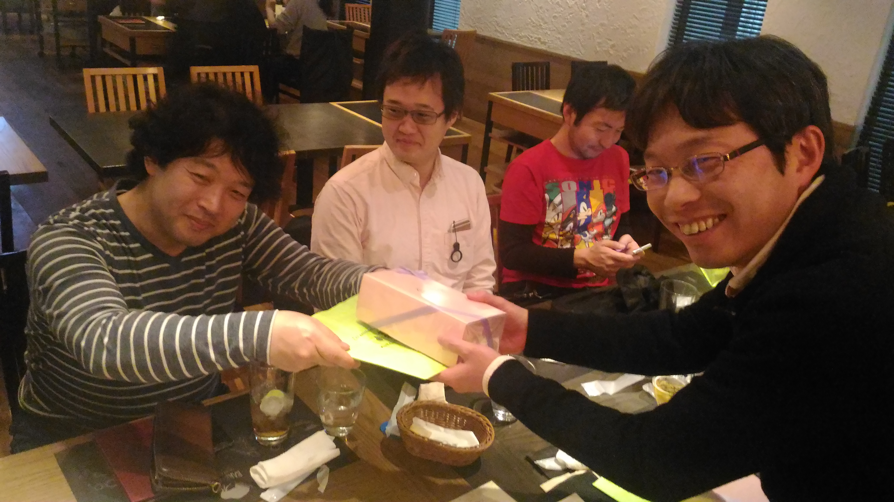

:date: 2017-03-01 23:40
:categories: ['Sphinx', 'SoftwareDesign']
:body type: text/x-rst

============================================================
2017/03/01 SoftwareDesign誌 Sphinx連載完了打ち上げ #sphinxjp
============================================================

`SoftwareDesign 2015年4月号`_ から、 **Sphinxで始めるドキュメント作成術** という連載を行っていました。

* `Software Design 2015年4月号:【1】テキストファイルからHTML，PDF，EPUBドキュメントを作れるツール(川本 安武) <http://gihyo.jp/magazine/SD/archive/2015/201504>`__
* `Software Design 2015年5月号:【2】議事録を書こう（前編）reSTの書き方，HTML変換の基本(川本 安武) <http://gihyo.jp/magazine/SD/archive/2015/201505>`__
* `Software Design 2015年6月号:【3】議事録を書こう（後編）複数のreSTに関連性を持たせる(川本 安武) <http://gihyo.jp/magazine/SD/archive/2015/201506>`__
* `Software Design 2015年7月号:【4】テーブルを使いこなそう(清水川 貴之) <http://gihyo.jp/magazine/SD/archive/2015/201507>`__
* `Software Design 2015年8月号:【5】目次，用語集，索引を付けよう-大きめのドキュメントを読みやすくするために(本文:川本 安武，短信:清水川 貴之) <http://gihyo.jp/magazine/SD/archive/2015/201508>`__
* `Software Design 2015年9月号:【6】Webサイトを作ろう（前編）(本文:山田 剛，短信:清水川 貴之) <http://gihyo.jp/magazine/SD/archive/2015/201509>`__
* `Software Design 2015年10月号:【7】Webサイトを作ろう（後編）(本文:山田 剛，短信:清水川 貴之) <http://gihyo.jp/magazine/SD/archive/2015/201510>`__
* `Software Design 2015年11月号:【8】HTMLテーマをカスタマイズしてみよう-ドキュメントの見た目を変える(本文:熊谷 章治，短信:清水川 貴之) <http://gihyo.jp/magazine/SD/archive/2015/201511>`__
* `Software Design 2015年12月号:【9】ドキュメントに図を入れよう-さまざまなグラフィックツールとの連携(本文:小宮 健，短信:清水川 貴之) <http://gihyo.jp/magazine/SD/archive/2015/201512>`__
* `Software Design 2016年1月号:【10】ドキュメントに図を入れよう-テキストマークアップから図を生成する(本文:小宮 健，短信:清水川 貴之) <http://gihyo.jp/magazine/SD/archive/2015/201601>`__
* `Software Design 2016年2月号:【11】HTMLドキュメントを検索しよう(本文:打田 智子，短信:清水川 貴之) <http://gihyo.jp/magazine/SD/archive/2015/201602>`__
* `Software Design 2016年3月号:【12】Sphinxで本を書こう-EPUBで出力する(本文:若山 史郎，短信:清水川 貴之) <http://gihyo.jp/magazine/SD/archive/2015/201603>`__
* `Software Design 2016年4月号:【13】MarkdownではじめるSphinx(清水川 貴之) <http://gihyo.jp/magazine/SD/archive/2016/201604>`__
* `Software Design 2016年5月号:【14】Sphinxで楽々ドキュメント翻訳(清水川 貴之) <http://gihyo.jp/magazine/SD/archive/2016/201605>`__
* `Software Design 2016年6月号:【15】ドキュメント翻訳フローの自動化(清水川 貴之) <http://gihyo.jp/magazine/SD/archive/2016/201606>`__
* `Software Design 2016年7月号:【16】Sphinxで運用ドキュメントを作る(波田野 裕一) <http://gihyo.jp/magazine/SD/archive/2016/201607>`__
* `Software Design 2016年8月号:【17】ドキュメントの種類に応じた表現ができる「Sphinxドメイン」(川本 安武) <http://gihyo.jp/magazine/SD/archive/2016/201608>`__
* `Software Design 2016年9月号:【18】ドキュメントを自動生成するautodoc(清水川 貴之) <http://gihyo.jp/magazine/SD/archive/2016/201609>`__
* `Software Design 2016年10月号:【19】Web APIドキュメントを書こう(小宮 健) <http://gihyo.jp/magazine/SD/archive/2016/201610>`__
* `Software Design 2016年11月号:【20】Sphinx環境ひとめぐり-エディタ，ビルド，バージョン管理，公開(安宅 洋輔) <http://gihyo.jp/magazine/SD/archive/2016/201611>`__
* `Software Design 2016年12月号:【21】PDFを出力しよう(山田 剛，小宮 健) <http://gihyo.jp/magazine/SD/archive/2016/201612>`__
* `Software Design 2017年1月号:【22】Sphinxで本を書こう(清水川 貴之) <http://gihyo.jp/magazine/SD/archive/2017/201701>`__
* `Software Design 2017年2月号:【23】Sphinx拡張の作り方(小宮 健) <http://gihyo.jp/magazine/SD/archive/2017/201702>`__
* `Software Design 2017年3月号:【24】ゲームで学ぶドキュメント設計(渋川 よしき) <http://gihyo.jp/magazine/SD/archive/2017/201703>`__

`2017年3月号`_ で24回目を迎えて、ついに終了したので、今日は執筆者陣で打ち上げです。

最終回の第24回目は、 `@shibu_jp`_ による「ゲームで学ぶドキュメント設計」。本人曰く、「怪文書」だそうです。

.. raw:: html

   <blockquote class="twitter-tweet" data-lang="ja">
SoftwareDesignの連載「Sphinxで始めるドキュメント作成術」も24回目にしてついに最終回、です！ 今回は <a href="https://twitter.com/shibu_jp">@shibu_jp</a> による、「ゲームで学ぶドキュメント設計」です。 <a href="https://twitter.com/hashtag/sphinxjp?src=hash">#sphinxjp</a> <a href="https://t.co/vnESQJZcwR">pic.twitter.com/vnESQJZcwR</a>
&mdash; Takayuki Shimizukawa (@shimizukawa) <a href="https://twitter.com/shimizukawa/status/832559337633505280">2017年2月17日</a></blockquote>
   

.. _SoftwareDesign 2015年4月号: http://gihyo.jp/magazine/SD/archive/2015/201504
.. _2017年3月号: http://gihyo.jp/magazine/SD/archive/2017/201703

今日の打ち上げは、 `バルバッコア新宿三丁目店`_ で、無限肉です。

.. _バルバッコア新宿三丁目店: http://barbacoa.jp/

.. raw:: html

   <blockquote class="twitter-tweet" data-lang="ja">
にくー (@ バルバッコア・グリル 新宿 in 新宿区, 東京都 w/ <a href="https://twitter.com/tk0miya">@tk0miya</a>) <a href="https://t.co/0cv1E9ltT0">https://t.co/0cv1E9ltT0</a> <a href="https://t.co/FO4TDQVGva">pic.twitter.com/FO4TDQVGva</a>
&mdash; Takayuki Shimizukawa (@shimizukawa) <a href="https://twitter.com/shimizukawa/status/836913707498287105">2017年3月1日</a></blockquote>
   

打ち上げに集まった全員で記念写真。技術評論社の吉岡さん(`@tyoshi99`_)、執筆したみなさん(`@shibu_jp`_ `@kk_Ataka`_ `@usaturn`_ `@shkumagai`_ `@moco_beta`_ `@togakushi`_ `@tk0miya`_ `@shimizukawa`_  (`@r_rudi`_, `@tcsh`_))、お疲れ様でしたー

.. _@tyoshi99:    https://twitter.com/tyoshi99
.. _@shibu_jp:    https://twitter.com/shibu_jp
.. _@kk_Ataka:    https://twitter.com/kk_Ataka
.. _@usaturn:     https://twitter.com/usaturn
.. _@shkumagai:   https://twitter.com/shkumagai
.. _@moco_beta:   https://twitter.com/moco_beta
.. _@togakushi:   https://twitter.com/togakushi
.. _@tk0miya:     https://twitter.com/tk0miya
.. _@shimizukawa: https://twitter.com/shimizukawa
.. _@r_rudi:      https://twitter.com/r_rudi
.. _@tcsh:        https://twitter.com/tcsh

.. raw:: html

   <blockquote class="twitter-tweet" data-lang="ja">
SD Sphinx連載執筆お疲れ！ <a href="https://twitter.com/tyoshi99">@tyoshi99</a> <a href="https://twitter.com/shibu_jp">@shibu_jp</a> <a href="https://twitter.com/kk_Ataka">@kk_Ataka</a> <a href="https://twitter.com/usaturn">@usaturn</a> <a href="https://twitter.com/shkumagai">@shkumagai</a> <a href="https://twitter.com/moco_beta">@moco_beta</a> <a href="https://twitter.com/togakushi">@togakushi</a> <a href="https://twitter.com/tk0miya">@tk0miya</a> <a href="https://twitter.com/shimizukawa">@shimizukawa</a> (<a href="https://twitter.com/r_rudi">@r_rudi</a>, <a href="https://twitter.com/tcsh">@tcsh</a>) <a href="https://t.co/elFdS9LWUR">pic.twitter.com/elFdS9LWUR</a>
&mdash; Takayuki Shimizukawa (@shimizukawa) <a href="https://twitter.com/shimizukawa/status/836931305954664451">2017年3月1日</a></blockquote>
   

最後に吉岡さんから、24回休載なしで完走した記念に焼き菓子を頂きました。
ありがとうございます！

   吉岡さんから、完走記念に洋菓子もらった！

