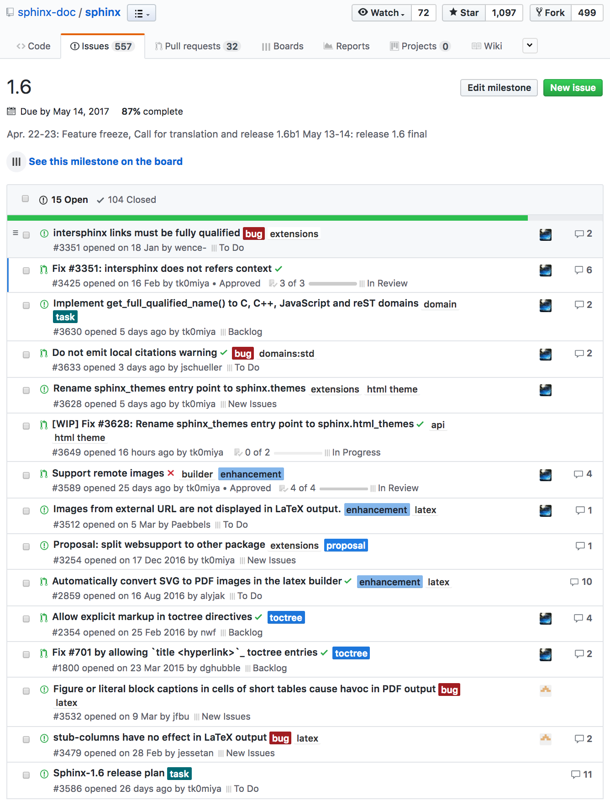

:date: 2017-04-21 18:45
:categories: ['Sphinx']
:body type: text/x-rst

===================================================================
2017/04/20 Sphinx-1.6リリースに向けた開発hack-a-thon day2 #sphinxjp
===================================================================

Sphinx-1.6b1 のリリースに向けた開発作業をやってきました。
昨日の続きです。
:doc:`../sphinx-dev-20170419/index` 

今日の開発hack-a-thonに参加したのは @tk0miya, @usaturn, @shimizukawa です。
Sphinx-users.jp の会長、(元)副会長、会計。

お腹がすいたので、ルノアール飯田橋西口店に寄ってカロリー摂取。

最初は1人でお店に入ったけれど、後から@usaturnが合流して、さらに@tk0miyaも合流。結局みんなで肉食べてからルノアールへ移動しました。Sphinx開発メンバーは肉をごちそうしてくれる方を募集してます！

.. raw:: html

   <blockquote class="twitter-tweet" data-lang="ja">
はー、Sphinxおいしいわー (@ くいしんぼ 飯田橋店 in 千代田区, 東京都) <a href="https://t.co/6IRKf4iVhr">https://t.co/6IRKf4iVhr</a> <a href="https://t.co/gtmQCQT6jW">pic.twitter.com/gtmQCQT6jW</a>
&mdash; Takayuki Shimizukawa (@shimizukawa) <a href="https://twitter.com/shimizukawa/status/855009941538697216">2017年4月20日</a></blockquote>
   

   <blockquote class="twitter-tweet" data-lang="ja">
<a href="https://twitter.com/hashtag/sphinxjp?src=hash">#sphinxjp</a> 執筆活動の為の燃料補給 <a href="https://t.co/JITzHxwsjX">https://t.co/JITzHxwsjX</a>
&mdash; うさたーん (@usaturn) <a href="https://twitter.com/usaturn/status/855009941051940864">2017年4月20日</a></blockquote>
   

   <blockquote class="twitter-tweet" data-lang="ja">
ハッカソンだよ！ (@ くいしんぼ 飯田橋店 in 千代田区, 東京都 w/ <a href="https://twitter.com/shimizukawa">@shimizukawa</a>) <a href="https://t.co/0xDxK0DsP4">https://t.co/0xDxK0DsP4</a> <a href="https://t.co/h6WG4KdwE0">pic.twitter.com/h6WG4KdwE0</a>
&mdash; tk0miya (@tk0miya) <a href="https://twitter.com/tk0miya/status/855017139111170049">2017年4月20日</a></blockquote>
   

食後にルノーアルに移動して、20時半〜22時頃まで、いろいろがんばりました。Sphinx-1.6b1が近い！

   Sphinx-1.6b1 まで、あと15チケット(87% 完了)

