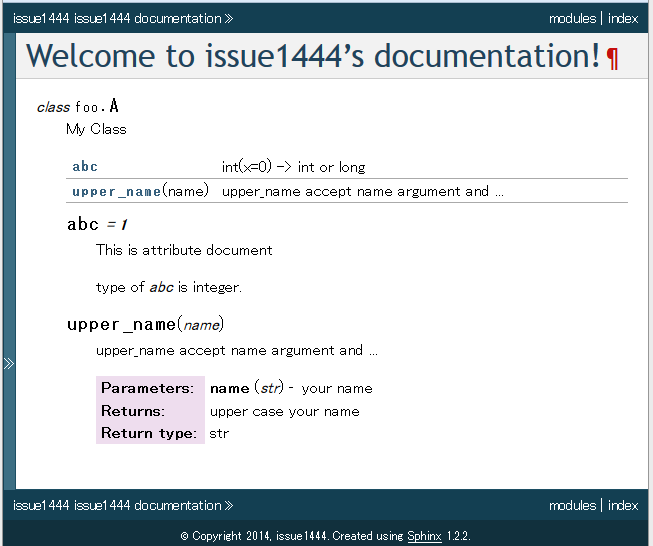
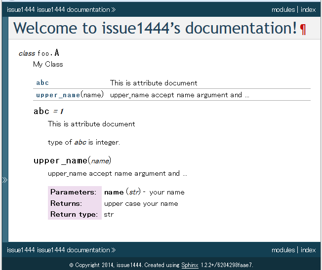

:date: 2014-4-12 15:00
:tags: Python, Sphinx
:body type: text/x-rst

=========================================================================================
2014/04/12 Sphinxメンテナ日記: autosummaryがattributeコメントを無視する問題(Issue #1444)
=========================================================================================

前置き: このエントリを読むと、あなたの知らないSphinxの機能を使えるようになるかもしれません。ならないかもしれません。前置きおわり。

autodocとautosummaryとで属性ドキュメントの内容が違う
==========================================================

元ネタ: `Issue #1444`_

autodocとautosummaryはPythonコードから自動的にドキュメントを作る機能で、Sphinxの :mod:`sphinx.ext.autodoc` と :mod:`sphinx.ext.autosummary` で使い方が紹介されています。

例えば、こういうPythonコードがあるとします。

.. literalinclude:: foo.py
   :language: python

コードそのものにあまり意味はありませんが、docstringなどを使って関数やクラス属性にドキュメントが書いてあります。
これをSphinxドキュメントに取り込むために以下のようにreSTを書きます。

.. literalinclude:: index_sample.txt
   :language: rst

この中で、 :rst:dir:`py:module` は :ref:`domains` が提供するディレクティブです。
:rst:dir:`autoclass` は :mod:`sphinx.ext.autodoc` 拡張が提供するディレクティブです。
:rst:dir:`autosummary` は :mod:`sphinx.ext.autodoc` 拡張が提供するディレクティブです。

conf.pyでは ``autosummary_generate = True`` を忘れないようにします。

.. literalinclude:: conf.py
   :language: python

これで :command:`make html` でビルドすると以下のようなHTMLが生成されます。

   ``abc`` の説明がautosummaryでは ``help(int)`` の説明になっている。

上記のように、期待とはちょっと違う結果が表示されます。intの説明はいらないので、そのint値の意味をサマリーに表示して欲しいですね。

この問題を修正したあとでは以下のように表示されます。

   ``abc`` の説明がautodocと同じ、 ``This is a ...`` という説明になっている。

問題を再現するSphinxプロジェクトは `Issue #1444`_ に添付してある issue1444.zip から入手できます。

問題の原因は？
=================

Pythonは関数のドキュメントをdocstringとして書くことが出来ますが、属性値のドキュメントを書く機能はありません。
そこで、autodocではPythonコードを解析して以下のようにドキュメントを書いたら認識するようになっています。

.. code-block:: python

   class Foo:
       """Fooのクラスドキュメント"""

       #: クラス属性Foo.barのドキュメントコメントです。
       #: 複数行書くことが出来ます。
       bar = 1

       flox = 1.5   #: Foo.floxのドキュメントコメントです。この書き方は1行のみ

       baz = 2
       """Foo.baz のdocstringです。"""

       def __init__(self):
           #: インスタンス.qux のドキュメントコメントです。
           self.qux = 3

           self.spam = 4
           """インスタンス.spam のdocstringです。"""

Python標準の機能では ``"""Fooのクラスドキュメント"""`` 以外は認識されないため、autodocでがんばって解析しているわけですが、autosummaryの方では「がんばって解析する」部分が省略されていました。

どうやって対策したの？
===========================

autodocの実装と同じ機能を呼び出すように実装を追加しました。
差分は https://bitbucket.org/birkenfeld/sphinx/commits/7029194ff9b9 にありますが、
実装にかかった時間より、テストコードで動作を担保するほうが時間がかかりました。

まとめ
=======

このバグ修正はSphinx-1.2.3に含まれる予定です。

参考
=======

* `Issue #1444`_
* :mod:`sphinx.ext.autodoc`
* :mod:`sphinx.ext.autosummary`

.. _Issue #1444: https://bitbucket.org/birkenfeld/sphinx/issue/1444/autosummary-does-not-create-the

