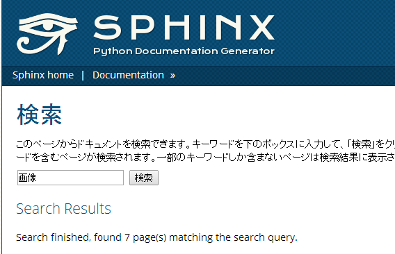

:date: 2014-3-21 18:00
:categories: ['Python', 'Sphinx']
:body type: text/x-rst

========================================================================================
2014/03/21 Sphinxメンテナ日記: JSで書き換えている文面が多言語化されない問題(Issue #1419)
========================================================================================

前置き: このエントリはSphinxの利用者にはまったく価値がないSphinxの内部実装などのネタを書くシリーズです。前置きおわり。

SphinxのHTMLで検索したとき ``Search Result`` って英語で表示される
==================================================================

元ネタ: `Issue #1419`_

  検索結果画面に英語が！

  (Search Results とか Search finished, ... とかは本当は日本語で表示して欲しい)

Sphinxの検索機能はJavaScriptで実装されていますが、検索ページなどJavaScriptでページ内を書き換えているところに、英語のまま文言が表示されてしまっています。こういった文字列はgettextを使って多言語化していますが、 `ja用のsphinx.po`_ ファイルにはちゃんとこれに対応した翻訳が書かれています。しかし、このpoファイルから作成されるJS用の翻訳カタログ `sphinx.js`_ にはメッセージが含まれていませんでした。

.. _sphinx.js: https://bitbucket.org/birkenfeld/sphinx/src/73418c5/sphinx/locale/ja/LC_MESSAGES/sphinx.js

どうやって sphinx.js を作るの？
=================================

そもそもsphinx.jsファイルはどうやって作るのかというと、 `Sphinxのsetup.py`_ にJSカタログ生成のためのコマンドが用意されています。 :command:`python setup.py compile_catalog` を実行すれば各国の言語poファイルからsphinx.jsファイルを生成してくれます。ただし、このコマンドはbabelがインストールしてある環境でのみ使えるようになっています。

Sphinxをインストールしただけではbabelはインストールされないので、別途pipなりなんなりでbabelをインストールする必要があります。私の環境の場合はbuildout.cfgに1行追加してbin/buidoutしました。

なぜsphinx.jsが正しく作られていないの？
==========================================

:command:`python setup.py compile_catalog` を実行しても適切な sphinx.js が生成されていないようです。 `Issue #1419`_ にも指摘がありますが、 `compile_catalog` でJS用にメッセージを抽出する部分で、 ``'.js'`` だけを対象にしていて、 ``'.js_t'`` (jinja2テンプレート化されたJS)と ``'.html'`` に含まれるJavaScriptのことを考慮していないのが原因でした。

いつからこの問題が発生していたのか？を調べてみることにしました。PyPIからバージョンのあたりを付けて調べてみたところ、1.0.8までは期待通りのsphinx.jsが生成されていましたが、1.1でsphinx.jsのファイルサイズが小さくなっていました。

sphinx.jsファイルはbitbucketにもコミットしてありますが、ファイルの履歴を追って問題の差分を見つけても、それがどのバージョンに含まれているのかを知るのが面倒だったので、PyPIからダウンロードして調べましたが、こういうのを調べるなにか良い方法ないですかね？

.. note::

   2014/3/22 追記:
   FUJIWARAさんからTwitterで教えてもらいました。ありがとうございます！

   `@flyingfoozy 22:17 - 2014年3月21日 <https://twitter.com/flyingfoozy/status/446999001724764160>`__

      @shimizukawa #mercurialjp 対象リビジョン特定(bisect等)後の話なら hg log -r "min(REV:: and tag())" （リリース対象＝タグ付きリビジョンと仮定）ですね > 「それがどのバージョンに含まれているのかを知る」

   なるほど？sphinx.jsのファイルサイズが激減した最初のコミットが ``080d33f``
   なので、そのリビジョンで実行してみます::

      $ hg log -r "min(080d33f:: and tag())"
      changeset:   3503:0a63129ab59b
      tag:         1.1
      user:        Georg Brandl <georg@python.org>
      date:        Sun Oct 09 23:25:40 2011 +0200
      summary:     Pre-release updates.

   おー、1.1だ！すごい！むずかしい！ｗ FUJIWARAさんありがとう！

Sphinx-1.1 から検索機能の多言語化が行われていたりして、その過程で、それまで.jsファイルだけを翻訳メッセージの抽出対象にしていればよかったのが、 ``.js_t`` ファイルや ``.html`` ファイルにも多言語化されたJavaScriptが含まれるようになり、それを `compile_catalog` で抽出対象にしわすれていたのが原因のようです。

修正差分
==============

はい
https://bitbucket.org/birkenfeld/sphinx/commits/4651955b4150#chg-setup.py

``string.endswith()`` ってシーケンスを渡せるんだぜ！

まとめ
===========

こういった「.jsファイルの多言語化は拡張子指定で抽出してるから.htmlや.js_tなど抽出対象の拡張子を増やしたらcompile_catalogでの指定を更新しないといけない」っていう情報はどうやって維持していったら良いんだろう？

そもそもそういう情報が無くても破綻しないように自動化する、という対策も、やりすぎると自動化の実装自体に手を取られてしまうし。

と思いつつ、特に対策しないことにしました。

参考
=======

* `Issue #1419`_

.. _Issue #1419: https://bitbucket.org/birkenfeld/sphinx/issue/1419/generated-i18n-sphinxjs-files-are-missing
.. _ja用のsphinx.po: https://bitbucket.org/birkenfeld/sphinx/src/73418c5/sphinx/locale/ja/LC_MESSAGES/sphinx.po#cl-723
.. _Sphinxのsetup.py: https://bitbucket.org/birkenfeld/sphinx/src/73418c5/setup.py#cl-68
