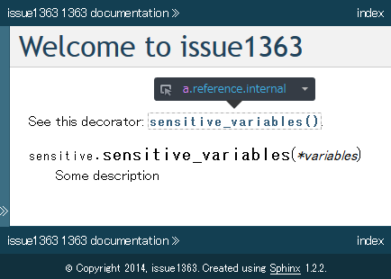
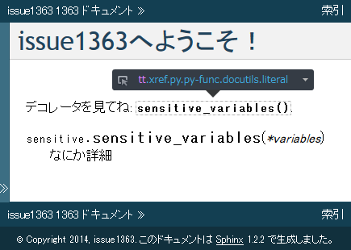
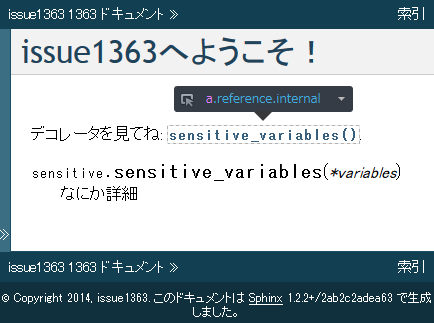

:date: 2014-3-29 14:00
:categories: ['Python', 'Sphinx']
:body type: text/x-rst

========================================================================
2014/3/29 Sphinxメンテナ日記: i18nで関数のリンク切れ問題(Issue #1363)
========================================================================

*Category: 'Python', 'Sphinx'*

前置き: このエントリはSphinxの内部実装などのネタを書くシリーズです。主にバグ修正の内容を書きます。前置きおわり。


Sphinxのi18n機能で翻訳ドキュメントをビルドすると関数のリンクが切れる
=======================================================================

元ネタ: `Issue #1363`_



   ``language='en'`` でビルドすれば関数定義へリンクしている



   ``language='ja'`` とi18n翻訳の組み合わせで関数へのリンクが失われる


:ref:`Sphinxのi18n機能 <sphinx:intl>` を使うとドキュメントを翻訳できますが、Sphinx-1.2 - Sphinx-1.2.2 では、その機能の一部にバグがあって、特定の条件のときに ``:func:`some_func``` が関数定義にリンクされないという問題があります。

以下が、問題の再現するreSTソースです:

.. code-block:: rst

   Welcome to issue1363
   =====================

   .. currentmodule:: sensitive

   See this decorator: :func:`sensitive_variables`.

   .. function:: sensitive_variables(*variables)

      Some description

   .. currentmodule:: reporting


問題を再現するSphinxプロジェクトは `Issue #1363`_ に添付してある issue1363.zip から入手できます。


問題の原因は？
=================

そもそも、 :rst:dir:`py:currentmodule` を使わなくてもreSTは以下のように書けます。

.. code-block:: rst

   See this decorator: :func:`sensitive.sensitive_variables`.

   .. function:: sensitive.sensitive_variables(*variables)

      Some description


関数名の前にそれが所属するモジュール名もフルで書けばいいわけです。 :rst:dir:`py:currentmodule` は、何度も書くのが面倒な場合に省略して書くための機能を提供してるわけです。

で、i18n機能を使うと :rst:dir:`py:currentmodule` の存在を無視して、さらに通常のドキュメントビルドで最後に :rst:dir:`py:currentmodule` で設定した値を使ってしまうので、上記の例では ``reporting`` が使われ、 ``reporting.sensitive_variables`` という関数定義は当然見つからないので、リンク切れになってしまいました。i18n機能実装者の一人が  :rst:dir:`py:currentmodule` のことを知らなかったようです（俺や...！）。


なぜ py:currentmodule が無視されたの？
==========================================

翻訳機能のほとんどは `transforms.pyのLocaleクラス`_ で実装されており、翻訳ドキュメントビルドは以下の流れで行われます。


1. `make html` を実行する
2. rstソースが読み込まれてnode(内部形式)にparseされる
3. parseの最終段階で `docutilsのtransform`_ で:

   1. 翻訳対象nodeを対象として選び、
   2. 対象nodeの文字列をmsgidとして取り出し、
   3. msgidを使ってpoから翻訳済み文字列を取得して
   4. 翻訳済み文字列を改めてparseして翻訳済みnodeを生成し、
   5. 翻訳対象nodeと差し替える

4. parse済みのnode群をキャッシュとして .doctrees に保存
5. builderが.doctreesをロードしてwriterでHTML形式で書き出す
6. builderがstatic htmlや画像、HTMLテーマのなどのファイルをコピー

今回問題になったのは、3.1. **翻訳対象nodeを対象として選び** という部分と、3.4.の **翻訳済み文字列を改めてparseして翻訳済みnodeを生成し** という部分です。

翻訳対象ノードは `sphinx.util.node.extract_message`_ で選ばれていますが、簡略化して条件を列挙すると以下のものが選ばれるようになっています。

* docutils.nodes.TextElement のインスタンス
* ただし次のインスタンスではない: nodes.Invisible, nodes.Inline, nodes.literal_block, nodes.doctest_block
* source属性にソースファイルパスが格納されている(builtinノードの排除)

この条件によって、directiveなどを除いて、一般的な文章のみが翻訳対象となるようにしています。ついでにリテラルを対象外にしているため、ソースコードの引用などが翻訳出来ないようになっています。引用ソースやその中のコメントなどが翻訳出来ないのは困る場合もありますが、いまのところ仕様です。

翻訳対象に選ばれたノードのうち、poファイルから翻訳文字列を取得出来たものについては、その文字列だけで1つのドキュメントとしてreSTのparseを行います。例に使用しているソースで言うと、 ``See this decorator: :func:`sensitive.sensitive_variables`.`` の翻訳文字列 ``デコレータを見てね: :func:`sensitive_variables`.`` を1つのreSTファイルと見なしてparseします。このため、このparseの時点で **.. currentmodule:: sensitive という指定が前の行にある、という情報が失われます** 。

これで、翻訳済みnodeがリンク先を見失う準備が整いました。

どうやって対策したの？
===========================

この問題は、前の行に特別なdirectiveを置くとparseした結果のnodeの状態が変わる、という仕組みに起因しています。実はSphinx内でけっこう多く使われている仕組みです。例えば、セクションの前にラベルを置くとセクションノードに参照用のIDが設定される、とかもそのうちのひとつです。しかしセクションとラベルの組み合わせでは、問題があることに気づいていたので、そのようなnodeの属性について、翻訳前nodeから属性値を取得して翻訳後nodeにも付ける、といった方法で問題が起こらないように対策しています。具体的には、 'ids' 属性などの調整するべき属性を調べて、コピーしています。ホワイトリスト方式ですね。

ところが今回はホワイトリスト方式は使えませんでした。参照を扱うノードについては `reftarget` という属性をホワイトリスト方式でコピーしていたのですが、前述の :rst:dir:`py:currentmodule` ディレクティブではそれ以外にも ``py:module``, ``py:class``, ``refspecific`` という3つの属性を追加設定していました。この追加設定は :ref:`sphinx:domains` のPythonドメインで行われており、どの属性を対象とすればよいかは拡張ドメインの実装に依存します。このため、Sphinx同梱のドメインについてはホワイトリスト化することができますが、Sphinx同梱でない拡張ドメインなどを使用した場合には事前にホワイトリストを作ることは出来ません。


ということで、今回はホワイトリスト方式がだめだったので、ブラックリスト方式で実装しました。
その修正差分がこれです: https://bitbucket.org/birkenfeld/sphinx/commits/2ab2c2adea63


.. code-block:: diff

        for old in old_refs:
            key = get_ref_key(old)
            if key:
   -            xref_reftarget_map[key] = old["reftarget"]
   +            xref_reftarget_map[key] = old.attributes
        for new in new_refs:
            key = get_ref_key(new)
   -        if key in xref_reftarget_map:
   -            new['reftarget'] = xref_reftarget_map[key]
   +        # Copy attributes to keep original node behavior. Especially
   +        # copying 'reftarget', 'py:module', 'py:class' are needed.
   +        for k, v in xref_reftarget_map.get(key, {}).items():
   +            # Note: This implementation overwrite all attributes.
   +            # if some attributes `k` should not be overwritten,
   +            # you should provide exclude list as:
   +            # `if k not in EXCLUDE_LIST: new[k] = v`
   +            new[k] = v


コメントがたくさん埋まってますが、これは、テストした範囲ではコピーしてはいけない属性値がなかったので、ブラックリストを実装していないためです。次に実装する人のためにコメント多め。

これで、バグが直りました！



   ``language='ja'`` でビルドしてもリンクされている


まとめ
=======

このバグ修正はSphinx-1.2.3に含まれる予定です。

ちなみに、この変更で :rst:dir:`py:currentmodule` だけでなく :rst:dir:`py:currentclass` の挙動も修正されます。Python以外の他のドメインでも同じような実装があれば修正されていると思います。

i18n対応の実装は、こんな感じで個別対応がたくさんあるので、メンテナンスがなかなか大変なことになっています。Sphinx-1.3リリース後くらいに実装の見直しをしたほうが良い気がするなあ・・。


参考
=======

* `Issue #1363`_
* `transforms.pyのLocaleクラス`_
* `docutilsのtransform`_
* `sphinx.util.node.extract_message`_

.. _Issue #1363: https://bitbucket.org/birkenfeld/sphinx/issue/1363/cross-references-issue-when-translating
.. _transforms.pyのLocaleクラス: https://bitbucket.org/birkenfeld/sphinx/src/96a18ae/sphinx/transforms.py#cl-155
.. _docutilsのtransform: http://docutils.sourceforge.net/docs/ref/transforms.html
.. _sphinx.util.node.extract_message: https://bitbucket.org/birkenfeld/sphinx/src/96a18ae/sphinx/util/nodes.py#cl-44

