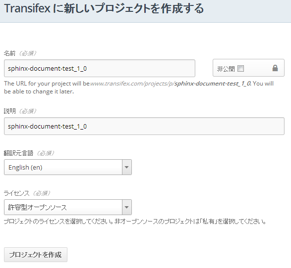
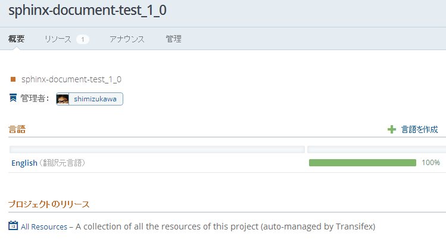
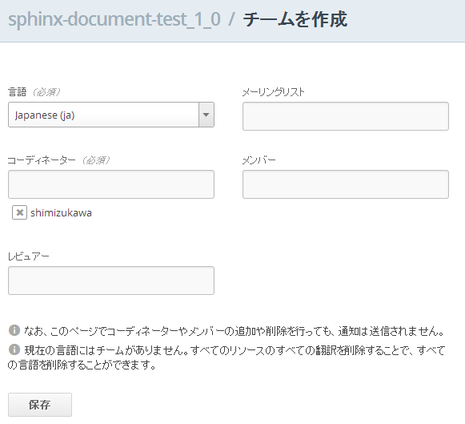
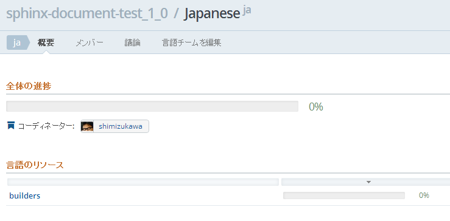

:date: 2013-03-31 13:00
:tags: Sphinx, i18n, translation, transifex, amazon-s3

==================================================================================
2013/03/31 Sphinxのi18n機能を使った翻訳手順(with transifex, amazon-s3)
==================================================================================

Sphinx 1.2 のドキュメントをSphinxの :ref:`sphinx:intl` 機能を使って翻訳するプロジェクトを進めています。Sphinx 1.1では国際化機能に多くの問題があったのですが、1.2でだいぶ解消されたため、Sphinxドキュメント自体を対象に翻訳サイクルを回して、Sphinx本家の手順として採用しようと考えています。

その、Sphinxを使った翻訳サイクルについてまとめたのがこのblogエントリです。

このエントリで扱う環境は以下の前提とします。

:OS: Ubuntu 12.04 x64
:Python: 2.7推奨 (2.5以降必須)
:hg: 大体どれでもOK
:pip: 1.2以降
:sphinx: 1.2 (2013/3/31時点のリポジトリ最新版)
:翻訳対象: Sphinx 1.2 (同上)
:その他: 各コマンドはvirtualenv環境内とします

.. contents::
   :local:

Sphinxの最新版をインストール
=============================

翻訳の対象とするドキュメントと実行するSphinxは2013/3/31時点での最新版とします。
`SphinCon2013スライド: Sphinx 1.2 preview`_ で紹介しましたが、Sphinx 1.1までで翻訳の対象となっていなかった以下の項目が翻訳可能となったためです。

* 画像(figure)のキャプション
* 脚注(footnote)のcite
* 用語定義(definition)の用語
* 用語集(glossary)の用語
* 索引(index)の用語
* 翻訳文章中のリンクが壊れる問題
* docfield, versionadd系

以下の手順でsphinxの最新版をインストールします。

.. code-block:: bash

   $ export BASEDIR=/path/to
   $ cd $BASEDIR
   $ hg clone https://bitbucket.org/birkenfeld/sphinx
   $ pip install ./sphinx

Sphinxドキュメントからpotファイルを生成
=========================================

この例では ``conf.py`` に :confval:`sphinx:gettext_compact` が `False` に設定されている前提とします(Sphinx-1.2のドキュメントでは設定されています)。

.. code-block:: python

   gettext_compact = False

設定が無い状態(デフォルト=True)のままだとサブディレクトリ以下のドキュメントが全て1つのファイルに結合されてしまうため ``False`` に変更しています。ディレクトリ構造が維持された方がpoファイルを直接編集する場合や、元のrstファイルや実際のページを見ながら翻訳する時にやりやすいためです。

.. code-block:: bash

   $ cd $BASEDIR/sphinx/doc
   $ make gettext
   ...

これでpotファイルが ``_build/locale`` 以下に生成されます。
``locale/pot/`` にコピーしておきましょう。

.. code-block:: bash

   $ mkdir locale
   $ cp -R _build/locale locale/pot/

potファイルからpoファイルを作成
=================================

potファイルは全て ``locale/pot/`` ディレクトリにありますが、Sphinxでは翻訳ファイルは ``locale/ja/LC_MESSAGES/`` 以下に置く決まりになっています。

.. code-block:: bash

   $ cd $BASEDIR/sphinx/doc/locale
   $ mkdir -p ja/LC_MESSAGES
   $ cp -R pot/* ja/LC_MESSAGES

あとは LC_MESSAGES 以下の全ファイルの拡張子をpotからpoに変更してください。shellを駆使すれば簡単にできそうですね。

*#自分はPythonでやりました。後述するtransifexを使う場合は不要です。*

poファイルを翻訳
==================

``$BASEDIR/sphinx/doc/locale/ja/LC_MESSAGES`` 以下のpoファイルを翻訳します。
例えば、builders.poファイルの場合、以下のように翻訳していきます。

.. code-block:: po

   # a5600c3d2e3d48fc8c261ea0284db79b
   #: ../../builders.rst:4
   msgid "Available builders"
   msgstr ""

msgstrの部分にmsgidの内容を翻訳して以下のように書きます。

.. code-block:: po

   # a5600c3d2e3d48fc8c261ea0284db79b
   #: ../../builders.rst:4
   msgid "Available builders"
   msgstr "利用可能なビルダー"

複数行にまたがる場合は以下のように書いて下さい。

.. code-block:: po

   # 302558364e1d41c69b3277277e34b184
   #: ../../builders.rst:9
   msgid ""
   "These are the built-in Sphinx builders.  More builders can be added by "
   ":ref:`extensions <extensions>`."
   msgstr ""
   "このドキュメントにあるのが組み込みのSphinxのビルダーです。"
   "また、 :ref:`拡張 <extensions>` の仕組みを使うと、ビルダーを追加する"
   "こともできます。"

この例ではSphinxのreStructuredText(reST)の記法も翻訳文内に含まれています。
この部分はreSTの記法を崩さないように転記するように注意して下さい。

poファイルからmoファイルを作成
===============================

環境にgettextをインストールしてmsgfmtコマンドを使えるようにしましょう。

.. code-block:: bash

   $ aptitude install gettext

.. code-block:: bash

   $ cd $BASEDIR/sphinx/doc/locale/ja/LC_MESSAGES
   $ msgfmt builders.po -o builders.mo

これを各poファイルについて実行します。

面倒なのでtxutilを使う方法を紹介します。

txutil はsphinxと後述するtransifexに特化した簡単なサポートツールです。使い慣れた他のツールを使って行っても構いません。

.. code-block:: bash

   $ cd $BASEDIR
   $ hg clone https://bitbucket.org/shimizukawa/sphinx-transifex
   $ pip install ./sphinx-transifex

これでtxutilコマンドが使えるようになりました。

.. code-block:: bash

   $ cd $BASEDIR/sphinx/doc
   $ txutil --locale-dirs=locale build-mo

これで各poファイルがmoファイルにコンパイルされます。

翻訳を適用したHTMLを生成
=========================

``conf.py`` で :confval:`sphinx:locale_dirs` を設定されているか確認してください。この設定で翻訳データが格納されているmoファイルの場所をSphinxに教えます(Sphinx-1.2のドキュメントでは設定されています)。

.. code-block:: python

   locale_dirs = ['locale/']

また、 :confval:`sphinx:language` の設定も追加します。この設定値で、Sphinxにどの言語の翻訳カタログを使用するべきかを教えます。

準備が出来ました。HTMLのビルドを言語指定して行います。

.. code-block:: bash

   $ cd $BASEDIR/sphinx/doc
   $ make -e SPHINXOPTS="-D language='ja'" html

これで ``_build/html`` に翻訳済みHTMLが出力されました。おめでとうございます！
あとは、翻訳とビルドを繰り返して、翻訳を完成させて下さい。

.. tip::

   SphinxはreSTファイルの変更を検知して :command:`make html` 実行時に対象
   ページを際ビルドします。しかしmoファイルが更新された場合にはその変更を
   検知しないため、再ビルド時に対象のページがビルドされません。

   そのような場合には :command:`make clean && make html` を実行するといった
   方法で回避して下さい。

potの更新をpoに反映する
========================

ドキュメントが更新されると、改めてpotファイルの生成を行って翻訳済みのpoファイルに差分を適用していきたくなります。しかしpotファイルの更新差分を確認してpoファイルに適用していくのを手動で行うのは大変な作業です。

gettextに付属の msgmerge_ コマンドや i18ndude_ といったツールを使って差分を適用することが出来ます。

.. code-block:: bash

   $ msgmerge -U locale/pot/builders.pot locale/ja/LC_MESSAGES/builders.po
   ........... done.

あるいは、後述する Transifex_ サービス等を使えば、ローカルで差分適用等行う必要は無くなりますが、サービス依存になってしまうので、どちらが良いかは状況に応じて使い分けるのが良いでしょう。

生成したHTMLを公開サーバーにアップロード
=========================================

外部サービスを使ったHTMLファイルの公開方法はいくつか `Sphinxで作ったドキュメントのホスティング :: ドキュメンテーションツール スフィンクス Sphinx-users.jp`_ で紹介しています。

ここでは `Amazon Simple Storage Service（Amazon S3）`_ を使って公開する方法を概要だけ紹介します。s3のアカウント、bucket作成、 ``Access Key Id`` と ``Secret Access Key`` は出来ているものとして話を進めます。

それぞれ以下の値だとして話を進めます。

:Access Key Id: <aws-access-key-id>
:Secret Access Key: <aws-secret-access-key>
:bucket: sphinx-doc.example.com

また、DNSの設定で http://sphinx-doc.example.com/ でbucketを閲覧できるように設定済みという前提で話を進めます。

s3のクライアントツールをインストール
-------------------------------------

とりあえず環境変数を設定します。

.. code-block:: bash

   $ export AWS_ACCESS_KEY_ID=<aws-access-key-id>
   $ export AWS_SECRET_ACCESS_KEY=<aws-secret-access-key>
   $ export PIP_USE_MIRRORS=true
   $ export PIP_EGG=true

boto_rsync をインストール。

.. code-block:: bash

   $ pip install boto_rsync

HTMLをs3に同期します。

.. code-block:: bash

   $ cd $BASEDIR/sphinx/doc
   $ boto-rsync --delete -g public-read _build/html s3://sphinx-doc.example.com/

簡単ですね。これで http://sphinx-doc.example.com/ で同期したHTMLを確認できます。 ``--delete`` オプションを付けているので、ローカルにないファイルはs3から自動的に削除されます。

.. note::

   s3での公開は簡単なのですが、お金の問題があるので注意して下さい。
   s3はデータの保持量と転送量とで費用が発生するモデルになっています。
   このため、例えば公開しているサイトに大量アクセスするスクリプト等で
   攻撃を受けるとあっというまに課金額が大変なことになってしまいます。
   `Amazon CloudFront`_ を併用したり等、うまく運用する方法があれば、
   ぜひ `@shimizukawa`_ まで教えて下さい。

potファイルをtransifexに登録
=============================

transifexにID登録
------------------

サイト上での翻訳で使うアカウントの他に、念のためコマンドから使う専用のID/PWを登録しておきましょう。API専用のトークン生成とかできるとうれしいなあ。

:Transifex UserName: <transifex-username>
:Transifex Password: <transifex-password>

transifexに翻訳プロジェクトを新規作成
--------------------------------------

現在のtransifexでは1つの翻訳プロジェクトがドキュメントの複数のバージョンを扱うことが出来ないため、ここではバージョン番号を付けてプロジェクトを作成します。

:Project ID: ``sphinx-document-test_1_0``
:URL: https://www.transifex.com/projects/p/sphinx-document-test_1_0/

   Transifex_ で新規のプロジェクトを作成する画面

transifexクライアントツールをインストール
------------------------------------------

transifex_client をインストール。

.. code-block:: bash

   $ pip install transifex_client

.. seealso:: http://help.transifex.com/features/client/index.html

設定ファイルを作成
-------------------

.. code-block:: bash

   $ tx init --user=<transifex-username> --pass=<transifex-password>
   Creating .tx folder...
   Transifex instance [https://www.transifex.com]:
   Creating skeleton...
   Creating config file...
   No authentication data found.
   No entry found for host https://www.transifex.com. Creating...
   Updating /home/ubuntu/.transifexrc file...
   Done.

途中 ``Transifex instance [https://www.transifex.com]:`` で入力待ちになりますが、そのままEnterキー押下で進めます。これでホームディレクトリに ``~/.transifexrc`` というIDとPASSWORDを設定したファイルが作成され、翻訳のための設定ファイルが現在のディレクトリに ``.tx/config`` として作成されます。

次に先ほど作成した ``sphinx-document-test_1_0`` プロジェクトの設定を行います。

.. code-block:: bash

   $ cd $BASEDIR/sphinx/doc
   $ tx set --auto-local -r sphinx-document-test_1_0.builders \
   "locale/<lang>/LC_MESSAGES/builders.po" --source-lang en \
   --source-file locale/pot/builders.pot --execute

これで ``.tx/config`` に以下のように定義が追加されます。

.. code-block:: ini

   [main]
   host = https://www.transifex.com

   [sphinx-document-test_1_0.builders]
   file_filter = locale/<lang>/LC_MESSAGES/builders.po
   source_file = locale/pot/builders.pot
   source_lang = en
   type = PO

先ほどのコマンドをpotファイルの数だけ行います。

面倒なのでtxutilを使います。

.. code-block:: bash

   $ cd $BASEDIR/sphinx/doc
   $ txutil update-txconfig-resources --locale-dirs=locale

``.tx/config`` にpotファイルを登録したら以下のコマンドでTransifexにリソース登録を実行します。

.. code-block:: bash

   $ cd $BASEDIR/sphinx/doc
   $ tx push -s
   Pushing translations for resource sphinx-document-test_1_0.builders:
   Pushing source file (locale/pot/builders.pot)
   Resource does not exist.  Creating...
   ...
   Done.

これでリソースが登録されました。

   Transifexに英語リソースを登録した状態

transifexで翻訳
================

翻訳するためには ``言語を作成`` する必要があります。

   Transifexに言語を追加する画面

言語を追加画面ですが、言語翻訳のためのチーム作成画面という扱いですね。
コーディネーターが必須なので自分のIDを設定しておいて下さい。
また、ここでは翻訳先言語として ``ja`` を選択しています。

翻訳チームが作成出来ると、自動的に英語リソースの翻訳用リソースが用意されます。

   Transifexの日本語リソース画面

あとはTransifexで翻訳を進めて下さい。

transifexから翻訳済みpoファイルを取得
======================================

.. code-block:: bash

   $ cd $BASEDIR/sphinx/doc
   $ tx pull -l ja
   Pulling translations for resource sphinx-document-test_1_0.builders (source: locale/pot/builders.pot)
    -> ja: locale/ja/LC_MESSAGES/builders.po
   ...
   Done.

これでTransifex上で翻訳したpoファイルがローカルディレクトリに取得出来ます。
なお、ローカルディレクトリに既にpoファイルがある場合は上書きされるので注意して下さい。

.. note::

   :command:`tx push -l ja` コマンドを使えばローカルにあるpoファイルで
   Transifex上の翻訳を上書き更新することができます。既に手元にpoファイルが
   ある場合は最初にpushコマンドでアップロードしておくと良いでしょう。

   ローカルでのpoファイルの更新と、Transifex上での翻訳を同時に行った場合、
   両方をうまく管理するのは難しくなります。このためTransifex上でのみ翻訳
   するようにして、ローカルではバージョン管理等しない方がよいと思います。

これで、Transifexで翻訳してローカル環境で翻訳したHTMLを生成し、s3で公開する手順が一通り揃いました。

poファイル取得からHTMLアップロードまで実行
===========================================

ここまでで、以下のサイクルでドキュメント更新と翻訳が行えるようになりました。

* reSTドキュメントの更新 -> :command:`make gettext` -> :command:`tx push -s`
* Transifexでの翻訳 -> :command:`tx pull -l ja` -> :command:`make html` -> :command:`boto-rsync`

ここまでの手順を整理します。txutilの、ここまでで紹介していないコマンドも使っています。

セットアップ
--------------

環境変数を設定して、諸々インストールします。

.. code-block:: bash

   cd $BASEDIR

   ########################################
   # setup environment values
   export PIP_USE_MIRRORS=true
   export PIP_EGG=true
   export AWS_ACCESS_KEY_ID=<aws-access-key-id>
   export AWS_SECRET_ACCESS_KEY=<aws-secret-access-key>
   export TXUTIL_TRANSIFEX_USERNAME=<transifex-username>
   export TXUTIL_TRANSIFEX_PASSWORD=<transifex-password>

   ########################################
   # install requirements
   hg clone https://bitbucket.org/shimizukawa/sphinx-transifex
   hg clone https://bitbucket.org/birkenfeld/sphinx
   pip install ./sphinx-transifex ./sphinx boto_rsync

``.tx/config`` と ``~/.transifexrc`` を作成します。

.. code-block:: bash

   $ cd $BASEDIR/sphinx/doc
   $ txutil create-transifexrc
   $ txutil create-txconfig

transifex上のpotファイルの更新
-------------------------------

.. code-block:: bash

   ########################################
   # make pot files and push to transifex
   cd $BASEDIR/sphinx/doc
   make gettext
   cp -R _build/locale locale/pot
   txutil update-txconfig-resources
   tx push -s

transifex上の翻訳を取得してビルドした翻訳HTMLをs3にアップロード
----------------------------------------------------------------

.. code-block:: bash

   ########################################
   # setup transifex file
   cd $BASEDIR/sphinx/doc
   tx pull -l ja
   txutil --locale-dirs=locale build-mo

   ########################################
   # make translated document
   make -e SPHINXOPTS="-D language='ja'" html

   ########################################
   # deploy to s3
   boto-rsync --delete -g public-read _build/html s3://sphinx-doc.example.com/

まとめ
========

Jenkins_ や TravisCI_, `drone.io`_ を使えば、これまでの手順を自動化して、ドキュメントや翻訳が更新されたら自動的に翻訳済みHTMLをs3にアップロードする、ということも出来るようになります。

また、Transifexは翻訳更新時に Web Hook で通知を行えるため、TravisCI, drone.io 等と連携できます。

翻訳をスムーズに行う環境がそろってきたので、英語ドキュメントを翻訳公開している方はぜひ試してみてください（もっと効率のよい方法を思いついたらぜひ教えて下さい）。

.. _`SphinCon2013スライド: Sphinx 1.2 preview`: http://shimizukawa.bitbucket.org/sphinx120-preview/index.html#id3
.. _`Sphinxで作ったドキュメントのホスティング :: ドキュメンテーションツール スフィンクス Sphinx-users.jp`: http://sphinx-users.jp/cookbook/hosting/index.html
.. _`Amazon CloudFront`: http://aws.amazon.com/jp/cloudfront/
.. _`@shimizukawa`: https://twitter.com/shimizukawa/
.. _Transifex: https://www.transifex.com/
.. _Jenkins: http://jenkins-ci.org/
.. _TravisCI: https://travis-ci.org/
.. _`drone.io`: https://drone.io/
.. _i18ndude: https://pypi.python.org/pypi/i18ndude/
.. _`Amazon Simple Storage Service（Amazon S3）`: http://aws.amazon.com/jp/s3/ 
.. _msgmerge: http://www.linuxcommand.org/man_pages/msgmerge1.html
