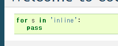

:date: 2012-08-20 23:30:00
:categories: ['python', 'sphinx', 'docutils']
:body type: text/x-rst

========================================================================
2012/08/20 SphinxでDocutils-0.9のインラインコードハイライトを試してみた
========================================================================

*'python', 'sphinx', 'docutils'*

先日の `Sphinx+翻訳 Hack-a-thon 2012.08 (2012/8/19)`_ ではほとんどPyConJP 2012の準備をしていたのですが、ちょっとだけ時間が取れたので、SphinxとDocutils-0.9の組み合わせでインラインコードハイライトを試してみました。

元ネタはこちらのsphinx-dev MLで出ていた `In line syntax highlighting?`_ という質問と回答から。

docutils-0.9から導入されたcodeディレクティブとcodeロール
===========================================================

通常Sphinxでコードハイライトを行う場合は ``code-block`` ディレクティブを使いますが、docutils-0.9でcodeディレクティブとcodeロールが追加されたので、Sphinxで使っているdocutilsを更新することで以下のように書けます。

まずはcodeディレクティブから。

codeディレクティブでコードハイライト
--------------------------------------

.. code-block:: rst

   .. code:: python
      :class: highlight

      for s in ['spam', 'egg']:
         print(s)

SphinxではHTMLエレメントに ``highlight`` クラスが無いと色づけが正しく反映されないため、class指定を行っています。

次にcodeロール。

codeロールでインラインコードハイライト
----------------------------------------

.. code-block:: rst

   this is :code:`for s in ['spam', 'egg']:` inline code.

残念ながら色づけが行われませんでした。ディレクティブと同様、 ``highlight`` クラスが必要なので、以下のようにcodeロールにclassオプションを指定します。

.. code-block:: rst

   .. role:: code(code)
      :class: highlight

   this is :code:`for s in ['spam', 'egg']:` inline code.

まだ言語判別がうまく働いていないため文字列が色分けされていません。そこで、以下のようにします。

.. code-block:: rst

   .. role:: ipy(code)
      :language: python
      :class: highlight

   this is :ipy:`for s in ['spam', 'egg']:` inline code.

これでインラインコードが綺麗にハイライトされるようになりました。

ちなみに、以下のようにconf.pyでipyを定義しておけばroleディレクティブで一々定義しなくても使えます。

.. code-block:: python

   ## append these code to conf.py

   from docutils.parsers.rst.roles import code_role

   def ipy_role(role, rawtext, text, lineno, inliner, options={}, content=[]):
       options['class'] = ['highlight']
       options['language'] = 'python'
       return code_role(
               role, rawtext, text, lineno, inliner,
               options=options, content=content)

   def setup(app):
       app.add_role('ipy', ipy_role)

.. _`Sphinx+翻訳 Hack-a-thon 2012.08 (2012/8/19)`: http://connpass.com/event/816/
.. _`In line syntax highlighting?`: https://groups.google.com/d/msg/sphinx-dev/-4Waaw9qQx4/jnXBjKuQKFMJ
