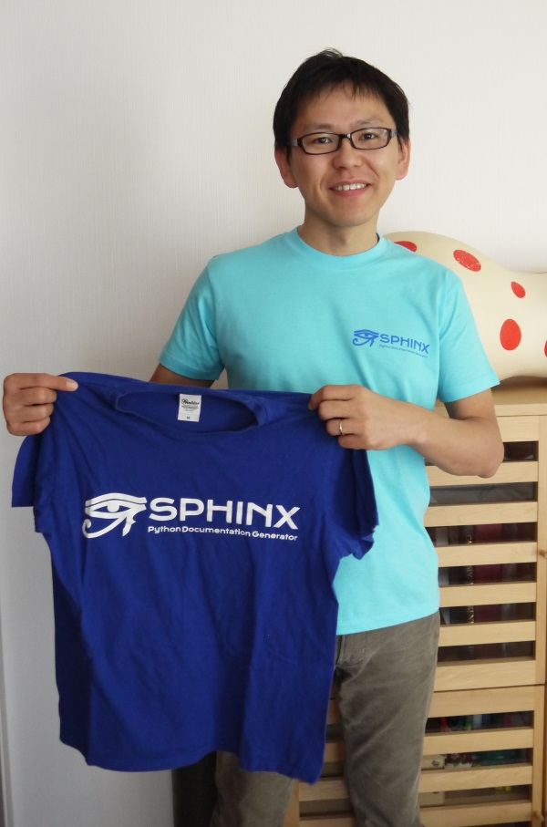

:date: 2014-10-25 12:00
:tags: Sphinx, SphinxCon
:body type: text/x-rst

=================================================================
2014/10/25 SphinxCon JP 2014 前日、イベント紹介します #sphinxjp
=================================================================

   SphinxCon JP 2014 明日 10/26(日)開催！

   * `SphinxCon JP 2014 参加登録`_
   * `SphinxCon JP 2014 タイムテーブル`_

SphinxCon JP 2014 を明日開催します！
朝10時からハンズオン、午後は14時から7つのプレゼンを予定しています。

`SphinxCon JP 2014 タイムテーブル`_

#. Welcome to Sphinx-1.3 (清水川)
#. SIerでもSphinxを使いたい！総括 (kk_Ataka)
#. SphinxとLaTeXで作る英文マニュアル (力武 健次)
#. Markdownもはじめよう (高橋征義)
#. Sphinx拡張 探訪 2014 (小宮 健 (@tk0miya))
#. 検索エンジンOktavia (渋川よしき)
#. Sphinx HTML Theme Hacks (shkumagai)

今回は「Sphinxをはじめよう」というテーマでイベントを開催しますが、Sphinxの初心者でなくても楽しめる、Sphinxを始めるときに気になる広い範囲の話題が聞けそうです。
私も、先日リリースされた `Sphinx-1.3b1`_ をベースに、 **Welcome to Sphinx-1.3** というタイトルでプレゼンします。

また、一日中ハッカソンを並行で行うので、まわりの人と色々話しながらSphinxしましょう。イベント終盤には会場のVOYAGE GROUPさんからの提供で、 **ビアバッシュしながらのLT大会** も実施します。LTは当日募集します。

ここ数日でキャンセル待ちだった参加者も全員参加できる状態になりました。もうちょっと減るのかな？興味のある方はキャンセル待ち登録してみてください。(※追記: 10/25 13:30現在、 **残席3** です)

`SphinxCon JP 2014 参加登録`_

おまけ
========

今回のイベントに合わせて、新しいSphinxTシャツを作りました。欲しい人を事前募集していたので、事前希望した方にイベントでお渡しする予定です。

   Sphinx Tシャツ 2014

   着てる方が2014年版。持ってる方が2013年版です。

原価900円前後。1000円で売って差額は Sphinx-users.jp に寄付します。

.. _SphinxCon JP 2014 参加登録: http://sphinxjp.connpass.com/event/8448/
.. _SphinxCon JP 2014 タイムテーブル: http://sphinx-users.jp/event/20141026_sphinxconjp/index.html#id4
.. _Sphinx-1.3b1: https://pypi.python.org/pypi/Sphinx/1.3b1

