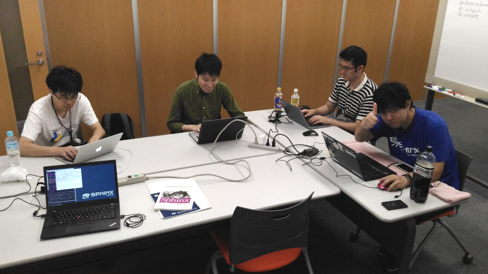

:date: 2017-07-29 17:00
:tags: Sphinx

=====================================================
Sphinx + 翻訳 hack-a-thon 2017.07 #sphinxjp
=====================================================

週末のこのイベントは、Sphinxか、ドキュメントや翻訳に関連していれば（していなくても？）なにをやっても良いイベントです。黙々とそれぞれが好きなことをやる、ゆるーい感じの会です。平日夜に開催している :doc:`Tea Night <../sphinxjp-tea-night-201707/index>`_ は、Sphinxネタでワイワイとお話するのが中心のイベントなので、それぞれ参加者層が微妙に違っていて面白い。今回は、先日のTea Nightに参加したdtzxさんがHack-a-thonにも参加したので、珍しく参加メンバーが似た感じになってます。

:イベント: `Sphinx+翻訳 hack-a-thon 2017.07`_
:参加者: @tk0miya(会長), @shimizukawa(会計), @usaturn, nskgch, @dtzx
:会場: タイムインターメディア社（曙橋）

.. _Sphinx+翻訳 hack-a-thon 2017.07: https://sphinxjp.connpass.com/event/62396/

.. raw:: html

   <blockquote class="twitter-tweet" data-lang="ja">
<a href="https://twitter.com/hashtag/sphinxjp?src=hash">#sphinxjp</a> + 翻訳 hack-a-thon 始まりました！いえーい！！ (@ タイムインターメディア in 新宿区, 東京都) <a href="https://t.co/D2UhiAZdDe">https://t.co/D2UhiAZdDe</a> <a href="https://t.co/RoGDTjsBo2">pic.twitter.com/RoGDTjsBo2</a>
&mdash; Takayuki Shimizukawa (@shimizukawa) <a href="https://twitter.com/shimizukawa/status/891155404343955457">2017年7月29日</a></blockquote>
   

上記の写真は、自分が30分遅れて会場に着いたときの状況。ゆるーいイベントだけど、これはだいぶ緩いね。

今回は、イベント運営者の予定がちょっとあって、17時までで終了。

ぼちぼち人も集まってきて自己紹介や、やることを話して、黙々タイムへ。

   Sphinx + 翻訳 Hack-a-thon 黙々タイム

みんながやったこと
=====================

- @tk0miya: sphinx本体のバグ対応をするか機能を追加するか、なにかそのあたりをやります。

  - 3つくらいバグを確認して、1つは直しました。
  - 最近メンテのペースを落としているので、

- dtzx(たかはし): 前回teanightに出た、reSTをそこで知ったので、今度はreSTを書いてみたい

  - reSTの記法を色々眺めて、だんだん分かってきた気がする
  - 自分メモとしてreSTをまとめて、そのうちQiitaなどに書きたい

- nskgch: 引き続き、Sphinxの公式ドキュメント翻訳をやります。

  - 翻訳をずっとやってました
  - Github が GitHub になったために翻訳が無効になってたのを再度修正して有効にしてました

- @usaturn: 普段はインフラエンジニアやってます。今日は某Sphinx本の執筆ができていないので、引き継ぎも含めてやります

  - 今日は、本のギブアップを宣言しました。他の人に手伝ってもらいつつ、またがんばります
  - やった範囲をPR出しました
  - 残りのタスクを分割してIssueにしました

- @shimizukawa: 最近Sphinxのメンテナ業をさぼって、本のレビューをしたり（エキPy2）、本の執筆をしたり（Sphinx）、本の翻訳をしたり（まだ内緒）してます。今日は、ちょっと翻訳してから、執筆をやります。

自分がやったこと
==================

* 本の執筆（Sphinx）

  * 自分担当分の残りをガッと終わらせよう

    * reSTのディレクティブの説明が14個
    * Sphinxのディレクティブの説明が12個
    * Sphinxのロールの説明が23個
    * ... ちょっと多いので、便利そうなものだけ取り上げます

  * 他のメンバーが忙しくて進んでいないようなので、手伝うことにした

* 本の翻訳（まだ内緒）

  * 27章あるうちの14章分の翻訳を終えた！ついに半分までキター！！

* 本のレビュー（エキPy）

  * 著者レビュー中。今日明日で2章くらいレビューしたい

* ちょっとSphinxコミッター

  * @tk0miya とautodocのリファクタリングについて相談（自分は主に相づちを打つ役）

    * 新しい実装を推し進めると、どうしても既存のDocumenterクラスのインターフェースと合わなくなってしまう
    * autodoc2を作ってSphinx2.0で入れ替えるのか
    * autodocの中身を徐々に入れ替えていくのか
    * どうやっても、autodocのDocumenterを拡張している人がいると破綻しそう
    * まずは理想とするコードを実装してから(autodoc2)、互換レイヤーを実装する(autodoc対応)のが良いのではないか

  * apidocの明示的な名前空間パッケージ利用が動作しない問題

    * https://sphinxjp.connpass.com/event/62396/
    * 以前名前空間パッケージ対応したときに、一部考慮が足りてなかった
    * もらったパッチのままだとまずそうなので、対応方法を検討
    * https://github.com/sphinx-doc/sphinx/pull/3966

写真とられてた！

.. raw:: html

   <blockquote class="twitter-tweet" data-lang="ja">
本日の Sphinx ハッカソンの様子です <a href="https://twitter.com/hashtag/sphinxjp?src=hash">#sphinxjp</a> <a href="https://t.co/G5qk7GquMM">pic.twitter.com/G5qk7GquMM</a>
&mdash; sphinx-users.jp (@sphinxjp) <a href="https://twitter.com/sphinxjp/status/891191697257803776">2017年7月29日</a></blockquote>
   

