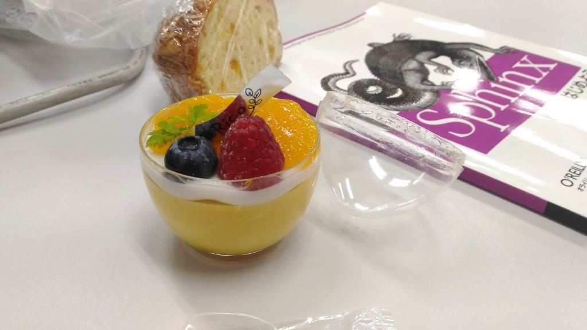

:date: 2017-08-27 23:59
:tags: Sphinx

=====================================================
Sphinx + 翻訳 hack-a-thon 2017.08 #sphinxjp
=====================================================

`Sphinxをはじめよう`_ の執筆が佳境です。ということで、今日のSphinx+翻訳 Hack-a-thonはオフライン執筆会という感じでした（執筆に関わっていないnskgchさんはだいぶaway感あったかも..すみません）。

集まって作業すると、色々と相談したかったことが出てきてお互いに割り込み合ったこともあり、執筆自体はそれほどハイペースには進まなかった気もします。とはいえ、チャットで相談するよりも密度濃くできたので、複数人執筆の場合たまにオフライン会やるのは良いですね。

:イベント: `Sphinx+翻訳 hack-a-thon 2017.08`_
:参加者: @tk0miya(会長), @shimizukawa(会計), @usaturn, nskgch
:会場: タイムインターメディア社（曙橋）

.. _Sphinxをはじめよう: https://www.oreilly.co.jp/books/9784873116488/
.. _Sphinx+翻訳 hack-a-thon 2017.08: https://sphinxjp.connpass.com/event/65411/

みんながやったこと
=====================

- nskgch: 公式ドキュメント翻訳を進めた。未翻訳部分をやったので勉強しながら進めました
- tk0miya: 書籍やりました
- usaturn: 書籍やりました
- shimizukawa: 書籍やりました

次回は `PyCon JP 2017 Sprint`_ （参加費無料）内での開催かもしれません。

.. _PyCon JP 2017 Sprint: https://pyconjp.connpass.com/event/62858/

   Sphinx + 翻訳 Hack-a-thon スイーツタイム

