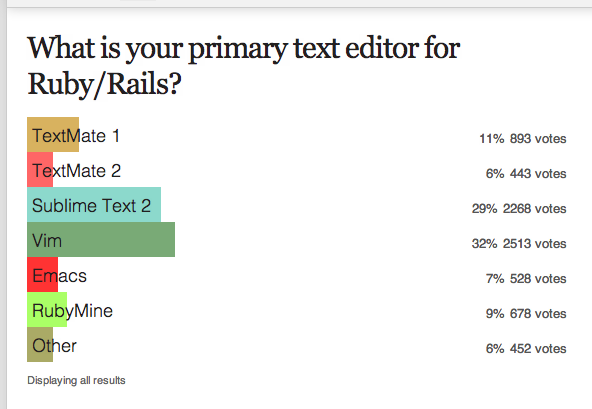

:date: 2012-07-13 23:50:00
:tags: Editor, SublimeText2, Python, Ruby

==================================================
Sublime Text 2 Study #1 に参加しました
==================================================

今日は `Sublime Text 2 Study #1`_ に参加しました。会場は `万葉さん`_ オフィス。久々に行ったらソファーとか増えてた。

参加者は全員Rubyistで、けっこうアウェー感強かったけど、connpass上でメモとりまくって密かに存在をアピールしてみました。

以下、マイメモ貼り付け。

.. raw:: html

   

「Sublime Text 2 を使い始めたきっかけは？」「テキストエディタ: Sublime Text 2 は事実上の TextMate 2? <a href="http://t.co/3whA87wR" target="_blank">http://t.co/3whA87wR</a> を読んだから」 <a href="http://t.co/FpmAwYw9" target="_blank">http://t.co/FpmAwYw9</a>

   
posted at <a href="http://twitter.com/shimizukawa/status/223728975933997056" target="_blank">19:41:59</a>

   

「connpassの中のひとに会えると思ったけどキャンセルされてしまった＞＜」 <a href="http://t.co/FpmAwYw9" target="_blank">http://t.co/FpmAwYw9</a> <a href="http://twitter.com/search?q=%23sublimetext" target="_blank">#sublimetext</a>

   
posted at <a href="http://twitter.com/shimizukawa/status/223729651401506816" target="_blank">19:44:40</a>

   

devの方が良い？「とりあえずdev使っておけばいいんじゃない？」 <a href="http://t.co/FpmAwYw9" target="_blank">http://t.co/FpmAwYw9</a> <a href="http://twitter.com/search?q=%23sublimetext" target="_blank">#sublimetext</a>

   
posted at <a href="http://twitter.com/shimizukawa/status/223730753366802432" target="_blank">19:49:02</a>

   

「とりあえず無料で使える。ときどき「買ってね」って表示される」 ライセンスは評価期間について書いてないなー <a href="http://t.co/pGp66E7u" target="_blank">http://t.co/pGp66E7u</a> <a href="http://t.co/FpmAwYw9" target="_blank">http://t.co/FpmAwYw9</a> <a href="http://twitter.com/search?q=%23sublimetext" target="_blank">#sublimetext</a>

   
posted at <a href="http://twitter.com/shimizukawa/status/223730988977623040" target="_blank">19:49:59</a>

   

「minimapが気持ち悪くて一回使うのやめたんですよね」 ソースコードの全体像が右端に表示されてる！便利なのかなー？ <a href="http://t.co/FpmAwYw9" target="_blank">http://t.co/FpmAwYw9</a> <a href="http://twitter.com/search?q=%23sublimetext" target="_blank">#sublimetext</a>

   
posted at <a href="http://twitter.com/shimizukawa/status/223731145471303680" target="_blank">19:50:36</a>

   

「プラグインはPythonで書ける、他の言語で書けるかは分からないけどTextMateのプラグインが使えるって聞いた気がする」 Python! <a href="http://t.co/FpmAwYw9" target="_blank">http://t.co/FpmAwYw9</a> <a href="http://twitter.com/search?q=%23sublimetext" target="_blank">#sublimetext</a>

   
posted at <a href="http://twitter.com/shimizukawa/status/223735349287985152" target="_blank">20:07:18</a>

   

tab_sizeはファイルの拡張子毎に設定出来る？ -&gt; プロジェクト毎に設定できるので、このプロジェクトでは2とか設定できるみたい。 <a href="http://t.co/BiCNj1Ev" target="_blank">http://t.co/BiCNj1Ev</a> <a href="http://t.co/FpmAwYw9" target="_blank">http://t.co/FpmAwYw9</a> <a href="http://twitter.com/search?q=%23sublimetext" target="_blank">#sublimetext</a>

   
posted at <a href="http://twitter.com/shimizukawa/status/223736215852154880" target="_blank">20:10:45</a>

   

「Cmd+D (winではctrl+D) で単語選択。もう一度おすとその単語と同じ単語が次々と選択状態に。同時編集していける。」 きも...すげー！ <a href="http://t.co/FpmAwYw9" target="_blank">http://t.co/FpmAwYw9</a> <a href="http://twitter.com/search?q=%23sublimetext" target="_blank">#sublimetext</a>

   
posted at <a href="http://twitter.com/shimizukawa/status/223738201129496576" target="_blank">20:18:38</a>

   

「Cmd+Shift+D  (winではCtrl+Shift+D) でカーソル行を次の行に複製して貼り付け」 vimだとyyp相当かな？ <a href="http://t.co/FpmAwYw9" target="_blank">http://t.co/FpmAwYw9</a> <a href="http://twitter.com/search?q=%23sublimetext" target="_blank">#sublimetext</a>

   
posted at <a href="http://twitter.com/shimizukawa/status/223738612792045568" target="_blank">20:20:16</a>

   

「Cmd+Shift+p (winではCtrl+略) でいろんなコマンドを実行出来る」 エディタのコマンドをインクリメンタルサーチできる。便利。 <a href="http://t.co/FpmAwYw9" target="_blank">http://t.co/FpmAwYw9</a> <a href="http://twitter.com/search?q=%23sublimetext" target="_blank">#sublimetext</a>

   
posted at <a href="http://twitter.com/shimizukawa/status/223739226666176513" target="_blank">20:22:43</a>

   

「 <a href="http://t.co/rFj4VovJ" target="_blank">http://t.co/rFj4VovJ</a> これは入れておきましょう。インストール方法はPythonプログラムをSublime Textのconsoleに貼り付けるだけ」 なにそれすごいｗｗ <a href="http://t.co/FpmAwYw9" target="_blank">http://t.co/FpmAwYw9</a> <a href="http://twitter.com/search?q=%23sublimetext" target="_blank">#sublimetext</a>

   
posted at <a href="http://twitter.com/shimizukawa/status/223745048607604736" target="_blank">20:45:51</a>

   

「vimにもバンドルっていうのがありますね」「emacsにもありますね」 PyCharm, RubyMineにもありますね。gemやeggもGUIでインストールできるよ <a href="http://t.co/FpmAwYw9" target="_blank">http://t.co/FpmAwYw9</a> <a href="http://twitter.com/search?q=%23sublimetext" target="_blank">#sublimetext</a>

   
posted at <a href="http://twitter.com/shimizukawa/status/223747328786448384" target="_blank">20:54:54</a>

   

「お勧めのプラグインはありますか？」「RubyTestがいいですね」 自分も探してみよう。reStructuredTextはある、textileもあるな <a href="http://t.co/FpmAwYw9" target="_blank">http://t.co/FpmAwYw9</a> <a href="http://twitter.com/search?q=%23sublimetext" target="_blank">#sublimetext</a>

   
posted at <a href="http://twitter.com/shimizukawa/status/223748352213397504" target="_blank">20:58:58</a>

   

「RubyTestの機能で Cmd+. (dot) でspecとコードの間を行き来できる。これあると非常に楽です」 テストと実装の間を楽に行き来できるのは良いな <a href="http://t.co/FpmAwYw9" target="_blank">http://t.co/FpmAwYw9</a> <a href="http://twitter.com/search?q=%23sublimetext" target="_blank">#sublimetext</a>

   
posted at <a href="http://twitter.com/shimizukawa/status/223748971728867329" target="_blank">21:01:26</a>

   

「Cmd+R で関数やクラスの定義一覧表示、インクリメンタルサーチ、定義位置にジャンプ」 便利。Ctrl+Rというのがbashを想起させるな～ <a href="http://t.co/FpmAwYw9" target="_blank">http://t.co/FpmAwYw9</a> <a href="http://twitter.com/search?q=%23sublimetext" target="_blank">#sublimetext</a>

   
posted at <a href="http://twitter.com/shimizukawa/status/223750424849694720" target="_blank">21:07:13</a>

   

Sublime Text 2 のプラグイン実装を読む会になった。Pythonで実装されているし、thread起動とかもやってる... そういえばTextMateのプラグインを使うのは簡単なのかなー？ <a href="http://t.co/FpmAwYw9" target="_blank">http://t.co/FpmAwYw9</a> <a href="http://twitter.com/search?q=%23sublimetext" target="_blank">#sublimetext</a>

   
posted at <a href="http://twitter.com/shimizukawa/status/223751897121701888" target="_blank">21:13:04</a>

   

プラグイン実装、外部プロセス呼び出しとかしなければthread起動とか要らなかったんや・・。エディタのテキストを書き換えるの簡単ね。 <a href="http://t.co/35KK8j3C" target="_blank">http://t.co/35KK8j3C</a> <a href="http://t.co/FpmAwYw9" target="_blank">http://t.co/FpmAwYw9</a> <a href="http://twitter.com/search?q=%23sublimetext" target="_blank">#sublimetext</a>

   
posted at <a href="http://twitter.com/shimizukawa/status/223752477965688833" target="_blank">21:15:22</a>

   

「じゃあここで、練習で作った "選択した文字列をrot13で暗号化するプラグイン" を説明します」 師範、おもしろすぎます！ｗｗ <a href="http://t.co/FpmAwYw9" target="_blank">http://t.co/FpmAwYw9</a> <a href="http://twitter.com/search?q=%23sublimetext" target="_blank">#sublimetext</a>

   
posted at <a href="http://twitter.com/shimizukawa/status/223753141466841088" target="_blank">21:18:00</a>

   

「pluginはpython力の問題があるので、次に進みます」 師範～ 「ここから本題のsnipet行きます」 師範～ <a href="http://t.co/FpmAwYw9" target="_blank">http://t.co/FpmAwYw9</a> <a href="http://twitter.com/search?q=%23sublimetext" target="_blank">#sublimetext</a>

   
posted at <a href="http://twitter.com/shimizukawa/status/223757898780643328" target="_blank">21:36:54</a>

   

snippetも便利だ。tabtriggerに 'def' を設定してscopeをruby用python用にそれぞれ作っておけば言語別の関数定義snippetを用意出来る <a href="http://t.co/FpmAwYw9" target="_blank">http://t.co/FpmAwYw9</a> <a href="http://twitter.com/search?q=%23sublimetext" target="_blank">#sublimetext</a>

   
posted at <a href="http://twitter.com/shimizukawa/status/223759693934366720" target="_blank">21:44:02</a>

   

Sublime Text 2 はTextMateを置き換えるか？ pluginとsnippetがそのまま使えるし、これ、置き換えられるんじゃね・・？ <a href="http://t.co/FpmAwYw9" target="_blank">http://t.co/FpmAwYw9</a> <a href="http://twitter.com/search?q=%23sublimetext" target="_blank">#sublimetext</a>

   
posted at <a href="http://twitter.com/shimizukawa/status/223761712325738496" target="_blank">21:52:04</a>

   

「Sublime Text 2 は「ここがすごい！」っていうものはないけど、そつなく使っていけるエディタですね。いいですね」 PyCharmも難が無い。無難って実は強いよね <a href="http://t.co/FpmAwYw9" target="_blank">http://t.co/FpmAwYw9</a> <a href="http://twitter.com/search?q=%23sublimetext" target="_blank">#sublimetext</a>

   
posted at <a href="http://twitter.com/shimizukawa/status/223763754100326400" target="_blank">22:00:10</a>

   

pep8lintプラグインをインストールしたらsaveをhookしてpep8を実行してる。仕組みは簡単でsublime_plugin.EventListenerを継承してplugin書けば良いらしい <a href="http://t.co/FpmAwYw9" target="_blank">http://t.co/FpmAwYw9</a> <a href="http://twitter.com/search?q=%23sublimetext" target="_blank">#sublimetext</a>

   
posted at <a href="http://twitter.com/shimizukawa/status/223765199444918273" target="_blank">22:05:55</a>

   

終了～。お疲れ様でした！「次回はpluginの作り方とかやりますか？」 次回！！ <a href="http://t.co/FpmAwYw9" target="_blank">http://t.co/FpmAwYw9</a> <a href="http://twitter.com/search?q=%23sublimetext" target="_blank">#sublimetext</a>

   
posted at <a href="http://twitter.com/shimizukawa/status/223765383700680704" target="_blank">22:06:39</a>

既にPyCharm買ってしまったけど、pluginが便利すぎてSublime Text 2も使いたくなってきた。59ドル...。

.. _`Sublime Text 2 Study #1`: http://connpass.com/event/769/
.. _`万葉さん`: http://everyleaf.com/
