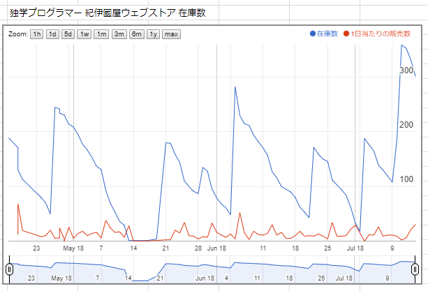

:date: 2018-07-14 10:00
:tags: python, 独プロ

===========================================================
ジュンク堂池袋『独学プログラマー』 トークセッション & 6刷！
===========================================================

6/18（月）に『独学プログラマー』の著者コーリー・アルソフと、翻訳者2名でトークイベントを行いました。

7/11（水）には、 `みんなのPython勉強会#37`_ に参加し、本の紹介LTをさせてもらいました。

そして、今月も増刷することになりました！6刷り～

.. figure:: talk-session.*
   :width: 80%

   ジュンク堂でのトークセッション

.. _みんなのPython勉強会#37: https://startpython.connpass.com/event/81625/

.. contents::
   :local:

Cory来日対談
=============

5月22日、自分の誕生日に、Coryから「誕生日おめでとう！ところで日本に遊びに行くから飲みに行こう」というFacebookの投稿をもらってから、色々調整してたら、対談+ジュンク堂イベント、という流れが実現出来ました（調整は、ほんとど共同翻訳者のmasaya（新木さん）と出版社の田島さんがやってくれた）。

対談は、トークセッションの予行を兼ねて、6/15（金）に2時間弱の時間で行いました。
そのときの話が日経トレンディネットで記事になっています。

.. figure:: talk-meeting.*
   :width: 80%
   :target: http://trendy.nikkeibp.co.jp/atcl/pickup/15/1003590/070301740/

   `独学プログラマーになるために必要なこと - 日経トレンディネット`_

.. _独学プログラマーになるために必要なこと - 日経トレンディネット: http://trendy.nikkeibp.co.jp/atcl/pickup/15/1003590/070301740/

そのあと、芝公園の `とうふ屋うかい`_ で懇親会してきました。お店は編集者の田島さんが「日本庭園や日本料理を紹介したい」ということで選んだんですが、コーリーも、コーリーの友人もとても楽しんでくれたようです。

懇親会には、コーリーの友人も一緒に参加しました。彼は、コーリーが実施している The Self-Taught Programmer BootCamp 2回目の生徒で、BootCamp終了後にY-Combinatorの支援を受けて起業したらしいです（すごい！）。

.. figure:: ukai.*
   :width: 80%

   みんなで記念撮影

   - 右前: 清水川（監訳者）
   - 右中: コーリー（著者）
   - 右奥: コーリーの友達
   - 左前: kame-chan（レビューアー）
   - 左中: 新木masaya（訳者）
   - 左奥: 田島（編集者）

.. _とうふ屋うかい: http://www.ukai.co.jp/shiba/

ジュンク堂池袋 トークセッション
================================

.. raw:: html

   <blockquote class="twitter-tweet" data-lang="ja">
6月18日(月)の独学プログラマーのトークセッションの案内があった(エスカレーターからなので撮るの難しかった) (@ ジュンク堂書店 池袋本店 - <a href="https://twitter.com/junkudo_ike?ref_src=twsrc%5Etfw">@junkudo_ike</a> in 豊島区, 東京都) <a href="https://t.co/0E0nqhcUNz">https://t.co/0E0nqhcUNz</a> <a href="https://t.co/8MJdKwqqFG">pic.twitter.com/8MJdKwqqFG</a>
&mdash; Takanori Suzuki (@takanory) <a href="https://twitter.com/takanory/status/1007855747647049728?ref_src=twsrc%5Etfw">2018年6月16日</a></blockquote>
   

以前のblogで予告したとおり（ :doc:`../the-self-taught-programmer-15k-cory-event/index` ）、6/18（月）に『独学プログラマー』の著者コーリー・アルソフと、翻訳者2名でトークイベントを行いました。当日は雨の中25名くらいの参加者に来て頂きました。当日参加を決めた方もいたようで、席はほとんど埋まってました。

.. figure:: talk-session.*
   :width: 80%

   ジュンク堂でのトークセッション

このときのトークの内容について、blogを書いてくれている方がいるので詳細はそちらに譲ります。

   - `ジュンク堂トークセッション：独学プログラマー著者来訪 - 『システムノヲニワソト』 <https://blog.goo.ne.jp/system-oni800/e/3f7261e0c8d7381cdcbed6182a12ae72>`_
   - `トークセッション「独学プログラマーとして成功するには、何が必要か？」 - 猫をだまして飛んで行く。 <https://cat-p0k0pen.hateblo.jp/entry/2018/06/20/003838>`_
   - `イベントレポート | 独学プログラマーとして成功するには、何が必要か？ #独学プログラマー #独プロ - nikkie-ftnextの日記 <http://nikkie-ftnext.hatenablog.com/entry/2018/07/10/225055>`_

この日は、コーリーのお母さんも参加。前日に日本に来たそうです。

.. figure:: cory-sign.*
   :width: 80%

   トークセッション前、店頭POPを3人で書いてるところ

お母さん、トークセッション中は後ろの方でずっと息子の動画を撮ったり写真をとったりしてました。

.. raw:: html

   <blockquote class="twitter-tweet" data-lang="ja">
Signing some books! <a href="https://t.co/KfHGYOaRtn">pic.twitter.com/KfHGYOaRtn</a>
&mdash; Cory Althoff (@coryealthoff) <a href="https://twitter.com/coryealthoff/status/1010190947492290570?ref_src=twsrc%5Etfw">2018年6月22日</a></blockquote>
   

打ち上げは「山ちゃん」。ジャパニーズスタイル居酒屋、ということで選んだんだけど、コーリーのお母さんが手羽先で大喜び。

.. figure:: yamachan.*
   :width: 80%

   山ちゃんのスパイシー手羽先で打ち上げ

後日、この日3人で書いたPOPがジュンク堂の店頭に置かれました。

.. raw:: html

   <blockquote class="twitter-tweet" data-lang="ja">
【お知らせ】日経BP社『独学プログラマー』の著者コーリー・アルソフさん、訳者の清水川貴之さん、新木雅也さんから直筆POPをいただきました。ぜひ店頭でご覧下さい。 <a href="https://t.co/1BDnjlmv2o">pic.twitter.com/1BDnjlmv2o</a>
&mdash; ジュンク堂書店池袋本店/PC書 (@junkudo_ike_pc) <a href="https://twitter.com/junkudo_ike_pc/status/1009033315301539842?ref_src=twsrc%5Etfw">2018年6月19日</a></blockquote>
   

みんなのPython勉強会でLT
========================

7/11（水）には、 `みんなのPython勉強会#37`_ に参加し、本の紹介LTをさせてもらいました。LTでは、書籍の紹介とトークセッションの報告、コーリーのサイン入り書籍を3冊プレゼント！

.. raw:: html

   <blockquote class="twitter-tweet" data-lang="ja">
今日はプレゼントたくさん<a href="https://twitter.com/hashtag/stapy?src=hash&amp;ref_src=twsrc%5Etfw">#stapy</a> <a href="https://t.co/GzC2Q4DZnP">pic.twitter.com/GzC2Q4DZnP</a>
&mdash; ◥◣◥◣あべんべん◢◤◢◤ (@abenben) <a href="https://twitter.com/abenben/status/1017035801471750146?ref_src=twsrc%5Etfw">2018年7月11日</a></blockquote>
   

   <blockquote class="twitter-tweet" data-lang="ja">
<a href="https://twitter.com/hashtag/stapy?src=hash&amp;ref_src=twsrc%5Etfw">#stapy</a> プレゼント争奪戦～ Cory のサイン入り <a href="https://twitter.com/hashtag/%E7%8B%AC%E3%83%97%E3%83%AD?src=hash&amp;ref_src=twsrc%5Etfw">#独プロ</a> もプレゼントしたー (@ クリーク・アンド・リバー社 in 千代田区, 東京都) <a href="https://t.co/2A1zowbB7n">https://t.co/2A1zowbB7n</a> <a href="https://t.co/Temp7t2Zo8">pic.twitter.com/Temp7t2Zo8</a>
&mdash; Takayuki Shimizukawa (@shimizukawa) <a href="https://twitter.com/shimizukawa/status/1017027876972122112?ref_src=twsrc%5Etfw">2018年7月11日</a></blockquote>
   

   <blockquote class="twitter-tweet" data-lang="ja">
ジャンケン大会で独学プログラマーサイン本いただきました。なんと、原著者と監訳者のダブルサイン。 写経に励みます。<a href="https://twitter.com/hashtag/stapy?src=hash&amp;ref_src=twsrc%5Etfw">#stapy</a> <a href="https://t.co/oFHPMRBOtk">pic.twitter.com/oFHPMRBOtk</a>
&mdash; Atsushi Hyogo (@HYO_GO) <a href="https://twitter.com/HYO_GO/status/1017060221531795456?ref_src=twsrc%5Etfw">2018年7月11日</a></blockquote>
   

.. コーリー、字があんまりきれいじゃないな（自分も人のことは言えないｗ）

LTでは、トークセッションにも参加してくれた `@nikie <https://twitter.com/ftnext>`_ さんがイベントの要点を紹介してくれました。超ありがたい！感想として挙げてくれた **「分野ごとに中級者になっていくのかも」** というのは、本当にその通りだと思います（この表現、どこかで使わせてもらおう）。

.. figure:: nikkie-slide.*
   :width: 80%
   :target: https://gitpitch.com/ftnext/2018_LTSlides/master?p=stapy_July_self_taught#/

   `独学プログラマー著者イベントから共有したい3つのこと <https://gitpitch.com/ftnext/2018_LTSlides/master?p=stapy_July_self_taught#/>`_

自分のLTでは、自分がこの本を翻訳したいと思ったポイントの紹介と、トークセッションの報告をしました。

翻訳したいと思ったポイントは以下にまとめています:

- `独学プログラマー - 清水川のScrapbox <https://scrapbox.io/shimizukawa/%E7%8B%AC%E5%AD%A6%E3%83%97%E3%83%AD%E3%82%B0%E3%83%A9%E3%83%9E%E3%83%BC#5ad89f4219119700001c3d52>`_

自己紹介とトークセッションの報告はGoogle Slideです:

.. raw:: html

   <iframe src="https://docs.google.com/presentation/d/e/2PACX-1vRygYfyRNNAU3M1W5jUacfILSauURs0xFNooh68o8HlWJf-sWGN-7vc-htW7FpBVhya0MOTyaNMDkQ2/embed?start=false&loop=false&delayms=60000" frameborder="0" width="960" height="569" allowfullscreen="true" mozallowfullscreen="true" webkitallowfullscreen="true"></iframe>

LTの様子、撮られてた！

.. raw:: html

   <blockquote class="twitter-tweet" data-lang="ja">
<a href="https://twitter.com/hashtag/stapy?src=hash&amp;ref_src=twsrc%5Etfw">#stapy</a> 清水川さんのLT始まりました <a href="https://t.co/IcMyBWLXaI">pic.twitter.com/IcMyBWLXaI</a>
&mdash; すーぎー@革カブ (@soogie) <a href="https://twitter.com/soogie/status/1017023537075273729?ref_src=twsrc%5Etfw">2018年7月11日</a></blockquote>
   

第6刷
======

7/13（金）に6刷が決定しました。まじか！

   独学プログラマー 紀伊國屋ウェブストア 在庫数の推移

発売以来、紀伊國屋ウェブストアの在庫数を記録しているんですが、ペース変わらず売れてるようでう嬉しいです。今までは内容更新する余裕がなかったんですが、6刷では正誤表の内容をできるだけ修正する（編集の田島さんがやってくれる）ことになっています。ありがたい～。

- `コーリー・アルソフ「独学プログラマー」日経BP社 - みんなで正誤表 <http://public-errata.appspot.com/errata/book/9784822292270/>`_

--------------

AmazonレビューやTwitterでの感想などを以下のページにまとめているので、書籍の内容が気になる方は読んでみてください。肯定的、否定的を問わず集めています。

:doc:`../the-self-taught-programmer-misc/index`

今後も引き続き、感想などお待ちしています！

