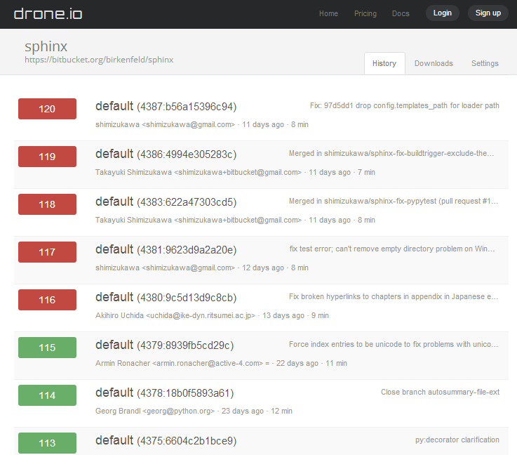
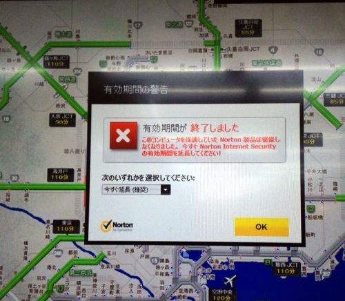

:date: 2013-12-21 15:00
:categories: ['Python', 'tox', 'virtualenv', 'setuptools']
:body type: text/x-rst

====================================================================================================
2013/12/21 世界中のtoxテストがsetuptools-2.0リリース日(12月7日)以降Python-2.5のテストで失敗してる話
====================================================================================================

*Category: 'Python', 'tox', 'virtualenv', 'setuptools'*

   12/7以降、SphinxがPython-2.5でエラーになってる

   https://drone.io/bitbucket.org/birkenfeld/sphinx

python-2.5のテストが落ちました
==============================

`setuptools-2.0`_ が2013/12/7にリリースされました。そして、 tox_ の自動テストがエラーになりました。toxがテスト用のpython-2.5仮想環境を作ろうとして、その際にsetuptools-2.0以降をインストールできないのが原因です。

.. _setuptools-2.0: https://pypi.python.org/pypi/setuptools/2.0
.. _tox: https://pypi.python.org/pypi/tox

12/7以降、python-2.5でのテストは以下のようにエラーになってしまいます::

   $ tox -e py25
   glob sdist-make: /home/ubuntu/src/bitbucket.org/birkenfeld/sphinx/setup.py
   py25 create: /home/ubuntu/src/bitbucket.org/birkenfeld/sphinx/.tox/py25
   (略)
   already using interpreter /usr/bin/python2.5
   new python executable in py25/bin/python2.5
   also creating executable in py25/bin/python
   installing setuptools......................................
   (略)
     downloading http://pypi.python.org/packages/2.5/s/setuptools/setuptools-0.6
   c11-py2.5.egg
   searching for setuptools
   reading http://pypi.python.org/simple/setuptools/
   reading http://peak.telecommunity.com/snapshots/
   reading https://pypi.python.org/pypi/setuptools
   best match: setuptools 2.0.1
   downloading https://pypi.python.org/packages/source/s/setuptools/setuptools-2
   .0.1.tar.gz#md5=04aedc705644fda5848b7b428774e5ff
   processing setuptools-2.0.1.tar.gz
   running setuptools-2.0.1/setup.py -q bdist_egg --dist-dir /tmp/easy_install-t
   w6agb/setuptools-2.0.1/egg-dist-tmp-2gfdgo
   setup.py:16: warning: 'with' will become a reserved keyword in python 2.6
   traceback (most recent call last):
   (略)
     file "setup.py", line 16
       with open(init_path) as init_file:
               ^
   syntaxerror: invalid syntax
   (略)
   error: invocationerror: /usr/bin/python2.5 /home/ubuntu/virtualenv/python2.7/
   local/lib/python2.7/site-packages/tox/vendor/virtualenv.py --setuptools --pyt
   hon /usr/bin/python2.5 py25 (see /home/ubuntu/src/bitbucket.org/birkenfeld/sp
   hinx/.tox/py25/log/py25-0.log)

エラーメッセージにあるように、最新のsetuptoolsがpython-2.5で動作しないためにこのような問題が起きています。

toxとvirtualenvとpipとsetuptools
================================

toxは複数のpythonバージョンをテストするために、内部でvirtualenvを使っています。で、virtualenvで仮想化された各環境内でパッケージをパッケージインストールするために、setuptoolsとpipを使用しています。

ここで、各バージョンについて、ちょっと表にまとめてみましょう。

.. csv-table::
   :stub-columns: 1
   :header-rows: 1

   date,setuptools,pip,virtualenv,tox
   2013/06/09,0.7.2 (distribute統合),↓,↓,↓
   2012/06/13,↓,↓,↓,1.4 (-py24)
   2013/07/05,(distribute-0.7.3 終了),↓,↓,↓
   2012/09/01,↓,1.2 (-py24),1.8 (-py24),↓
   2013/03/07,↓,1.3 (+pypi ssl),1.9.1,↓
   2013/06/22,↓,↓,↓,1.5.0
   2013/07/05,0.8 (py24～py33),↓,↓,↓
   2013/07/23,↓,1.4 (break py31),1.10 (-py25),↓
   2013/08/08,↓,1.4.1 (break py31),↓,↓
   2013/08/15,↓,↓,↓,1.6.0 (+virtualenv1.9.1 for py25)
   2013/09/04,↓,↓,↓,1.6.1 (+py25 insecure)
   2013/12/01,1.4.2,↓,↓,↓
   2013/12/07,"2.0 (-py24,-py25)",↓,↓,↓
   xxxx/xx/xx,↓,↓,↓,1.7.0 (-py25)

左の方がより低レイヤー（屋台骨側）です。

各パッケージとも早々にpython-2.4サポートをdropしました。その後virtualenvがpython-2.5もdropしましたが、toxは大人の事情のせいか知らないですが、virtualenv-1.9.1を同梱してpython-2.5を独自にサポートしつづけてきました。

しかし、12/7に、ついにsetuptoolsがpython-2.4, 2.5をdropしたため、toxはpython-2.5サポートをあきらめたようで、次の `tox-1.7ではpython-2.5をdropする予定で進んで要るみたい`__ です。

.. __: https://bitbucket.org/hpk42/tox/commits/df22328d

tox with python-2.5
===================

ここで、世の中の各種パッケージが一斉にpython-2.5をdropするわけにはいかないので、2.5サポートを維持する必要があるパッケージはtoxを使いつつpython-2.5をうまく動作させる方法はないものか、という模索をすることになります。sphinx-1.2とか。

色々やってみたところ、1つだけ方法がありました。以下のバージョンの組み合わせで環境を作ればいけます。

:setuptools: 1.4.2 (py25対応)
:pip: 1.3 (--insecureオプション対応)
:virtualenv: 1.9.1 (py25対応)
:tox: 1.5 (py25環境で最新のsetuptoolsをインストールしない)

tox-1.6からvirtualenv-1.9.1を同梱していて、python-2.5の場合にはこれを使うようにしていますが、その過程でsetuptoolsの最新版をインストールしてしまいます。しかし、tox-1.5はそのような機能が無いため、virtualenv-1.9.1をインストールしておいてあげればそれを使ってくれます。

`python-2.4, 2.5 をサポートしたez_setup.py`__ を使って、以下のようにして環境を作成しましょう::

   $ wget https://bitbucket.org/pypa/setuptools/raw/bootstrap-py24/ez_setup.py
   $ python2.5 ez_setup.py
   $ easy_install-2.5 -u virtualenv==1.9.1 tox==1.5

.. __: https://pypi.python.org/pypi/setuptools/2.0.1#python-2-4-and-python-2-5-support

ポイントは、toxをpython-2.5環境にインストールするところです。

.. note::

   detoxはtoxの並列実行版です。python-2.5で動作するdetoxが0.9.3以降ですが、0.9.3でtox-1.6.1以上必須となっているため、このやり方では使えません。

まとめ
======

tox, virtualenv, setuptools がPython-2.5のサポート打ち切りを表明しつつある現在、もうさすがにPython-2.5は終わりそうな感じです。Sphinx-1.2はリリースしたばかりなのでもうすこしPython-2.5をサポートし続ける必要がありますが、次の1.3ではDropする予定でいます。

   有効期限が切れました

