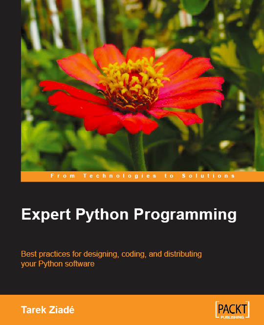

エキスパート Python プログラミング
===================================

.. toctree::
   :maxdepth: 1

   reading/index

.. image:: Python_cover.jpg

* 原書タイトル： `Expert Python Programming <http://www.packtpub.com/expert-python-programming>`_
* 日本語版タイトル: `エキスパートPythonプログラミング <http://ascii.asciimw.jp/books/books/detail/978-4-04-868629-7.shtml>`_
* 出版社: `アスキー・メディアワークス <http://ascii.asciimw.jp/>`_
* 著者: Tarek Ziade
* 翻訳: 稲田直哉, 渋川よしき, 清水川貴之, 森本哲也
* 定価: 3,780円 (本体3,600円)
* 発売日: 2010年5月31日
* 形態：B5変 (416ページ)
* ISBN：978-4-04-868629-7

(上記ボタンは一旦、アスキー・メディアワークスのサイトに遷移します）

.. contents::
   :local:

序文
-----

『エキスパートPythonプログラミング』（著：Tarek Ziade、訳：稲田直哉, 渋川よしき, 清水川貴之, 森本哲也、アスキーメディアワークス刊） より、序文を一部引用・掲載します。

日本語翻訳出版によせて (Tarek Ziade)
^^^^^^^^^^^^^^^^^^^^^^^^^^^^^^^^^^^^^^

Pythonコミュニティや、一般的なオープンソースコミュニティがもっとも大切にしている価値観のうちの1つが、知識を共有するということです。私がオープンソースに関わる仕事をはじめた10年ほど前に、私は人々の興味の中心がお金ではない、という事実にたいへん感銘を受けました。そこに参加する多くの人達は、学んで、体験して、共有したいと考えていました。

私にとって本を書くという行動は、Pythonという言語について私が関心を持っていることを、他の人と共有するための手段です。また、Webのおかげで、一度本を書くと、読者とオンライン上で出会うことができるため、新たな人とのつながりもできます。

私はこれまでに、母国語であるフランス語で本を2冊書き、その後、より多くの読者に届けたいと思い、英語で1冊書きました。しかし、世界にはフランス語や英語を読むことができない人や、自分の母国語で書かれた本のほうが安心するという人が数多くいることを知るたびにフラストレーションを感じていました。

今あなたが手にしている本は、Naoki INADA、Takayuki SHIMIZUKAWA、Yoshiki SHIBUKAWAそしてTetsuya MORIMOTOの4人がすばらしい仕事をしてくれたおかげで出版されることになった、私の英語の本の日本語翻訳です。彼らはきちんと仕事をこなし、その過程で多くの誤植や間違いを修正していったので、オリジナルの英語版よりも日本語版のほうがより良いものとなりました。

特に、私は現在日本語を学んでいるということもあるため、私はこの翻訳を本当に誇りに感じています。私が書いた英語のものと同じように、この本を楽しんでもらえることを願っています。書籍の内容について話をしたい場合には、 tarek at ziade.org まで遠慮無くメールを送ってください。

-- Tarek Ziade

日本語版まえがき
^^^^^^^^^^^^^^^^

本書の良いところは数え切れないほどありますが、特にすばらしい点が2つあります。

1つ目は、Pythonという言語の「今」がたくさん詰まっているという点です。Pythonは後方互換性の高さのために、初めて学習したときのバージョンの知識のままで困ることがない、という特徴がありますが、本書を読むとPythonの進化の恩恵を、そのベストプラクティスとともに学ぶことができます。

2つ目は、egg、PyPI、virtualenv、buildout、Buildbot、Sphinx、Mercurial、Tracなど、ソフトウェア開発のライフサイクルの各段階における現在のベストプラクティスがまとめて読めるようになっているという点です。新しい言語の学習には、「文法やイディオム」のほかに「どのようにその世界で活動していけばいいのか」も含まれますが、現在のPythonにおけるプラグマティックな開発方法を知ることができます。

このような情報がまとめられている書籍は、Pythonだけでなく、他の言語についてもこれまではありませんでした。この本は「Pythonを知っている」状態から「Pythonをマスターしている」状態に成長するための本であると同時に、他の言語をある程度マスターしている人がPythonの世界でどのように活動していけばいいのかを知るのにも適しています。

翻訳にあたって
^^^^^^^^^^^^^^

翻訳にあたって、翻訳者の間で共有していたZenは2つです。1つ目は原著の良さを十分に読者の皆さんに届けられるように、たとえ内容は高度でも、わかりやすい日本語になるように注意を払いました。たった1つの段落の翻訳をどうするのかについて、議論を数時間にわたって繰り広げたこともありました。2つ目は、原著の出版から時間がたち、状況が変化した部分を最新にするというものです。原著はPython 2.5を対象にしていますが、現在幅広く使われている2.6に説明を合わせたほか、いくつか古くなっていた情報を更新したり、最新の情報をノート欄や脚注という形式でふんだんに追加しました。原著には脚注がないため、脚注で記述されている内容はすべて訳者による注釈になります。

現在、Pythonは2.X系から3.X系への大々的なマイグレーションを行っています。そのため、言語のコアに関わる2章と3章の説明については、3.X系に関する補足も加えました。なお、5章からはさまざまなツールが登場していますが、まだ3.X系に移行しきれていないツールも数多くあるため、ここに関しては原著と同様に2.X系に絞って動作の検証を行っています。ただし、著者のTarekが『本書はだれのために書かれたのか？』というセクションで語っているとおり、現時点のツールを使ってみて学んだ考え方や仕事の流れなどは、ツールが変わっても生き続けるものばかりです。ムダになることはないでしょう。

また、プログラミングのイディオムとしてまとめて説明されることが少なく、3への移行で影響を受ける、文字列とUnicodeに関する章を「付録A」として書き下ろしで追加しています。

1章: さあ、はじめよう
----------------------

* Python のインストール
   * Python の各種実装
      * Jython
      * IronPython
      * PyPy
      * その他の実装
   * Linux へのインストール
      * パッケージインストール
      * ソースコードからのコンパイル
   * Windows へのインストール
      * Python のインストール
      * MinGW のインストール
      * MSYS のインストール
   * Mac OS Xへのインストール
      * パッケージインストール
      * ソースからのコンパイル
* インタラクティブモード
   * インタラクティブモードのカスタマイズ
      * IPython: 拡張されたインタラクティブモード
* setuptools のインストール
   * setuptools の動作を理解する
   * EasyInstall を用いた、setuptoolsのインストール
   * distutils でMinGWを使用させる
* 作業環境
   * エディタと、補助ツールを使用する
      * コードエディタ
      * Vim のインストールと設定
      * 他のエディタの使用
      * その他の実行ファイル
   * 統合開発環境(IDE)の使用
      * Eclipse とPyDevのインストール
* まとめ

2章: 構文ベストプラクティス - クラス以外
----------------------------------------
* リスト内包表記
* イテレータとジェネレータ
   * ジェネレータ
   * コルーチン
   * ジェネレータ式
   * itertools モジュール
      * islice: ウィンドウイテレータ
      * tee: 前後方イテレータ
      * groupby: ユニークイテレータ
      * 他の関数
* デコレータ
   * デコレータの書き方
   * 引数チェック
   * キャッシュ
   * プロキシ
   * コンテキストプロバイダ
* with と contextlib
   * contextlib モジュール
   * コンテキストの例
* まとめ

3章: 構文ベストプラクティス - クラスの世界
-------------------------------------------
* 組み込み型のサブクラス化
* スーパークラスからメソッドへのアクセス
   * Python のメソッド解決順序(MRO)を理解する
   * super の落とし穴
      * super と従来の呼び出しを混在させる
      * 親クラスと異なる引数定義の混在
   * ベストプラクティス
* ディスクリプタとプロパティ
   * ディスクリプタ
      * イントロスペクションディスクリプタ
      * メタディスクリプタ
   * プロパティ
* スロット
* メタプログラミング
   * __new__ メソッド
   * __metaclass__ メソッド
* まとめ

4章: 良い名前を選ぶ
--------------------
* PEP 8 と命名規則のベストプラクティス
* 命名規則のスタイル
   * 変数
      * 定数
         * 命名規則と使用例
      * パブリック変数とプライベート変数
   * 関数とメソッド
      * プライベートの論争
      * 特殊メソッド
      * 引数
   * プロパティ
   * クラス
   * モジュールとパッケージ
* 名前付けガイド
   * ブール値の名前の前に “has” か “is” を付ける
   * シーケンス要素を複数形にする
   * 辞書型に明示的な名前を付ける
   * 汎用性の高い名前を避ける
   * 既存の名前を避ける
* 引数のベストプラクティス
   * 反復型設計を行いながら引数を作成する
   * 引数とテストを信頼する
   * 魔法の引数である `*args` と `**kw` は注意して使用する
* クラス名
* モジュール名とパッケージ名
* API の開発プロセス
   * 高レベルな関数の提供
   * 名前空間木の構築
   * コードの分割
   * egg の使用
   * 段階的な廃止プロセスの使用
* 役に立つツール
   * Pylint
   * CloneDigger
* まとめ

5章: パッケージを作る
---------------------
* 全てのパッケージで共通のパターン
   * setup.py: 全てをコントロールするスクリプト
      * sdist
      * MANIFEST.in ファイル
      * build と bdist
      * bdist_egg
      * install
      * パッケージのアンインストール
      * develop
      * test
      * register と upload
      * Python 2.6 での .pypirc の書式
      * 新しいコマンドを作る
      * setup.py の使い方のまとめ
      * コマンドの別名
      * その他の重要なメタデータ
* テンプレートベースのアプローチ
   * Python Paste
   * テンプレートを作る
* パッケージのテンプレートを作る
* 開発サイクル
   * バージョン番号に使うべき値は？
   * ナイトリービルド
* まとめ

6章: アプリケーションを作る
---------------------------
* Atomisator: 導入
* 全体像
* 開発環境
   * テストランナーを追加する
   * パッケージ構造を追加する
* パッケージを書く
   * atomisator.parser
      * 最初のパッケージを作る
      * 最初の doctest を作る
      * テスト環境を構築する
      * コードを書く
   * atomisator.db
      * SQLAlchemy
   * DBとのマッピングを作る
   * API を提供する
   * atomisator.feed
   * atomisator.main
* Atomisator を配布する
* パッケージの依存関係
* まとめ

7章: zc.buildoutを使う
-----------------------
* zc.buildout の哲学
   * 設定ファイルの構造
      * 最小の設定ファイル
      * [buildout] セクションのオプション
   * buildout コマンド
   * レシピ
      * 重要なレシピ
      * レシピを作る
      * Atomisator buildout 環境
      * buildout フォルダ構造
   * さらに先へ
* リリースと配布
   * パッケージをリリースする
   * リリース設定ファイルを追加する
   * アプリケーションのビルドとリリース
* まとめ

8章: コードの管理
-----------------
* バージョン管理システム
   * 中央集中型システム
   * 分散型システム
      * 分散の戦略
   * 中央集中か、分散か?
   * Mercurial
   * Mercurial でプロジェクトを管理する
      * 専用フォルダのセットアップ
      * hgwebdir の設定
      * Apache の設定
      * 認証のセットアップ
      * クライアントの設定
* 継続的インテグレーション
   * Buildbot
      * Buildbot のインストール
      * Buildbot と Mercurial のフック
      * Apache と Buildbot のフック
* まとめ

9章: ライフサイクルの管理
-------------------------
* 複数のアプローチの比較
   * ウォーターフォール開発モデル
   * スパイラル開発モデル
   * 反復型開発モデル
* ライフサイクルを規定する
   * 計画
   * 開発
   * 全体デバッグ
   * リリース
* トラッキングシステムの設定
   * Trac
      * インストール
      * Apache 設定
      * 権限設定
   * Trac を使用したプロジェクトライフサイクル
      * 計画
      * 開発
      * クリーニング
      * リリース
* まとめ

10章: プロジェクトのドキュメント作成 [#]_
------------------------------------------

.. [#] 10章の内容をreST,HTML,PDF,ePub形式で公開しています。 `sphinx-users.jpサイト <http://sphinx-users.jp/articles/index.html#id3>`_ を参照して下さい。

* 技術文書を書くための７つのルール
   * 2ステップで書く
   * 読者のターゲットを明確にする
   * シンプルなスタイルを使用する
   * 情報のスコープを絞る
   * 実在するようなコードのサンプルを使用する
   * なるべく少なく、かつ十分なドキュメント
   * テンプレートの使用
* reStructuredText 入門
   * セクション構造
   * リスト
   * インラインマークアップ
   * リテラルブロック
   * リンク
* ドキュメントの構築
   * ポートフォリオの構築
      * 設計
         * 共通テンプレート
      * 使用方法
         * レシピ
         * チュートリアル
         * モジュールヘルパー
      * 運用
* 自分自身のポートフォリオを構築する
   * ドキュメントのランドスケープの構築
      * 制作者のレイアウト
      * 顧客のレイアウト
         * インデックスのページでの作業
         * モジュールヘルパーの登録
         * 索引のマーカーの追加
         * クロス・リファレンス
* まとめ

11章: テスト駆動開発
--------------------
* テストをしていない人へ
   * テスト駆動開発の原則
      * ソフトウェアのリグレッションを防ぐ
      * コードの品質の向上
      * 最適な開発者向けのドキュメントの提供
      * より素早く、信頼性の高いコードの生産
   * どのような種類のテストがあるのか？
      * 受け入れテスト
      * ユニットテスト
      * Python の標準のテストツール
                         * unittest
                         * doctest
* テストをしている人へ
   * ユニットテストの落とし穴
   * 代替のユニットテストフレームワーク
      * nose
         * テストランナー
         * テストの作成
         * テストフィクスチャの作成
         * setuptools との統合と、プラグインシステム
         * まとめ
      * py.test
         * テストクラスの無効化
         * 分散テストの自動化
         * テストの非同期実行
         * まとめ
   * フェイクとモック
      * フェイクの構築
      * モックの使用
   * ドキュメント駆動開発
      * ストーリーの作成
* まとめ

12章: 最適化: 一般原則とプロファイリングテクニック
---------------------------------------------------
* 3つのルール
   * まず、動かす
   * ユーザー視点で考える
   * 可読性とメンテナンス性を保つ
* 最適化戦略
   * 外部の原因を探す
   * ハードウェアを拡張する
   * スピードテストを書く
* ボトルネックを見つける
   * CPU のプロファイリング
      * マクロプロファイリング
      * マイクロプロファイリング
      * Pystone を計測する
   * メモリ使用量をプロファイリングする
      * Python はメモリをどのように扱うか
      * メモリのプロファイリング
         * Guppy-PE 入門
         * Heapy でメモリ使用量を調査する
         * Cコードのメモリリーク
   * ネットワークのプロファイリング
* まとめ

13章: 最適化: 解法
-------------------
* 複雑さを減らす
   * 循環的複雑度を計測する
   * オーダーを計算する
   * シンプルにする
      * リストの探索
      * list の代わりにsetを使う
      * 外部呼び出しを減らし、仕事量を減らす
      * collection モジュールを使う
         * deque
         * defaultdict
         * namedtuple
* マルチスレッドを使う
   * マルチスレッドとは
   * Python はスレッドをどのように扱うのか?
   * いつスレッドを使うべきか?
      * 応答性のあるインタフェースを作る
      * 作業を委譲する
      * マルチユーザー・アプリケーション
      * 簡単なサンプル
* マルチプロセス化
   * multiprocessing
* キャッシュ
   * 決定性キャッシュ
   * 非決定性キャッシュ
   * 投機キャッシュ
      * Memcached
   * まとめ

14章: Pythonのためのデザインパターン
------------------------------------
* 生成に関するパターン
   * Singleton パターン
* 構造に関するパターン
   * Adapter パターン
      * インタフェース
   * Proxy パターン
   * Facade パターン
* 振る舞いに関するパターン
   * Observer パターン
   * Visitor パターン
   * Template パターン
   * まとめ

Appendix: Unicode
------------------
* バイト文字列とユニコード文字列
   * 変換とエラーハンドラ
   * デフォルトエンコーディング
* 基本方針
   * 文字列の入出力
   * オブジェクトの文字列化
   * ファイルシステム
* 現実の問題に対処する
   * ConfigParser
      * テキストストリームを使う
      * ラッパーを作る
* Python3
   * バイト列と文字列
   * デフォルトエンコーディング
   * 文字列の入出力
   * オブジェクトの文字列化
   * ファイルシステム
   * configparser
* まとめ

