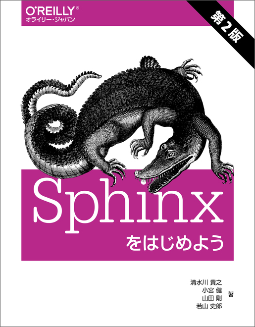
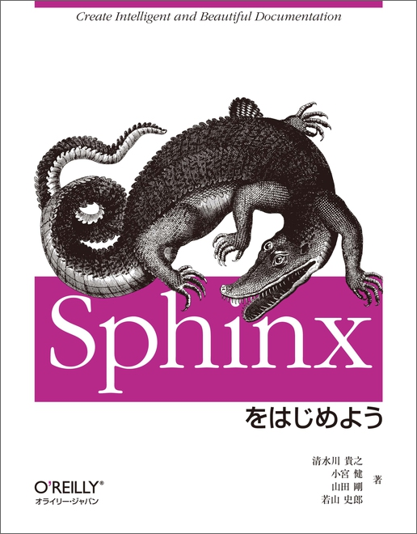
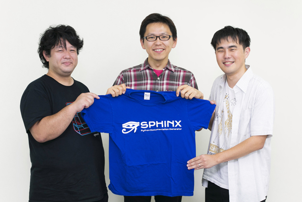

========
Articles
========

.. contents::
   :local:
   :depth: 1
   :backlinks: none

Books
=====

`エキスパートPythonプログラミング 改訂3版`__
----------------------------------------------
2021.07, アスキードワンゴ

.. __: https://www.amazon.co.jp/dp/4048930842/freiaweb-22

.. raw:: html

   

<a href="http://www.amazon.co.jp/exec/obidos/ASIN/4048930842/freiaweb-22/ref=nosim/" name="amazletlink" target="_blank">エキスパートPythonプログラミング改訂3版</a>
posted at 21.08.02

Michal Jaworski Tarek Ziade  KADOKAWA (2021-07-30) 売り上げランキング: 7,873 

<a href="http://www.amazon.co.jp/exec/obidos/ASIN/4048930842/freiaweb-22/ref=nosim/" name="amazletlink" target="_blank">Amazon.co.jpで詳細を見る</a>

.. csv-table:: Information
   :widths: 1,7
   :stub-columns: 1
   :delim: :

   対象読者: 卓越したPythonプログラマになりたい方
   Format: 紙, Kindle, PDF, 他
   Price: 3,800円+税
   ISBN-13: 978-404-893084-0
   概要: Pythonを使って仕事をしている開発者が普段どのようなツールやテクニックを用いて仕事をしているのか、また開発者が実際に現場で用いているベストプラクティスについて解説した書籍です。本書を読むことで、先進的なPythonプログラマが日常的に使用している開発ノウハウを学ぶことができます。
   著者: Michal Jaworski、Tarek Ziade
   翻訳: 稲田 直哉、芝田 将、渋川 よしき、清水川 貴之、森本 哲也
   関連記事: ":doc:`../blog/expert-python-programming-3rd-intro/index`"

`自走プログラマー`__
-----------------------------------------------
2020.2.27,

.. __: https://amzn.to/2LE5DjK

.. raw:: html

   

<a href="http://www.amazon.co.jp/exec/obidos/ASIN/4297111977/freiaweb-22/ref=nosim/" name="amazletlink" target="_blank">自走プログラマー ~Pythonの先輩が教えるプロジェクト開発のベストプラクティス120</a>
posted with <a href="http://www.amazlet.com/" title="amazlet" target="_blank">amazlet</a> at 20.03.09

清水川 貴之 清原 弘貴 tell-k  技術評論社  売り上げランキング: 10,445 

<a href="http://www.amazon.co.jp/exec/obidos/ASIN/4297111977/freiaweb-22/ref=nosim/" name="amazletlink" target="_blank">Amazon.co.jpで詳細を見る</a>

.. csv-table:: Information
   :widths: 1,7
   :stub-columns: 1
   :delim: :

   対象読者:  Python入門者から中級者になりたい人、技術的な選択を迷わずにできるようになりたい人
   Format: 紙, 電子版
   Price: 2,980円+税
   ISBN-13: 978-4297111977
   概要: 本書は、「プログラミング入門者が中級者にランクアップ」するのに必要な知識をお伝えする本です。扱っている120のトピックは、実際の現場で起こった問題とその解決方法を元に執筆しています。このため、扱っているプロジェクトの規模や、失敗パターンのレベル感もさまざまです。各トピックでは具体的な問題とベストプラクティス、なぜそれがベストなのかを解説します。
   著者: 清水川 貴之  (著), 清原 弘貴  (著), tell-k  (著), 株式会社ビープラウド (監修)
   執筆範囲: * 49トピック
   関連記事: "
* `10年以上のノウハウを詰め込んだ「自走プログラマー」を執筆しました - Make組ブログ <https://blog.hirokiky.org/entry/2020/02/20/105341>`_
* `「自走プログラマー」は中級以上のPythonプログラマーになりたい人のための豊富なレシピ集 - ビープラウド社長のブログ <https://shacho.beproud.jp/entry/self-propelled-programmer>`_ "

`Pythonプロフェッショナルプログラミング第3版`__
-----------------------------------------------
2018.6.12, 秀和システム

.. __: https://amzn.to/2LE5DjK

.. raw:: html

   

<a href="http://www.amazon.co.jp/exec/obidos/ASIN/4798053821/freiaweb-22/ref=nosim/" name="amazletlink" target="_blank">Pythonプロフェッショナルプログラミング 第3版</a>
posted with <a href="http://www.amazlet.com/" title="amazlet" target="_blank">amazlet</a> at 18.06.10

株式会社ビープラウド  秀和システム  売り上げランキング: 22,183 

<a href="http://www.amazon.co.jp/exec/obidos/ASIN/4798053821/freiaweb-22/ref=nosim/" name="amazletlink" target="_blank">Amazon.co.jpで詳細を見る</a>

Information

:対象読者: Pythonを読み書きできて、実際の業務、特にWeb開発と機械学習の開発手法を学びたい人
:Format: 紙, 電子版
:Price: 2,800円+税
:ISBN-13: 978-4-7980-5382-0
:概要: Pythonのシステム開発技法はどんどん進化しています。また、テキストで学んだことと開発現場では違ったノウハウも求められます。そのため、新人はまず実践知識を学ばなくてはなりません。本書は、Pythonでの開発経験豊富なシステム開発会社員が、今まで培ってきた技術や知識、ノウハウをもとに、新人がスムーズに開発に参加するために必要なPython開発の知識を解説します。GitおよびGitHubによるソースコード管理もわかります。（2版からの改定部分）バージョン管理システムはMercurialからGit/GitHubに変更。CI(継続的インテグレーション)ツールはJenkinsからCircleCIに変更。Pythonライブラリ紹介を削除し、機械学習プロジェクトの開発ノウハウの章を新設。
:著者: ビープラウド(鈴木たかのり, 清水川貴之, tell-k, 清原弘貴, James Van Dyne, 的場達也, 吉田花春, 新木雅也, altnight, 川村愛美, 石上晋)
:執筆範囲:
   * 3章 Python プロジェクトの構成とパッケージ作成
   * 9章 Python パッケージングと運用への活用
:関連記事:
   * :doc:`../blog/python-professional-programming-3rd/index`

`エキスパートPythonプログラミング 改訂2版`__
----------------------------------------------
2018.02, アスキードワンゴ

.. __: https://www.amazon.co.jp/dp/4048930613/freiaweb-22

.. raw:: html

   

<a href="http://www.amazon.co.jp/exec/obidos/ASIN/4048930613/freiaweb-22/ref=nosim/" name="amazletlink" target="_blank">エキスパートPythonプログラミング改訂2版</a>
posted with <a href="http://www.amazlet.com/" title="amazlet" target="_blank">amazlet</a> at 18.02.11

Michal Jaworski Tarek Ziade  KADOKAWA (2018-02-26) 売り上げランキング: 11,344 

<a href="http://www.amazon.co.jp/exec/obidos/ASIN/4048930613/freiaweb-22/ref=nosim/" name="amazletlink" target="_blank">Amazon.co.jpで詳細を見る</a>

.. .. figure:: 
..    :target: https://www.amazon.co.jp/dp/4048930613/freiaweb-22
..    :width: 200

Information

:対象読者: 卓越したPythonプログラマになりたい方
:Format: 紙, Kindle, PDF, 他
:Price: 3,600円+税
:ISBN-13: 978-404893-061-1
:概要: Pythonを使って仕事をしている開発者が普段どのようなツールやテクニックを用いて仕事をしているのか、また開発者が実際に現場で用いているベストプラクティスについて解説した書籍です。本書を読むことで、先進的なPythonプログラマが日常的に使用している開発ノウハウを学ぶことができます。
:著者: Michal Jaworski、Tarek Ziade
:翻訳: 稲田 直哉、芝田 将、渋川 よしき、清水川 貴之、森本 哲也
:関連記事:
   - :doc:`../blog/expert-python-programming-2nd/index`
   - :doc:`../blog/expert-python-programming-2nd-intro/index`

`独学プログラマー`__
----------------------
2018.02, 日経BP社

.. __: https://www.amazon.co.jp/dp/4822292274/freiaweb-22

.. raw:: html

   

<a href="http://www.amazon.co.jp/exec/obidos/ASIN/4822292274/freiaweb-22/ref=nosim/" name="amazletlink" target="_blank">独学プログラマー Python言語の基本から仕事のやり方まで</a>
posted with <a href="http://www.amazlet.com/" title="amazlet" target="_blank">amazlet</a> at 18.02.11

コーリー・アルソフ  日経BP社  売り上げランキング: 536 

<a href="http://www.amazon.co.jp/exec/obidos/ASIN/4822292274/freiaweb-22/ref=nosim/" name="amazletlink" target="_blank">Amazon.co.jpで詳細を見る</a>

.. .. figure:: images/tstp-ja.jpg
..    :target: https://www.amazon.co.jp/dp/4822292274/freiaweb-22
..    :width: 200

Information

:対象読者: プログラミングを覚えて、面接を受けて、仕事を得て、チームで働きたいといった、プロのプログラマーになるための学習に興味がある方
:Format: 紙, 電子版
:Price: 2,200円+税
:ISBN-13: 978-4-82229-227-0
:概要: 本書は「Pythonだけ」を学ぶ本ではありません。Pythonを使ってプログラミングを紹介していますが、伝えたい内容はPythonに限らない「プログラミング全般」の知識です。本書の著者、コーリー・アルソフは、「独学プログラマー」です。本書は、彼が独学で、ゼロからプログラミングを学んだ体験に基づいて書かれました。プログラミングを独学で身に付けるために、著者がPythonを通して学んだエッセンスが書かれています。彼の独学プログラマーとしての学び方は、Amazon.comでの本書の評価を見るとわかるように、多くの人に支持されています。
:著者: コーリー・アルソフ(Cory Althoff)
:監訳: 清水川貴之
:翻訳: 清水川貴之、新木雅也
:関連記事:
   - :doc:`../blog/pycharm-blog-201706-self-taught-programmer-interview-with-cory-althoff/index`
   - :doc:`../blog/the-self-taught-programmer-intro/index`
   - :doc:`../blog/the-self-taught-programmer-sample/index`
   - :doc:`../blog/the-self-taught-programmer-misc/index`
   - :doc:`../blog/the-self-taught-programmer-10k/index`

`Sphinxをはじめよう 第2版`__
-----------------------------
2017.10, O'Reilly Japan

.. __: https://www.oreilly.co.jp/books/9784873118192/

Information

:対象読者: Sphinxに初めて触れる方, ドキュメントをテキストで書きたい方
:Format: Print PDF ePub mobi
:Price: 1,800円+税
:ISBN-13: 978-4-87311-819-2
:概要: Sphinxの概要からインストール、基本的な利用法について。またSphinxからLaTeXを経由してPDFを作成したり、EPUBフォーマットの電子書籍を作成する方法を紹介。第1版からの更新として、最新のバージョンに対応し、画像埋め込みの章とMarkdownを利用する手順をまとめた付録を追加。付録の "reStructuredTextリファレンス" を拡充。
:著者: 清水川貴之, 小宮健, 山田剛, 若山史郎
:執筆範囲:
   * 1章 Sphinxとは
   * 3章 議事録を書いてみよう（HTMLへの変換）
   * 付録A reStructuredTextリファレンス

`Pythonプロフェッショナルプログラミング第2版`__
-------------------------------------------------
2015.2.27, 秀和システム

.. __: http://amzn.to/2qeuqAJ

.. raw:: html

   

<a href="http://www.amazon.co.jp/exec/obidos/ASIN/479804315X/freiaweb-22/ref=nosim/" name="amazletlink" target="_blank">Pythonプロフェッショナルプログラミング第2版</a>
posted with <a href="http://www.amazlet.com/" title="amazlet" target="_blank">amazlet</a> at 17.05.24

ビープラウド  秀和システム  売り上げランキング: 90,745 

<a href="http://www.amazon.co.jp/exec/obidos/ASIN/479804315X/freiaweb-22/ref=nosim/" name="amazletlink" target="_blank">Amazon.co.jpで詳細を見る</a>

Information

:対象読者: Pythonの言語は入門していて、実際の業務でどのように開発を行っていくかを学びたい人
:Size: B5変, 472ページ
:Format: 紙, Kindle, kobo
:Price: 2,800円+税
:ISBN-10: 479804315X
:ISBN-13: 978-4798043159
:概要: ビープラウドに入社したメンバーに、業務で必要な言語知識、プロジェクトの進め方、などを伝えるための本。
:著者: ビープラウド(清水川貴之, 岡野真也, drillbits, cactusman, 東健太, tell-k, 文殊堂, 冨田洋祐, aodag, 鈴木たかのり, 清原弘貴)
:執筆範囲:
   * 3章 Python プロジェクトの構成とパッケージ作成
   * 7章 ドキュメントの基盤を整える
   * 9章 Python パッケージングと運用への活用

:関連記事:
   * :doc:`../blog/python-professional-programming-2nd/index`
   * :doc:`../blog/python-professional-programming-2nd-mihon/index`
   * :doc:`../blog/python-professional-programming-2nd-ebook/index`

`Sphinxをはじめよう`__
-----------------------------
2013.09, O'Reilly Japan

.. __: https://www.oreilly.co.jp/books/9784873116488/

* 2015年11月, 更新 & PDF版追加

Information

:対象読者: Sphinxに初めて触れる方, ドキュメントをテキストで書きたい方
:Format: PDF ePub mobi
:Price: 1,600円+税
:ISBN-13: 978-4-87311-648-8
:概要: Sphinxの概要からインストール、基本的な利用法について。またSphinxからLaTeXを経由してPDFを作成したり、EPUBフォーマットの電子書籍を作成する方法を紹介
:著者: 清水川貴之, 小宮健, 山田剛, 若山史郎
:執筆範囲:
   * 1章 Sphinxとは
   * 付録A reStructuredTextリファレンス

`Pythonプロフェッショナルプログラミング`__
--------------------------------------------
2012.3.26, 秀和システム

.. __: http://amzn.to/2qTIfYt

.. raw:: html

   

<a href="http://www.amazon.co.jp/exec/obidos/ASIN/4798032948/freiaweb-22/ref=nosim/" name="amazletlink" target="_blank">Pythonプロフェッショナルプログラミング</a>
posted with <a href="http://www.amazlet.com/" title="amazlet" target="_blank">amazlet</a> at 17.05.24

ビープラウド  秀和システム  売り上げランキング: 388,137 

<a href="http://www.amazon.co.jp/exec/obidos/ASIN/4798032948/freiaweb-22/ref=nosim/" name="amazletlink" target="_blank">Amazon.co.jpで詳細を見る</a>

Information

:対象読者: Pythonの言語は入門していて、実際の業務でどのように開発を行っていくかを学びたい人
:Size: B5変, 464ページ
:Format: 紙
:Price: 2,800円+税
:ISBN-10: 4798032948
:ISBN-13: 978-4798032948
:概要: ビープラウドに入社したメンバーに、業務で必要な言語知識、プロジェクトの進め方、などを伝えるための本。
:著者: ビープラウド(清水川貴之, 岡野真也, 池田洋介, 畠弥峰, drillbits, cactusman, 東健太, tell-k, 今川館, ナツ, 文殊堂, aita, 冨田洋祐)
:執筆範囲:
   * 4章 ドキュメントの基盤を整える
   * 7章 パッケージングと環境セットアップの自動化
:関連記事:
   * :doc:`../blog/2012-03-27-python-professional-programming/index`

`エキスパートPythonプログラミング`__
-----------------------------------------
2010.5.28, KADOKAWA/アスキー・メディアワークス

.. __: http://amzn.to/2qehDyc

* :doc:`expertpython/index` 目次、読書会と質疑応答

.. toctree::
   :maxdepth: 1
   :hidden:

   expertpython/index

.. raw:: html

   

<a href="http://www.amazon.co.jp/exec/obidos/ASIN/4048686291/freiaweb-22/ref=nosim/" name="amazletlink" target="_blank">エキスパートPythonプログラミング</a>
posted with <a href="http://www.amazlet.com/" title="amazlet" target="_blank">amazlet</a> at 17.05.24

Tarek Ziade  KADOKAWA/アスキー・メディアワークス  売り上げランキング: 299,414 

<a href="http://www.amazon.co.jp/exec/obidos/ASIN/4048686291/freiaweb-22/ref=nosim/" name="amazletlink" target="_blank">Amazon.co.jpで詳細を見る</a>

Information

:対象読者: 脱中級、上級を目指す人
:Size: B5変, 416ページ
:Format: 紙
:Price: 3,800円+税
:ISBN-10: 4048686291
:ISBN-13: 978-4048686297
:概要: Pythonを取り巻く環境について扱っている本で、個々の話題の難易度は高め
:著者: Tarek Ziade
:訳者: 稲田直哉, 渋川よしき, 清水川貴之, 森本哲也
:翻訳範囲:
   * 5章 パッケージを作る
   * 6章 アプリケーションを作る
   * 7章 zc.buildoutを使う
   * 10章 プロジェクトのドキュメント作成

Software Design Sphinx連載
--------------------------

.. raw:: html

   

<a href="http://www.amazon.co.jp/exec/obidos/ASIN/B00XU0UEJY/freiaweb-22/ref=nosim/" name="amazletlink" target="_blank">ソフトウェア デザイン 2015年 07 月号 [雑誌]</a>
posted with <a href="http://www.amazlet.com/" title="amazlet" target="_blank">amazlet</a> at 17.05.24

 技術評論社 (2015-06-18) 

<a href="http://www.amazon.co.jp/exec/obidos/ASIN/B00XU0UEJY/freiaweb-22/ref=nosim/" name="amazletlink" target="_blank">Amazon.co.jpで詳細を見る</a>

* `Software Design 2015年7月号:【4】テーブルを使いこなそう(清水川 貴之)`__
* `Software Design 2015年8月号:【5】目次，用語集，索引を付けよう-大きめのドキュメントを読みやすくするために(本文:川本 安武，短信:清水川 貴之)`__
* `Software Design 2015年9月号:【6】Webサイトを作ろう（前編）(本文:山田 剛，短信:清水川 貴之)`__
* `Software Design 2015年10月号:【7】Webサイトを作ろう（後編）(本文:山田 剛，短信:清水川 貴之)`__
* `Software Design 2015年11月号:【8】HTMLテーマをカスタマイズしてみよう-ドキュメントの見た目を変える(本文:熊谷 章治，短信:清水川 貴之)`__
* `Software Design 2015年12月号:【9】ドキュメントに図を入れよう-さまざまなグラフィックツールとの連携(本文:小宮 健，短信:清水川 貴之)`__
* `Software Design 2016年1月号:【10】ドキュメントに図を入れよう-テキストマークアップから図を生成する(本文:小宮 健，短信:清水川 貴之)`__
* `Software Design 2016年2月号:【11】HTMLドキュメントを検索しよう(本文:打田 智子，短信:清水川 貴之)`__
* `Software Design 2016年3月号:【12】Sphinxで本を書こう-EPUBで出力する(本文:若山 史郎，短信:清水川 貴之)`__
* `Software Design 2016年4月号:【13】MarkdownではじめるSphinx(清水川 貴之)`__
* `Software Design 2016年5月号:【14】Sphinxで楽々ドキュメント翻訳(清水川 貴之)`__
* `Software Design 2016年6月号:【15】ドキュメント翻訳フローの自動化(清水川 貴之)`__
* `Software Design 2016年9月号:【18】ドキュメントを自動生成するautodoc(清水川 貴之)`__
* `Software Design 2017年1月号:【22】Sphinxで本を書こう(清水川 貴之)`__

.. __: http://gihyo.jp/magazine/SD/archive/2015/201507
.. __: http://gihyo.jp/magazine/SD/archive/2015/201508
.. __: http://gihyo.jp/magazine/SD/archive/2015/201509
.. __: http://gihyo.jp/magazine/SD/archive/2015/201510
.. __: http://gihyo.jp/magazine/SD/archive/2015/201511
.. __: http://gihyo.jp/magazine/SD/archive/2015/201512
.. __: http://gihyo.jp/magazine/SD/archive/2015/201601
.. __: http://gihyo.jp/magazine/SD/archive/2015/201602
.. __: http://gihyo.jp/magazine/SD/archive/2015/201603
.. __: http://gihyo.jp/magazine/SD/archive/2016/201604
.. __: http://gihyo.jp/magazine/SD/archive/2016/201605
.. __: http://gihyo.jp/magazine/SD/archive/2016/201606
.. __: http://gihyo.jp/magazine/SD/archive/2016/201609
.. __: http://gihyo.jp/magazine/SD/archive/2017/201701

Articles
========

`独学プログラマーのススメ`__
-----------------------------
2018.04.27. - 日経トレンディネット

.. __: http://trendy.nikkeibp.co.jp/atcl/pickup/15/1003590/042501673/?rt=nocnt

.. figure:: images/trendy-nikkeibp.*
   :target: http://trendy.nikkeibp.co.jp/atcl/pickup/15/1003590/042501673/?rt=nocnt

* 過去の体験を元に、独学に対して思うメリットと落とし穴について寄稿しました
* 「今日から始められるよ」

PyCon JP 2016 レポート
----------------------------

- `2016.12.06. PyCon JP 2016 開催後レポート　～第2回 プログラムチームのPyCon JP 2016`__
- `2016.08.24. PyCon JP 2016 開催前レポート　～第2回 プログラムについて`__

.. __: https://codezine.jp/article/detail/9828
.. __: https://codezine.jp/article/detail/9600

`海外PyCon発表修行レポート2015`__
-----------------------------------
2015.6.15. - 2015.9.18. at gihyo.jp

.. __: http://gihyo.jp/news/report/01/overseas-pycon-presentation-training-2015

- `2015.06.15. 第1回 PyCon APAC 2015 in TaiwanでのSphinxに関する発表`__
- `2015.07.14. 第2回 PyCon SG 2015参加レポートとSphinxに関する発表`__
- `2015.08.10. 第3回 EuroPython 2015参加レポートと，Sphinxに関する発表（前編）`__
- `2015.08.12. 第4回 EuroPython 2015参加レポートと，Sphinxに関する発表（後編）`__
- `2015.09.07. 第5回 PyCon Malaysia 2015参加レポートとSphinx発表`__
- `2015.09.18. 第6回 PyCon Korea 2015参加レポートとSphinx発表`__

.. __: http://gihyo.jp/news/report/01/overseas-pycon-presentation-training-2015/0001
.. __: http://gihyo.jp/news/report/01/overseas-pycon-presentation-training-2015/0002
.. __: http://gihyo.jp/news/report/01/overseas-pycon-presentation-training-2015/0003
.. __: http://gihyo.jp/news/report/01/overseas-pycon-presentation-training-2015/0004
.. __: http://gihyo.jp/news/report/01/overseas-pycon-presentation-training-2015/0005
.. __: http://gihyo.jp/news/report/01/overseas-pycon-presentation-training-2015/0006

PyCon Taiwan 2013 レポート
----------------------------

- `2013.07.19. PyCon Taiwan 2013レポート　～イベント前日`__
- `2013.07.19. PyCon Taiwan 2013レポート　～初日`__
- `2013.07.19. PyCon Taiwan 2013レポート　～二日目`__

.. __: https://codezine.jp/article/detail/7236
.. __: https://codezine.jp/article/detail/7237
.. __: https://codezine.jp/article/detail/7238

PyCon JP 2012 レポート
----------------------------

- `2012.10.22. PyCon JP 2012 レポート　～第4回 総括`__
- `2012.09.13. PyCon JP 2012 開催前レポート　～第5回 併設イベントの紹介`__
- `2012.09.12. PyCon JP 2012 開催前レポート　～第4回 プログラム以外の諸々`__

.. __: https://codezine.jp/article/detail/6834
.. __: https://codezine.jp/article/detail/6765
.. __: https://codezine.jp/article/detail/6761

PyCon JP 2011 レポート
----------------------------

- `2011.09.15. 運営スタッフが振り返る「PyCon JP 2011」の模様と今後の展望`__

.. __: https://codezine.jp/article/detail/6151

Local Site
----------

.. toctree::
   :maxdepth: 1

   buildout/index
   buildbot/index
   pyhack4/index
   pyhack5/index
   xdv/index
   Sencha Touch 2 Exercise <http://www.freia.jp/taka/slides/sencha-touch2-exercise/index.html>
   [翻訳]Zope2関連ドキュメントと記事 <http://zope.jp/zope2/index.html>
   [翻訳]ユニットテスト <http://plone.jp/documentation/unit-testing>
   [翻訳] Pythonパッケージ ヒッチハイク・ガイド <http://www.freia.jp/taka/slides/python-distribute-ja/index.html>

.. * :doc:`buildbot/index`
..
..   buildbotはPythonベースの継続的インテグレーションシステムです。
..   サーバー・クライアントモデルで構成されており、リポジトリからのソース取得
..   からビルドとテストの実行までを様々なトリガーで実行します。
..   WebUIのみの提供でPythonが動作するプラットフォームであれば動作します。
..
.. * :doc:`buildout/index`
..
..   buildoutはPythonベースのビルドシステムです。パーツという単位で
..   アプリケーションを作成、組み立て、配置などを行い、非Pythonベースのものも
..   構築可能です。
..
.. * :doc:`pyhack5/index`
..
..   Python Hack-a-thon 5 ハンズオン中級コース用資料。
..   PythonのDocTestを使ってみよう。TDDをDocTestでやってみよう。
..   DocTest Driven Development などについて説明した実習型の資料です。
..
..
.. * :doc:`xdv/index`
..
..   HTMLコンテンツ変換ツール xdv のチュートリアルドキュメントです。
..
.. * `[翻訳]Pythonパッケージ ヒッチハイク・ガイド <http://www.freia.jp/taka/slides/python-distribute-ja/index.html>`_
..
..   http://www.freia.jp/taka/docs/python-distribute-ja
..   清水川が翻訳している、Pythonパッケージの作成に関するガイドドキュメントです。
..
.. * :doc:`pyhack4/index`
..
..   Python Hack-a-thon 4 のハンズオン中級コースで使用した、virtualenv,
..   setuptools, PyPI, buildoutを学ぶための資料です。
..
.. * `[翻訳]Zope2関連ドキュメントと記事 <http://docs.zope.jp/zope2/>`_
..
..   http://docs.zope.jp/zope2/
..   清水川が翻訳に参加しているZope2のドキュメント翻訳関連です。Zope 開発者ガイド,
..   Zope2リリース情報などがあります。
..
.. * `[翻訳]ユニットテスト <http://plone.jp/documentation/unit-testing>`_
..
..   http://plone.jp/documentation/unit-testing
..   清水川が翻訳したPloneのユニットテストに関するドキュメントです。

Interview
=========

`著名Pythonista清水川貴之氏が語る「独学プログラマー」が陥る落とし穴の回避法`__
------------------------------------------------------------------------------
2018.03.26 / エンジニアtype | 転職＠type

.. __: https://type.jp/et/feature/6678

.. figure:: images/typejp-et-feature-6678-shimizukawa_main.*
   :target: https://type.jp/et/feature/6678

- "プログラミング初学者にとっての「地図のような本」"
- "学ぶべきは、技術ではなく学ぶ姿勢"
- "プログラミングの楽しさを忘れないためにも、セルフマネジメントのスキルを磨いてほしい"

`書籍「独学プログラマー」コラボ問題公開　訳者のお二人にインタビューしました。`__
--------------------------------------------------------------------------------
2018.02.26 / PyQオフィシャルブログ

.. __: http://blog.pyq.jp/entry/interview_dokugaku_180226

.. figure:: images/blog-pyq-jp-entry-interview_dokugaku_180226.*
   :target: http://blog.pyq.jp/entry/interview_dokugaku_180226

- どんな本?
- 監訳ってどんな役割？
- 本書のオススメポイントは？
- PyQとコラボしたチャレンジ問題について

`バターコーヒーダイエットに成功した人にお話を聞いてみた！`__
-------------------------------------------------------------
2017.12.19 / ienomistyle おウチで飲む、食べる

.. __: https://www.ienomistyle.com/article/7178

.. raw:: html

   <blockquote class="twitter-tweet" data-lang="ja">
★NEW★ バターコーヒーダイエットに成功した人にお話を聞いてみた！ <a href="https://t.co/3o265nnQii">https://t.co/3o265nnQii</a> <a href="https://t.co/z4WbQMOrk6">pic.twitter.com/z4WbQMOrk6</a>
&mdash; イエノミスタイル (@ienomistyle) <a href="https://twitter.com/ienomistyle/status/942987741771583488?ref_src=twsrc%5Etfw">2017年12月19日</a></blockquote>
   

`PyCon JP 2017開催直前、緊急座談会　～採択倍率4倍を潜り抜けた登壇者たちが、発表の裏側やイベントの楽しみ方を徹底紹介`__
-----------------------------------------------------------------------------------------------------------------------
2017.9.1 / CodeZine（コードジン）

.. __: http://codezine.jp/article/detail/10391

.. figure:: images/codezine-jp-article-detail-10391.*
   :target: http://codezine.jp/article/detail/10391

`Pythonエンジニア列伝 Vol.1 清水川貴之氏（後編）`__
-----------------------------------------------------
2017.8.31 / PyQオフィシャルブログ

.. __: http://blog.pyq.jp/entry/lives_of_engineer_001_2

.. figure:: images/pyq-blog-lives-of-engineer-001-2.*
   :target: http://blog.pyq.jp/entry/lives_of_engineer_001_2

   ダメで当たり前なのでどんどんやる。アウトプットしていこう

`Pythonエンジニア列伝 Vol.1 清水川貴之氏（前編）`__
-----------------------------------------------------
2017.8.29 / PyQオフィシャルブログ

.. __: http://blog.pyq.jp/entry/lives_of_engineer_001_1

.. figure:: images/pyq-blog-lives-of-engineer-001-1.*
   :target: http://blog.pyq.jp/entry/lives_of_engineer_001_1

   手をいつでもあげられるように素振りをしよう

`清水川 貴之｜Special Contents｜Vantan`__
-----------------------------------------------
2016.11.14 / Vantan | インタビュー

.. __: https://vantan.jp/special/kiji.php?e_id=4511

`プログラム初心者でも問題なし！1日6時間 全3日間でPythonを武器にするPythonキャリアカレッジ`__
-----------------------------------------------------------------------------------------------
2016.10.26 / CGWORLD.jp | インタビュー

.. __: https://cgworld.jp/interview/201610-python.html

`OSSをHackしてキャリアが広がる～海外生まれのドキュメントツール『Sphinx』を開発・運営する日本人メンバーに聞く`__
-----------------------------------------------------------------------------------------------------------------
2014.10.21 / エンジニアtype

.. __: http://type.jp/et/log/article/sphinx-hack

   ムリせず自然体で3人それぞれが「できることをやる」

   （写真左から）山田剛氏、清水川貴之氏、小宮健氏の3人

