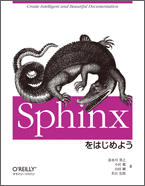

========
Articles
========

.. contents::
   :local:

Talks
=====

`仕事で使うちょっとしたコードをOSSとして開発メンテしていく - Django Redshift Backend の開発`__
-------------------------------------------------------------------------------------------------------------------------------
2016.9.21 at `PyCon JP 2016`__

.. __: https://www.slideshare.net/shimizukawa/why-dont-you-share-your-code-snippet-for-your-jobas-a-open-source-software-pycon-jp-2016
.. __: https://pycon.jp/2016/ja/schedule/presentation/48/

  .. raw:: html

     <iframe src="//www.slideshare.net/slideshow/embed_code/key/3FTXp1hrS1U3WN" width="595" height="485" frameborder="0" marginwidth="0" marginheight="0" scrolling="no" style="border:1px solid #CCC; border-width:1px; margin-bottom:5px; max-width: 100%;" allowfullscreen> </iframe>

`Easy contributable internationalization process with Sphinx`__
--------------------------------------------------------------------
2016.8.15 at `PyCon APAC 2016`__

.. __: https://www.slideshare.net/shimizukawa/easy-contributable-internationalization-process-with-sphinx-at-pycon-apac-2016
.. __: https://www.pycon.kr/2016apac/program/44

  .. raw:: html

     <iframe src="//www.slideshare.net/slideshow/embed_code/key/N4BCVTyZhKKK9u" width="595" height="485" frameborder="0" marginwidth="0" marginheight="0" scrolling="no" style="border:1px solid #CCC; border-width:1px; margin-bottom:5px; max-width: 100%;" allowfullscreen> </iframe>

`素振りのススメ`__
-----------------------
2016.1.27 at `Python入門者の集い`__

.. __: https://www.slideshare.net/shimizukawa/suburi-no-susume-at-python-nyumon
.. __: https://python-nyumon.connpass.com/event/23466/

  .. raw:: html

     <iframe src="//www.slideshare.net/slideshow/embed_code/key/9iS8q5POhRi14T" width="595" height="485" frameborder="0" marginwidth="0" marginheight="0" scrolling="no" style="border:1px solid #CCC; border-width:1px; margin-bottom:5px; max-width: 100%;" allowfullscreen> </iframe>

`Welcome to Sphinx-1.3`__
------------------------------
2014.10.26.at SphinxCon JP 2014

.. __: http://www.freia.jp/sphinxconjp2014-welcome-to-sphinx-1.3/index.html

`PyCharm活用術`__
----------------------
2014.9.13 at PyCon JP 2014

.. __: http://www.freia.jp/pyconjp2014-pycharm/index.html

`Python 2.5 からPython 3.3 で動作するツールの作り方`__
--------------------------------------------------------------------
2013.9.15. at PyCon APAC 2013

.. __: http://www.freia.jp/taka/slides/pyconapac2013-how-to-make-with-python2-to-3/index.html

* `Introduction to Sphinx documentation generator <http://www.freia.jp/taka/slides/pycontw2013-sphinx-introduction/index.html>`__ (@ `PyCon Taiwan 2013 <http://tw.pycon.org/2013/ja/speaker/#speaker_id_11>`__ . 2013.5.25.)
* `Chefの 環境別設定が 難しい話 <http://www.freia.jp/taka/slides/biglobe-tech-talk1-chef-lt/index.html>`__ (@ `Biglobe Tech Talk #1 <http://connpass.com/event/2486/>`__ . 2013.6.14.)
* `Chefで構築するBP-Redmine環境 <http://www.freia.jp/taka/slides/bpstudy68-chef/index.html>`__  (@ `BPStudy#68 <http://connpass.com/event/2207/>`__ . 2013.4.26.)
* `Pythonな会社でchefしてる例の紹介 <http://www.freia.jp/taka/slides/chef-casual-talk1/index.html>`__  (@ `Chef Casual Talk #1 <http://chef-meetup.doorkeeper.jp/events/3513>`__ 2013.4.15.)
* `ドキュメントジェネレータSphinx <http://www.freia.jp/taka/slides/everyrb-6th/index.html>`__ (@ `万葉.rb <http://everyleaf.github.io/kaigi/>`__ 2013.4.6.)
* `Sphinx 1.2 preview <http://www.freia.jp/taka/slides/sphinx120-preview/index.html>`__  (@ `SphinxCon JP 2013 Spring <http://connpass.com/event/1379/>`_ 2013.2.23.)

* `Refactoring A Python Beginner's Code <http://www.freia.jp/taka/slides/refactoring-python-beginners-code/index.html>`__ (@ `PyCon JP 2012 <http://2012.pycon.jp/program/sessions.html#session-15-1455-room433-ja>`__ 2012.9.15.)

* `Sphinxからプレゼンテーションスライドを作ってみた(htmlslide) <http://www.freia.jp/taka/slides/pycon-mini-jp-2011-sphinx-presentation/htmlslide/index.html>`__ (@ `PyCon mini JP 2011 <https://sites.google.com/site/pyconminijp/reports/lt#TOC-Sphinx->`__ 2011.1.31.)
* `Sphinxからプレゼンテーションスライドを作ってみた(s6) <http://www.freia.jp/taka/slides/pycon-mini-jp-2011-sphinx-presentation/s6/index.html>`__ (@ `PyCon mini JP 2011 <https://sites.google.com/site/pyconminijp/reports/lt#TOC-Sphinx->`__ 2011.1.31.)

* `Pythonで アジャイル 開発サイクル 2011ver. <http://www.freia.jp/taka/slides/xpfest2010/index.html>`__ (@ `XP祭り2010 ～ アジャイル学園祭～ <http://kokucheese.com/event/index/2167/>`__ 2010.9.4.)

Books
=====

`Pythonプロフェッショナルプログラミング第2版`__
-------------------------------------------------
2015.2.27, 秀和システム

:対象読者: Pythonの言語は入門していて、実際の業務でどのように開発を行っていくかを学びたい人
:サイズ: B5変, 472ページ
:フォーマット: 紙, Kindle, kobo
:価格: 2,800円(外税)
:ISBN-10: 479804315X
:ISBN-13: 978-4798043159
:概要: ビープラウドに入社したメンバーに、業務で必要な言語知識、プロジェクトの進め方、などを伝えるための本。
:著者: ビープラウド(清水川貴之, 岡野真也, drillbits, cactusman, 東健太, tell-k, 文殊堂, 冨田洋祐, aodag, 鈴木たかのり, 清原弘貴)
:執筆範囲:
   * 3章 Python プロジェクトの構成とパッケージ作成
   * 7章 ドキュメントの基盤を整える
   * 9章 Python パッケージングと運用への活用

.. __: http://amzn.to/2qeuqAJ

.. raw:: html

   

<a href="http://www.amazon.co.jp/exec/obidos/ASIN/479804315X/freiaweb-22/ref=nosim/" name="amazletlink" target="_blank">Pythonプロフェッショナルプログラミング第2版</a>
posted with <a href="http://www.amazlet.com/" title="amazlet" target="_blank">amazlet</a> at 17.05.24

ビープラウド  秀和システム  売り上げランキング: 90,745 

<a href="http://www.amazon.co.jp/exec/obidos/ASIN/479804315X/freiaweb-22/ref=nosim/" name="amazletlink" target="_blank">Amazon.co.jpで詳細を見る</a>

`Sphinxをはじめよう`__
-----------------------------
2013.09, O'Reilly Japan

.. __: https://www.oreilly.co.jp/books/9784873116488/

* 2015年11月, 改版 & PDF版追加

:対象読者: Sphinxに初めて触れる方, ドキュメントをテキストで書きたい方
:フォーマット: PDF ePub mobi
:価格: 1,600円(外税)
:ISBN-13: 978-4-87311-648-8
:概要: Sphinxの概要からインストール、基本的な利用法について。またSphinxからLaTeXを経由してPDFを作成したり、EPUBフォーマットの電子書籍を作成する方法を紹介
:著者: 清水川貴之, 小宮健, 山田剛, 若山史郎
:執筆範囲:
   * 1章 Sphinxとは
   * 付録A reStructuredTextリファレンス

`Pythonプロフェッショナルプログラミング`__
--------------------------------------------
2012.3.26, 秀和システム

.. __: http://amzn.to/2qTIfYt

:対象読者: Pythonの言語は入門していて、実際の業務でどのように開発を行っていくかを学びたい人
:サイズ: B5変, 464ページ
:フォーマット: 紙
:価格: 2,800円(外税)
:ISBN-10: 4798032948
:ISBN-13: 978-4798032948
:概要: ビープラウドに入社したメンバーに、業務で必要な言語知識、プロジェクトの進め方、などを伝えるための本。
:著者: ビープラウド(清水川貴之, 岡野真也, 池田洋介, 畠弥峰, drillbits, cactusman, 東健太, tell-k, 今川館, ナツ, 文殊堂, aita, 冨田洋祐)
:執筆範囲:
   * 4章 ドキュメントの基盤を整える
   * 7章 パッケージングと環境セットアップの自動化

.. raw:: html

   

<a href="http://www.amazon.co.jp/exec/obidos/ASIN/4798032948/freiaweb-22/ref=nosim/" name="amazletlink" target="_blank">Pythonプロフェッショナルプログラミング</a>
posted with <a href="http://www.amazlet.com/" title="amazlet" target="_blank">amazlet</a> at 17.05.24

ビープラウド  秀和システム  売り上げランキング: 388,137 

<a href="http://www.amazon.co.jp/exec/obidos/ASIN/4798032948/freiaweb-22/ref=nosim/" name="amazletlink" target="_blank">Amazon.co.jpで詳細を見る</a>

`エキスパートPythonプログラミング`__
-----------------------------------------
2010.5.28, KADOKAWA/アスキー・メディアワークス

.. __: http://amzn.to/2qehDyc

:対象読者: 脱中級、上級を目指す人
:サイズ: B5変, 416ページ
:フォーマット: 紙
:価格: 3,800円(外税)
:ISBN-10: 4048686291
:ISBN-13: 978-4048686297
:概要: Pythonを取り巻く環境について扱っている本で、個々の話題の難易度は高め
:著者: Tarek Ziade
:訳者: 稲田直哉, 渋川よしき, 清水川貴之, 森本哲也
:翻訳範囲:
   * 5章 パッケージを作る
   * 6章 アプリケーションを作る
   * 7章 zc.buildoutを使う
   * 10章 プロジェクトのドキュメント作成

* :doc:`expertpython/index` 目次、読書会と質疑応答

.. toctree::
   :maxdepth: 1
   :hidden:

   expertpython/index

.. raw:: html

   

<a href="http://www.amazon.co.jp/exec/obidos/ASIN/4048686291/freiaweb-22/ref=nosim/" name="amazletlink" target="_blank">エキスパートPythonプログラミング</a>
posted with <a href="http://www.amazlet.com/" title="amazlet" target="_blank">amazlet</a> at 17.05.24

Tarek Ziade  KADOKAWA/アスキー・メディアワークス  売り上げランキング: 299,414 

<a href="http://www.amazon.co.jp/exec/obidos/ASIN/4048686291/freiaweb-22/ref=nosim/" name="amazletlink" target="_blank">Amazon.co.jpで詳細を見る</a>

Software Design Sphinx連載
--------------------------

* `Software Design 2015年7月号:【4】テーブルを使いこなそう(清水川 貴之) <http://gihyo.jp/magazine/SD/archive/2015/201507>`__
* `Software Design 2015年8月号:【5】目次，用語集，索引を付けよう-大きめのドキュメントを読みやすくするために(本文:川本 安武，短信:清水川 貴之) <http://gihyo.jp/magazine/SD/archive/2015/201508>`__
* `Software Design 2015年9月号:【6】Webサイトを作ろう（前編）(本文:山田 剛，短信:清水川 貴之) <http://gihyo.jp/magazine/SD/archive/2015/201509>`__
* `Software Design 2015年10月号:【7】Webサイトを作ろう（後編）(本文:山田 剛，短信:清水川 貴之) <http://gihyo.jp/magazine/SD/archive/2015/201510>`__
* `Software Design 2015年11月号:【8】HTMLテーマをカスタマイズしてみよう-ドキュメントの見た目を変える(本文:熊谷 章治，短信:清水川 貴之) <http://gihyo.jp/magazine/SD/archive/2015/201511>`__
* `Software Design 2015年12月号:【9】ドキュメントに図を入れよう-さまざまなグラフィックツールとの連携(本文:小宮 健，短信:清水川 貴之) <http://gihyo.jp/magazine/SD/archive/2015/201512>`__
* `Software Design 2016年1月号:【10】ドキュメントに図を入れよう-テキストマークアップから図を生成する(本文:小宮 健，短信:清水川 貴之) <http://gihyo.jp/magazine/SD/archive/2015/201601>`__
* `Software Design 2016年2月号:【11】HTMLドキュメントを検索しよう(本文:打田 智子，短信:清水川 貴之) <http://gihyo.jp/magazine/SD/archive/2015/201602>`__
* `Software Design 2016年3月号:【12】Sphinxで本を書こう-EPUBで出力する(本文:若山 史郎，短信:清水川 貴之) <http://gihyo.jp/magazine/SD/archive/2015/201603>`__
* `Software Design 2016年4月号:【13】MarkdownではじめるSphinx(清水川 貴之) <http://gihyo.jp/magazine/SD/archive/2016/201604>`__
* `Software Design 2016年5月号:【14】Sphinxで楽々ドキュメント翻訳(清水川 貴之) <http://gihyo.jp/magazine/SD/archive/2016/201605>`__
* `Software Design 2016年6月号:【15】ドキュメント翻訳フローの自動化(清水川 貴之) <http://gihyo.jp/magazine/SD/archive/2016/201606>`__
* `Software Design 2016年9月号:【18】ドキュメントを自動生成するautodoc(清水川 貴之) <http://gihyo.jp/magazine/SD/archive/2016/201609>`__
* `Software Design 2017年1月号:【22】Sphinxで本を書こう(清水川 貴之) <http://gihyo.jp/magazine/SD/archive/2017/201701>`__

Articles
========

.. toctree::
   :maxdepth: 1

   buildout/index
   buildbot/index
   pyhack4/index
   pyhack5/index
   xdv/index
   Sencha Touch 2 Exercise <http://www.freia.jp/taka/slides/sencha-touch2-exercise/index.html>
   [翻訳]Zope2関連ドキュメントと記事 <http://docs.zope.jp/zope2/>
   [翻訳]ユニットテスト <http://plone.jp/documentation/unit-testing>
   [翻訳] Pythonパッケージ ヒッチハイク・ガイド <http://www.freia.jp/taka/slides/python-distribute-ja/index.html>

.. * :doc:`buildbot/index`
..
..   buildbotはPythonベースの継続的インテグレーションシステムです。
..   サーバー・クライアントモデルで構成されており、リポジトリからのソース取得
..   からビルドとテストの実行までを様々なトリガーで実行します。
..   WebUIのみの提供でPythonが動作するプラットフォームであれば動作します。
..
.. * :doc:`buildout/index`
..
..   buildoutはPythonベースのビルドシステムです。パーツという単位で
..   アプリケーションを作成、組み立て、配置などを行い、非Pythonベースのものも
..   構築可能です。
..
.. * :doc:`pyhack5/index`
..
..   Python Hack-a-thon 5 ハンズオン中級コース用資料。
..   PythonのDocTestを使ってみよう。TDDをDocTestでやってみよう。
..   DocTest Driven Development などについて説明した実習型の資料です。
..
.. * `XP祭り2010: Pythonでアジャイル開発サイクル 2010ver <http://www.freia.jp/taka/docs/xpfest2010/>`_
..
..   http://www.freia.jp/taka/docs/xpfest2010/
..   XP祭り2010で発表した内容です。Pythonでアジャイル開発を効率よく行う例として、
..   分散バージョン管理、構成管理、ユニットテスト、継続的インテグレ―ションなどを
..   用いた開発サイクルについて、それぞれPythonのツール群(MercurialHG,buildout,
..   Buildbot, Noseなど)の活用方法をお話します。
..
..
.. * :doc:`xdv/index`
..
..   HTMLコンテンツ変換ツール xdv のチュートリアルドキュメントです。
..
.. * `[翻訳]Pythonパッケージ ヒッチハイク・ガイド <http://www.freia.jp/taka/slides/python-distribute-ja/index.html>`_
..
..   http://www.freia.jp/taka/docs/python-distribute-ja
..   清水川が翻訳している、Pythonパッケージの作成に関するガイドドキュメントです。
..
.. * :doc:`pyhack4/index`
..
..   Python Hack-a-thon 4 のハンズオン中級コースで使用した、virtualenv,
..   setuptools, PyPI, buildoutを学ぶための資料です。
..
.. * `[翻訳]Zope2関連ドキュメントと記事 <http://docs.zope.jp/zope2/>`_
..
..   http://docs.zope.jp/zope2/
..   清水川が翻訳に参加しているZope2のドキュメント翻訳関連です。Zope 開発者ガイド,
..   Zope2リリース情報などがあります。
..
.. * `[翻訳]ユニットテスト <http://plone.jp/documentation/unit-testing>`_
..
..   http://plone.jp/documentation/unit-testing
..   清水川が翻訳したPloneのユニットテストに関するドキュメントです。
..
.. * :doc:`misc/index`
..
..   以前書いたり翻訳したりしたドキュメントなど。

