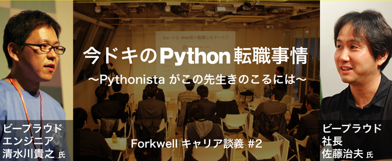

========
Articles
========

.. contents::
   :local:
   :depth: 1
   :backlinks: none

Talks
=====

`仕事で使うちょっとしたコードをOSSとして開発メンテしていく - Django Redshift Backend の開発`__
-------------------------------------------------------------------------------------------------------------------------------
2016.9.21. at `PyCon JP 2016`__

.. __: https://www.slideshare.net/shimizukawa/why-dont-you-share-your-code-snippet-for-your-jobas-a-open-source-software-pycon-jp-2016
.. __: https://pycon.jp/2016/ja/schedule/presentation/48/

  .. raw:: html

     <iframe src="//www.slideshare.net/slideshow/embed_code/key/3FTXp1hrS1U3WN" width="595" height="485" frameborder="0" marginwidth="0" marginheight="0" scrolling="no" style="border:1px solid #CCC; border-width:1px; margin-bottom:5px; max-width: 100%;" allowfullscreen> </iframe>

`Easy contributable internationalization process with Sphinx`__
--------------------------------------------------------------------
2016.8.15. at `PyCon APAC 2016`__

.. __: https://www.slideshare.net/shimizukawa/easy-contributable-internationalization-process-with-sphinx-at-pycon-apac-2016
.. __: https://www.pycon.kr/2016apac/program/44

  .. raw:: html

     <iframe src="//www.slideshare.net/slideshow/embed_code/key/N4BCVTyZhKKK9u" width="595" height="485" frameborder="0" marginwidth="0" marginheight="0" scrolling="no" style="border:1px solid #CCC; border-width:1px; margin-bottom:5px; max-width: 100%;" allowfullscreen> </iframe>

`素振りのススメ`__
-----------------------
2016.1.27. at `Python入門者の集い`__

.. __: https://www.slideshare.net/shimizukawa/suburi-no-susume-at-python-nyumon
.. __: https://python-nyumon.connpass.com/event/23466/

  .. raw:: html

     <iframe src="//www.slideshare.net/slideshow/embed_code/key/9iS8q5POhRi14T" width="595" height="485" frameborder="0" marginwidth="0" marginheight="0" scrolling="no" style="border:1px solid #CCC; border-width:1px; margin-bottom:5px; max-width: 100%;" allowfullscreen> </iframe>

`世界のSphinx事情`__
-----------------------
2015.11.24. at `SphinxCon JP 2015`__

.. __: https://www.slideshare.net/shimizukawa/sphinx-in-the-world-sphinxcon-jp-2015
.. __: http://sphinx-users.jp/event/20151124_sphinxconjp/index.html

  .. raw:: html

     <iframe src="//www.slideshare.net/slideshow/embed_code/key/6ZTrb69QtZXetG" width="595" height="485" frameborder="0" marginwidth="0" marginheight="0" scrolling="no" style="border:1px solid #CCC; border-width:1px; margin-bottom:5px; max-width: 100%;" allowfullscreen> </iframe> 
 <strong> <a href="//www.slideshare.net/shimizukawa/sphinx-in-the-world-sphinxcon-jp-2015" title="世界のSphinx事情 @ SphinxCon JP 2015" target="_blank">世界のSphinx事情 @ SphinxCon JP 2015</a> </strong> from <strong><a target="_blank" href="https://www.slideshare.net/shimizukawa">Takayuki Shimizukawa</a></strong> 

`Sphinx紹介 - Sphinxワークショップ@関西`__
---------------------------------------------
2015.10.31. at `Sphinx ワークショップ@関西`__

.. __: https://www.slideshare.net/shimizukawa/jus-sphinx-sphinx
.. __: https://sphinxjp.connpass.com/event/22023/

  .. raw:: html

     <iframe src="//www.slideshare.net/slideshow/embed_code/key/JTOFDiQsiS9bgF" width="595" height="485" frameborder="0" marginwidth="0" marginheight="0" scrolling="no" style="border:1px solid #CCC; border-width:1px; margin-bottom:5px; max-width: 100%;" allowfullscreen> </iframe> 
 <strong> <a href="//www.slideshare.net/shimizukawa/jus-sphinx-sphinx" title="JUS関西 Sphinxワークショップ@関西 Sphinx紹介" target="_blank">JUS関西 Sphinxワークショップ@関西 Sphinx紹介</a> </strong> from <strong><a target="_blank" href="https://www.slideshare.net/shimizukawa">Takayuki Shimizukawa</a></strong> 

`Sphinxで作る貢献しやすいキュメント翻訳の仕組み`__
------------------------------------------------------
2015.10.10. at `PyCon JP 2015`__

.. __: https://www.slideshare.net/shimizukawa/sphinx-53764167
.. __: https://pycon.jp/2015/ja/schedule/presentation/45/

.. raw:: html

   <iframe src="//www.slideshare.net/slideshow/embed_code/key/sSPVJJCHbsvUyt" width="595" height="485" frameborder="0" marginwidth="0" marginheight="0" scrolling="no" style="border:1px solid #CCC; border-width:1px; margin-bottom:5px; max-width: 100%;" allowfullscreen> </iframe> 
 <strong> <a href="//www.slideshare.net/shimizukawa/sphinx-53764167" title="Sphinxで作る貢献しやすいキュメント翻訳の仕組み" target="_blank">Sphinxで作る貢献しやすいキュメント翻訳の仕組み</a> </strong> from <strong><a target="_blank" href="https://www.slideshare.net/shimizukawa">Takayuki Shimizukawa</a></strong> 

Sphinx autodoc: automated API documentation
--------------------------------------------

* 2015.8.29 PyCon Korea 2015 (page__, slide__)

  .. __: https://www.pycon.kr/2015/program/33
  .. __: https://www.slideshare.net/shimizukawa/sphinx-autodoc-automated-api-documentation-pyconkr-2015

* 2015.8.22 PyCon Malaysia 2015 (slide__)

  .. __: https://www.slideshare.net/shimizukawa/sphinx-autodoc-automated-api-documentation-pyconmy-2015

* 2015.7.20 EuroPython 2015 (page__, slide__)

  .. __: https://ep2015.europython.eu/conference/talks/sphinx-autodoc-automated-api-documentation
  .. __: https://www.slideshare.net/shimizukawa/sphinx-autodoc-automated-api-documentation-europython-2015-in-bilbao

* 2015.6.7 PyCon APAC 2015 in Taiwan (page__, slide__)

  .. __: https://tw.pycon.org/2015apac/zh/program/69
  .. __: https://www.slideshare.net/shimizukawa/sphinx-autodoc-automated-api-documentation-pyconapac2015

Easy contributable internationalization process with Sphinx
------------------------------------------------------------

* 2015.8.23 PyCon Malaysia 2015 (slide__)

  .. __: https://www.slideshare.net/shimizukawa/easy-contributable-internationalization-process-with-sphinx-pyconmy2015

* 2015.6.18 PyCon Singapore 2015 (page__, slide__)

  .. __: https://pycon.sg/static/archive/2015/schedule/presentation/49/index.html
  .. __: https://www.slideshare.net/shimizukawa/easy-contributable-internationalization-process-with-sphinx-pyconsg2015

* 2015.6.6 PyCon APAC 2015 in Taiwan (page__, slide__)

  .. __: https://tw.pycon.org/2015apac/zh/program/50
  .. __: https://www.slideshare.net/shimizukawa/easy-contributable-internationalization-process-with-sphinx-pycon-apac-2015-in-taiwan-49057754

`PyPro2の読みどころ紹介：Python開発の過去と現在`__
----------------------------------------------------
2015.5.29. at `BPStudy93`__

.. __: https://www.slideshare.net/shimizukawa/pypro2python-bpstudy93
.. __: https://bpstudy.connpass.com/event/13348/

`Pythonコミュニティ-紹介`__
-----------------------------
2015.5.16. at `LOCAL 2015`__

.. __: https://www.slideshare.net/shimizukawa/python-local-2015
.. __: https://local-community-summit.doorkeeper.jp/events/22821

`PyPro2の読みどころ紹介：Python開発の過去と現在`__
-----------------------------------------------------
2015.3.26. at `白ヤギ勉強会（第13回）`__

.. __: https://www.slideshare.net/shimizukawa/pypro2python3
.. __: http://aial.connpass.com/event/12900/

`Forkwell キャリア談義 #2 feat. ビープラウド`__
-------------------------------------------------
2015.3.5. at Forkwell キャリア談義#2

.. __: https://forkwell.connpass.com/event/11424/

`執筆中のPythonプロフェッショナルプログラミング第2版でsphinxを使っている話`__
---------------------------------------------------------------------------------
2014.12.6. at `版管理+自動組版`__

.. __: https://www.slideshare.net/shimizukawa/python2sphinx
.. __: https://connpass.com/event/6724/

`Welcome to Sphinx-1.3`__
------------------------------
2014.10.26. at SphinxCon JP 2014

.. __: http://www.freia.jp/taka/slides/sphinxconjp2014-welcome-to-sphinx-1.3/index.html

`PyCharm活用術`__
----------------------
2014.9.13. at PyCon JP 2014

.. __: http://www.freia.jp/taka/slides/pyconjp2014-pycharm/index.html

`Python 2.5 からPython 3.3 で動作するツールの作り方`__
--------------------------------------------------------------------
2013.9.15. at PyCon APAC 2013

.. __: http://www.freia.jp/taka/slides/pyconapac2013-how-to-make-with-python2-to-3/index.html

`Introduction to Sphinx documentation generator`__
-------------------------------------------------------
2013.5.25. at `PyCon Taiwan 2013`__

.. __: http://www.freia.jp/taka/slides/pycontw2013-sphinx-introduction/index.html
.. __: http://tw.pycon.org/2013/ja/speaker/#speaker_id_11

`Chefの 環境別設定が難しい話`__
----------------------------------
2013.6.14. at `Biglobe Tech Talk #1`__

.. __: http://www.freia.jp/taka/slides/biglobe-tech-talk1-chef-lt/index.html
.. __: http://connpass.com/event/2486/

`Chefで構築するBP-Redmine環境`__
--------------------------------------
2013.4.26. at `BPStudy#68`__

.. __: http://www.freia.jp/taka/slides/bpstudy68-chef/index.html
.. __: http://connpass.com/event/2207/

`Pythonな会社でchefしてる例の紹介`__
--------------------------------------
2013.4.15. at `Chef Casual Talk #1`__

.. __: http://www.freia.jp/taka/slides/chef-casual-talk1/index.html
.. __: http://chef-meetup.doorkeeper.jp/events/3513

`ドキュメントジェネレータSphinx`__
--------------------------------------
2013.4.6. at `万葉.rb`__

.. __: http://www.freia.jp/taka/slides/everyrb-6th/index.html
.. __: http://everyleaf.github.io/kaigi/

`Sphinx 1.2 preview`__
---------------------------
2013.2.23. at `SphinxCon JP 2013 Spring`__

.. __: http://www.freia.jp/taka/slides/sphinx120-preview/index.html
.. __: http://connpass.com/event/1379/

`Writing a book using sphinx`_
-----------------------------------------------------
2012.9.16. at `SphinxCon JP 2012`__

.. _Writing a book using sphinx: https://www.slideshare.net/shimizukawa/writing-a-book-using-sphinx-sphinxconjp-2012
.. __: http://sphinx-users.jp/event/20120916_sphinxconjp/

日本語と英語のスライドがあります

- `Sphinxを使って本を書こう`__
- `Writing a book using sphinx`_

.. __: https://www.slideshare.net/shimizukawa/sphinx-pyconjp-2012

`Refactoring A Python Beginner's Code`__
----------------------------------------------
2012.9.15. at `PyCon JP 2012`__

.. __: http://www.freia.jp/taka/slides/refactoring-python-beginners-code/index.html
.. __: http://2012.pycon.jp/program/sessions.html#session-15-1455-room433-ja

`PYTHON PACKAGING`__
--------------------------
2012.3.17. at `Python Developers Festa 2012.03`__

.. __: https://www.slideshare.net/shimizukawa/python-packaging-pyfes-201203
.. __: http://voluntas.hatenablog.com/entry/20111015/1318682867

`Pythonスタートアップ勉強会 Python入門`__
-------------------------------------------
2011.9.28. at リクルートエージェント Pythonスタートアップセミナー

.. __: https://www.slideshare.net/shimizukawa/python201109-python

* togetter: https://togetter.com/li/193984

`BPStudy#48 PyCon JP 2011 開催報告`__
---------------------------------------
2011.8.31. at `BPStudy#48`__

.. __: https://www.slideshare.net/shimizukawa/bpstudy48-pyconjp2011
.. __: https://bpstudy.connpass.com/event/809/

`ドキュメンテーションを加速するストレスフリーの作図ツール『blockdiag』`__
-----------------------------------------------------------------------------
2011.6.18. at `日本UNIXユーザ会 2011年6月勉強会`__

.. __: https://www.slideshare.net/shimizukawa/blockdiag-jus20116
.. __: http://sphinx-users.jp/event/20110618_jus_benkyoukai/index.html

`Sphinxからプレゼンテーションスライドを作ってみた`__
------------------------------------------------------
2011.1.31. at `PyCon mini JP 2011`__

.. __: http://www.freia.jp/taka/slides/pycon-mini-jp-2011-sphinx-presentation/s6/index.html
.. __: https://sites.google.com/site/pyconminijp/reports/lt#TOC-Sphinx-

2つのプレゼン用HTMLテーマでスライドを出力しました

* `s6版`__
* `htmlslide版`__

.. __: http://www.freia.jp/taka/slides/pycon-mini-jp-2011-sphinx-presentation/s6/index.html
.. __: http://www.freia.jp/taka/slides/pycon-mini-jp-2011-sphinx-presentation/htmlslide/index.html

`ドキュメントを作りたくなってしまう魔法のツールSphinx`__
------------------------------------------------------------
2010.12.8. at `日本UNIXユーザ会 2010年12月勉強会`__

.. __: https://www.slideshare.net/shimizukawa/sphinx-6084667
.. __: http://sphinx-users.jp/event/20101203_jus_benkyoukai.html

`Pythonで アジャイル 開発サイクル 2011ver.`__
------------------------------------------------
2010.9.4. at `XP祭り2010 ～ アジャイル学園祭～`__

.. __: http://www.freia.jp/taka/slides/xpfest2010/index.html
.. __: http://kokucheese.com/event/index/2167/

  Pythonでアジャイル開発を効率よく行う例として、
  分散バージョン管理、構成管理、ユニットテスト、継続的インテグレ―ションなどを
  用いた開発サイクルについて、それぞれPythonのツール群(MercurialHG,buildout,
  Buildbot, Noseなど)の活用方法をお話します。

`テスト自動化 - Buildbot & Selenium`__
-----------------------------------------
2008.3.7 at `Python Developers Camp 松本`__

.. __: https://www.slideshare.net/shimizukawa/python-autotest-pdc2008w
.. __: http://www.freia.jp/taka/blog/549/index.html

Books
=====

`Pythonプロフェッショナルプログラミング第2版`__
-------------------------------------------------
2015.2.27, 秀和システム

.. __: http://amzn.to/2qeuqAJ

.. raw:: html

   

<a href="http://www.amazon.co.jp/exec/obidos/ASIN/479804315X/freiaweb-22/ref=nosim/" name="amazletlink" target="_blank">Pythonプロフェッショナルプログラミング第2版</a>
posted with <a href="http://www.amazlet.com/" title="amazlet" target="_blank">amazlet</a> at 17.05.24

ビープラウド  秀和システム  売り上げランキング: 90,745 

<a href="http://www.amazon.co.jp/exec/obidos/ASIN/479804315X/freiaweb-22/ref=nosim/" name="amazletlink" target="_blank">Amazon.co.jpで詳細を見る</a>

Information

:対象読者: Pythonの言語は入門していて、実際の業務でどのように開発を行っていくかを学びたい人
:Size: B5変, 472ページ
:Format: 紙, Kindle, kobo
:Price: 2,800円+税
:ISBN-10: 479804315X
:ISBN-13: 978-4798043159
:概要: ビープラウドに入社したメンバーに、業務で必要な言語知識、プロジェクトの進め方、などを伝えるための本。
:著者: ビープラウド(清水川貴之, 岡野真也, drillbits, cactusman, 東健太, tell-k, 文殊堂, 冨田洋祐, aodag, 鈴木たかのり, 清原弘貴)
:執筆範囲:
   * 3章 Python プロジェクトの構成とパッケージ作成
   * 7章 ドキュメントの基盤を整える
   * 9章 Python パッケージングと運用への活用

`Sphinxをはじめよう`__
-----------------------------
2013.09, O'Reilly Japan

.. __: https://www.oreilly.co.jp/books/9784873116488/

* 2015年11月, 改版 & PDF版追加

Information

:対象読者: Sphinxに初めて触れる方, ドキュメントをテキストで書きたい方
:Format: PDF ePub mobi
:Price: 1,600円+税
:ISBN-13: 978-4-87311-648-8
:概要: Sphinxの概要からインストール、基本的な利用法について。またSphinxからLaTeXを経由してPDFを作成したり、EPUBフォーマットの電子書籍を作成する方法を紹介
:著者: 清水川貴之, 小宮健, 山田剛, 若山史郎
:執筆範囲:
   * 1章 Sphinxとは
   * 付録A reStructuredTextリファレンス

`Pythonプロフェッショナルプログラミング`__
--------------------------------------------
2012.3.26, 秀和システム

.. __: http://amzn.to/2qTIfYt

.. raw:: html

   

<a href="http://www.amazon.co.jp/exec/obidos/ASIN/4798032948/freiaweb-22/ref=nosim/" name="amazletlink" target="_blank">Pythonプロフェッショナルプログラミング</a>
posted with <a href="http://www.amazlet.com/" title="amazlet" target="_blank">amazlet</a> at 17.05.24

ビープラウド  秀和システム  売り上げランキング: 388,137 

<a href="http://www.amazon.co.jp/exec/obidos/ASIN/4798032948/freiaweb-22/ref=nosim/" name="amazletlink" target="_blank">Amazon.co.jpで詳細を見る</a>

Information

:対象読者: Pythonの言語は入門していて、実際の業務でどのように開発を行っていくかを学びたい人
:Size: B5変, 464ページ
:Format: 紙
:Price: 2,800円+税
:ISBN-10: 4798032948
:ISBN-13: 978-4798032948
:概要: ビープラウドに入社したメンバーに、業務で必要な言語知識、プロジェクトの進め方、などを伝えるための本。
:著者: ビープラウド(清水川貴之, 岡野真也, 池田洋介, 畠弥峰, drillbits, cactusman, 東健太, tell-k, 今川館, ナツ, 文殊堂, aita, 冨田洋祐)
:執筆範囲:
   * 4章 ドキュメントの基盤を整える
   * 7章 パッケージングと環境セットアップの自動化

`エキスパートPythonプログラミング`__
-----------------------------------------
2010.5.28, KADOKAWA/アスキー・メディアワークス

.. __: http://amzn.to/2qehDyc

* :doc:`expertpython/index` 目次、読書会と質疑応答

.. toctree::
   :maxdepth: 1
   :hidden:

   expertpython/index

.. raw:: html

   

<a href="http://www.amazon.co.jp/exec/obidos/ASIN/4048686291/freiaweb-22/ref=nosim/" name="amazletlink" target="_blank">エキスパートPythonプログラミング</a>
posted with <a href="http://www.amazlet.com/" title="amazlet" target="_blank">amazlet</a> at 17.05.24

Tarek Ziade  KADOKAWA/アスキー・メディアワークス  売り上げランキング: 299,414 

<a href="http://www.amazon.co.jp/exec/obidos/ASIN/4048686291/freiaweb-22/ref=nosim/" name="amazletlink" target="_blank">Amazon.co.jpで詳細を見る</a>

Information

:対象読者: 脱中級、上級を目指す人
:Size: B5変, 416ページ
:Format: 紙
:Price: 3,800円+税
:ISBN-10: 4048686291
:ISBN-13: 978-4048686297
:概要: Pythonを取り巻く環境について扱っている本で、個々の話題の難易度は高め
:著者: Tarek Ziade
:訳者: 稲田直哉, 渋川よしき, 清水川貴之, 森本哲也
:翻訳範囲:
   * 5章 パッケージを作る
   * 6章 アプリケーションを作る
   * 7章 zc.buildoutを使う
   * 10章 プロジェクトのドキュメント作成

Software Design Sphinx連載
--------------------------

.. raw:: html

   

<a href="http://www.amazon.co.jp/exec/obidos/ASIN/B00XU0UEJY/freiaweb-22/ref=nosim/" name="amazletlink" target="_blank">ソフトウェア デザイン 2015年 07 月号 [雑誌]</a>
posted with <a href="http://www.amazlet.com/" title="amazlet" target="_blank">amazlet</a> at 17.05.24

 技術評論社 (2015-06-18) 

<a href="http://www.amazon.co.jp/exec/obidos/ASIN/B00XU0UEJY/freiaweb-22/ref=nosim/" name="amazletlink" target="_blank">Amazon.co.jpで詳細を見る</a>

* `Software Design 2015年7月号:【4】テーブルを使いこなそう(清水川 貴之)`__
* `Software Design 2015年8月号:【5】目次，用語集，索引を付けよう-大きめのドキュメントを読みやすくするために(本文:川本 安武，短信:清水川 貴之)`__
* `Software Design 2015年9月号:【6】Webサイトを作ろう（前編）(本文:山田 剛，短信:清水川 貴之)`__
* `Software Design 2015年10月号:【7】Webサイトを作ろう（後編）(本文:山田 剛，短信:清水川 貴之)`__
* `Software Design 2015年11月号:【8】HTMLテーマをカスタマイズしてみよう-ドキュメントの見た目を変える(本文:熊谷 章治，短信:清水川 貴之)`__
* `Software Design 2015年12月号:【9】ドキュメントに図を入れよう-さまざまなグラフィックツールとの連携(本文:小宮 健，短信:清水川 貴之)`__
* `Software Design 2016年1月号:【10】ドキュメントに図を入れよう-テキストマークアップから図を生成する(本文:小宮 健，短信:清水川 貴之)`__
* `Software Design 2016年2月号:【11】HTMLドキュメントを検索しよう(本文:打田 智子，短信:清水川 貴之)`__
* `Software Design 2016年3月号:【12】Sphinxで本を書こう-EPUBで出力する(本文:若山 史郎，短信:清水川 貴之)`__
* `Software Design 2016年4月号:【13】MarkdownではじめるSphinx(清水川 貴之)`__
* `Software Design 2016年5月号:【14】Sphinxで楽々ドキュメント翻訳(清水川 貴之)`__
* `Software Design 2016年6月号:【15】ドキュメント翻訳フローの自動化(清水川 貴之)`__
* `Software Design 2016年9月号:【18】ドキュメントを自動生成するautodoc(清水川 貴之)`__
* `Software Design 2017年1月号:【22】Sphinxで本を書こう(清水川 貴之)`__

.. __: http://gihyo.jp/magazine/SD/archive/2015/201507
.. __: http://gihyo.jp/magazine/SD/archive/2015/201508
.. __: http://gihyo.jp/magazine/SD/archive/2015/201509
.. __: http://gihyo.jp/magazine/SD/archive/2015/201510
.. __: http://gihyo.jp/magazine/SD/archive/2015/201511
.. __: http://gihyo.jp/magazine/SD/archive/2015/201512
.. __: http://gihyo.jp/magazine/SD/archive/2015/201601
.. __: http://gihyo.jp/magazine/SD/archive/2015/201602
.. __: http://gihyo.jp/magazine/SD/archive/2015/201603
.. __: http://gihyo.jp/magazine/SD/archive/2016/201604
.. __: http://gihyo.jp/magazine/SD/archive/2016/201605
.. __: http://gihyo.jp/magazine/SD/archive/2016/201606
.. __: http://gihyo.jp/magazine/SD/archive/2016/201609
.. __: http://gihyo.jp/magazine/SD/archive/2017/201701

Articles
========

PyCon JP 2016 レポート
----------------------------

- `2016.12.06. PyCon JP 2016 開催後レポート　～第2回 プログラムチームのPyCon JP 2016`__
- `2016.08.24. PyCon JP 2016 開催前レポート　～第2回 プログラムについて`__

.. __: https://codezine.jp/article/detail/9828
.. __: https://codezine.jp/article/detail/9600

`海外PyCon発表修行レポート2015`__
-----------------------------------
2015.6.15. - 2015.9.18. at gihyo.jp

.. __: http://gihyo.jp/news/report/01/overseas-pycon-presentation-training-2015

- `2015.06.15. 第1回 PyCon APAC 2015 in TaiwanでのSphinxに関する発表`__
- `2015.07.14. 第2回 PyCon SG 2015参加レポートとSphinxに関する発表`__
- `2015.08.10. 第3回 EuroPython 2015参加レポートと，Sphinxに関する発表（前編）`__
- `2015.08.12. 第4回 EuroPython 2015参加レポートと，Sphinxに関する発表（後編）`__
- `2015.09.07. 第5回 PyCon Malaysia 2015参加レポートとSphinx発表`__
- `2015.09.18. 第6回 PyCon Korea 2015参加レポートとSphinx発表`__

.. __: http://gihyo.jp/news/report/01/overseas-pycon-presentation-training-2015/0001
.. __: http://gihyo.jp/news/report/01/overseas-pycon-presentation-training-2015/0002
.. __: http://gihyo.jp/news/report/01/overseas-pycon-presentation-training-2015/0003
.. __: http://gihyo.jp/news/report/01/overseas-pycon-presentation-training-2015/0004
.. __: http://gihyo.jp/news/report/01/overseas-pycon-presentation-training-2015/0005
.. __: http://gihyo.jp/news/report/01/overseas-pycon-presentation-training-2015/0006

PyCon Taiwan 2013 レポート
----------------------------

- `2013.07.19. PyCon Taiwan 2013レポート　～イベント前日`__
- `2013.07.19. PyCon Taiwan 2013レポート　～初日`__
- `2013.07.19. PyCon Taiwan 2013レポート　～二日目`__

.. __: https://codezine.jp/article/detail/7236
.. __: https://codezine.jp/article/detail/7237
.. __: https://codezine.jp/article/detail/7238

PyCon JP 2012 レポート
----------------------------

- `2012.10.22. PyCon JP 2012 レポート　～第4回 総括`__
- `2012.09.13. PyCon JP 2012 開催前レポート　～第5回 併設イベントの紹介`__
- `2012.09.12. PyCon JP 2012 開催前レポート　～第4回 プログラム以外の諸々`__

.. __: https://codezine.jp/article/detail/6834
.. __: https://codezine.jp/article/detail/6765
.. __: https://codezine.jp/article/detail/6761

PyCon JP 2011 レポート
----------------------------

- `2011.09.15. 運営スタッフが振り返る「PyCon JP 2011」の模様と今後の展望`__

.. __: https://codezine.jp/article/detail/6151

Local Site
----------

.. toctree::
   :maxdepth: 1

   buildout/index
   buildbot/index
   pyhack4/index
   pyhack5/index
   xdv/index
   Sencha Touch 2 Exercise <http://www.freia.jp/taka/slides/sencha-touch2-exercise/index.html>
   [翻訳]Zope2関連ドキュメントと記事 <http://zope.jp/zope2/index.html>
   [翻訳]ユニットテスト <http://plone.jp/documentation/unit-testing>
   [翻訳] Pythonパッケージ ヒッチハイク・ガイド <http://www.freia.jp/taka/slides/python-distribute-ja/index.html>

.. * :doc:`buildbot/index`
..
..   buildbotはPythonベースの継続的インテグレーションシステムです。
..   サーバー・クライアントモデルで構成されており、リポジトリからのソース取得
..   からビルドとテストの実行までを様々なトリガーで実行します。
..   WebUIのみの提供でPythonが動作するプラットフォームであれば動作します。
..
.. * :doc:`buildout/index`
..
..   buildoutはPythonベースのビルドシステムです。パーツという単位で
..   アプリケーションを作成、組み立て、配置などを行い、非Pythonベースのものも
..   構築可能です。
..
.. * :doc:`pyhack5/index`
..
..   Python Hack-a-thon 5 ハンズオン中級コース用資料。
..   PythonのDocTestを使ってみよう。TDDをDocTestでやってみよう。
..   DocTest Driven Development などについて説明した実習型の資料です。
..
..
.. * :doc:`xdv/index`
..
..   HTMLコンテンツ変換ツール xdv のチュートリアルドキュメントです。
..
.. * `[翻訳]Pythonパッケージ ヒッチハイク・ガイド <http://www.freia.jp/taka/slides/python-distribute-ja/index.html>`_
..
..   http://www.freia.jp/taka/docs/python-distribute-ja
..   清水川が翻訳している、Pythonパッケージの作成に関するガイドドキュメントです。
..
.. * :doc:`pyhack4/index`
..
..   Python Hack-a-thon 4 のハンズオン中級コースで使用した、virtualenv,
..   setuptools, PyPI, buildoutを学ぶための資料です。
..
.. * `[翻訳]Zope2関連ドキュメントと記事 <http://docs.zope.jp/zope2/>`_
..
..   http://docs.zope.jp/zope2/
..   清水川が翻訳に参加しているZope2のドキュメント翻訳関連です。Zope 開発者ガイド,
..   Zope2リリース情報などがあります。
..
.. * `[翻訳]ユニットテスト <http://plone.jp/documentation/unit-testing>`_
..
..   http://plone.jp/documentation/unit-testing
..   清水川が翻訳したPloneのユニットテストに関するドキュメントです。

Interview
=========

`清水川 貴之｜Special Contents｜Vantan`__
-----------------------------------------------
2016.11.14 / Vantan | インタビュー

.. __: https://vantan.jp/special/kiji.php?e_id=4511

`プログラム初心者でも問題なし！1日6時間 全3日間でPythonを武器にするPythonキャリアカレッジ`__
-----------------------------------------------------------------------------------------------
2016.10.26 / CGWORLD.jp | インタビュー

.. __: https://cgworld.jp/interview/201610-python.html

`OSSをHackしてキャリアが広がる～海外生まれのドキュメントツール『Sphinx』を開発・運営する日本人メンバーに聞く`__
-----------------------------------------------------------------------------------------------------------------
2014.10.21 / エンジニアtype

.. __: http://type.jp/et/log/article/sphinx-hack

   ムリせず自然体で3人それぞれが「できることをやる」

   （写真左から）山田剛氏、清水川貴之氏、小宮健氏の3人

