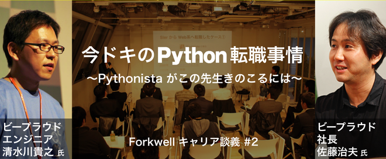

=====
Talks
=====

`Webアプリケーションの仕組み`__
================================
2017.9.18. at `PyCon JP 2018`__

.. __: https://goo.gl/3vBMzZ
.. __: https://pycon.jp/2018/event/sessions

  .. figure:: /_static/img/pyconjp2018-talk-web-application-mechanism.png
     :target: https://goo.gl/3vBMzZ
     :width: 80%

* 動画: https://www.youtube.com/watch?v=L7j2zgtpV9c
* Togetter: https://togetter.com/li/1268167

`len()関数がオブジェクトの長さを手にいれる仕組み`__
=====================================================
2017.9.8. at `PyCon JP 2017`__

.. __: https://www.slideshare.net/shimizukawa/how-does-python-get-the-length-with-the-len-function
.. __: https://pycon.jp/2017/ja/schedule/presentation/22/

  .. raw:: html

     <iframe src="//www.slideshare.net/slideshow/embed_code/key/aM9Yf35L5nu2e1" width="595" height="485" frameborder="0" marginwidth="0" marginheight="0" scrolling="no" style="border:1px solid #CCC; border-width:1px; margin-bottom:5px; max-width: 100%;" allowfullscreen> </iframe>

* 動画: https://www.youtube.com/watch?v=aich6wqftkA
* Togetter: https://togetter.com/li/1148634

`仕事で使うちょっとしたコードをOSSとして開発メンテしていく - Django Redshift Backend の開発`__
===============================================================================================================================
2016.9.21. at `PyCon JP 2016`__

.. __: https://www.slideshare.net/shimizukawa/why-dont-you-share-your-code-snippet-for-your-jobas-a-open-source-software-pycon-jp-2016
.. __: https://pycon.jp/2016/ja/schedule/presentation/48/

  .. raw:: html

     <iframe src="//www.slideshare.net/slideshow/embed_code/key/3FTXp1hrS1U3WN" width="595" height="485" frameborder="0" marginwidth="0" marginheight="0" scrolling="no" style="border:1px solid #CCC; border-width:1px; margin-bottom:5px; max-width: 100%;" allowfullscreen> </iframe>

`Easy contributable internationalization process with Sphinx`__
====================================================================
2016.8.15. at `PyCon APAC 2016`__

.. __: https://www.slideshare.net/shimizukawa/easy-contributable-internationalization-process-with-sphinx-at-pycon-apac-2016
.. __: https://www.pycon.kr/2016apac/program/44

  .. raw:: html

     <iframe src="//www.slideshare.net/slideshow/embed_code/key/N4BCVTyZhKKK9u" width="595" height="485" frameborder="0" marginwidth="0" marginheight="0" scrolling="no" style="border:1px solid #CCC; border-width:1px; margin-bottom:5px; max-width: 100%;" allowfullscreen> </iframe>

`素振りのススメ`__
=======================
2016.1.27. at `Python入門者の集い`__

.. __: https://www.slideshare.net/shimizukawa/suburi-no-susume-at-python-nyumon
.. __: https://python-nyumon.connpass.com/event/23466/

  .. raw:: html

     <iframe src="//www.slideshare.net/slideshow/embed_code/key/9iS8q5POhRi14T" width="595" height="485" frameborder="0" marginwidth="0" marginheight="0" scrolling="no" style="border:1px solid #CCC; border-width:1px; margin-bottom:5px; max-width: 100%;" allowfullscreen> </iframe>

`世界のSphinx事情`__
=======================
2015.11.24. at `SphinxCon JP 2015`__

.. __: https://www.slideshare.net/shimizukawa/sphinx-in-the-world-sphinxcon-jp-2015
.. __: http://sphinx-users.jp/event/20151124_sphinxconjp/index.html

  .. raw:: html

     <iframe src="//www.slideshare.net/slideshow/embed_code/key/6ZTrb69QtZXetG" width="595" height="485" frameborder="0" marginwidth="0" marginheight="0" scrolling="no" style="border:1px solid #CCC; border-width:1px; margin-bottom:5px; max-width: 100%;" allowfullscreen> </iframe> 
 <strong> <a href="//www.slideshare.net/shimizukawa/sphinx-in-the-world-sphinxcon-jp-2015" title="世界のSphinx事情 @ SphinxCon JP 2015" target="_blank">世界のSphinx事情 @ SphinxCon JP 2015</a> </strong> from <strong><a target="_blank" href="https://www.slideshare.net/shimizukawa">Takayuki Shimizukawa</a></strong> 

`Sphinx紹介 - Sphinxワークショップ@関西`__
=============================================
2015.10.31. at `Sphinx ワークショップ@関西`__

.. __: https://www.slideshare.net/shimizukawa/jus-sphinx-sphinx
.. __: https://sphinxjp.connpass.com/event/22023/

  .. raw:: html

     <iframe src="//www.slideshare.net/slideshow/embed_code/key/JTOFDiQsiS9bgF" width="595" height="485" frameborder="0" marginwidth="0" marginheight="0" scrolling="no" style="border:1px solid #CCC; border-width:1px; margin-bottom:5px; max-width: 100%;" allowfullscreen> </iframe> 
 <strong> <a href="//www.slideshare.net/shimizukawa/jus-sphinx-sphinx" title="JUS関西 Sphinxワークショップ@関西 Sphinx紹介" target="_blank">JUS関西 Sphinxワークショップ@関西 Sphinx紹介</a> </strong> from <strong><a target="_blank" href="https://www.slideshare.net/shimizukawa">Takayuki Shimizukawa</a></strong> 

`Sphinxで作る貢献しやすいキュメント翻訳の仕組み`__
======================================================
2015.10.10. at `PyCon JP 2015`__

.. __: https://www.slideshare.net/shimizukawa/sphinx-53764167
.. __: https://pycon.jp/2015/ja/schedule/presentation/45/

.. raw:: html

   <iframe src="//www.slideshare.net/slideshow/embed_code/key/sSPVJJCHbsvUyt" width="595" height="485" frameborder="0" marginwidth="0" marginheight="0" scrolling="no" style="border:1px solid #CCC; border-width:1px; margin-bottom:5px; max-width: 100%;" allowfullscreen> </iframe> 
 <strong> <a href="//www.slideshare.net/shimizukawa/sphinx-53764167" title="Sphinxで作る貢献しやすいキュメント翻訳の仕組み" target="_blank">Sphinxで作る貢献しやすいキュメント翻訳の仕組み</a> </strong> from <strong><a target="_blank" href="https://www.slideshare.net/shimizukawa">Takayuki Shimizukawa</a></strong> 

Sphinx autodoc: automated API documentation
============================================

* 2015.8.29 PyCon Korea 2015 (page__, slide__)

  .. __: https://www.pycon.kr/2015/program/33
  .. __: https://www.slideshare.net/shimizukawa/sphinx-autodoc-automated-api-documentation-pyconkr-2015

* 2015.8.22 PyCon Malaysia 2015 (slide__)

  .. __: https://www.slideshare.net/shimizukawa/sphinx-autodoc-automated-api-documentation-pyconmy-2015

* 2015.7.20 EuroPython 2015 (page__, slide__)

  .. __: https://ep2015.europython.eu/conference/talks/sphinx-autodoc-automated-api-documentation
  .. __: https://www.slideshare.net/shimizukawa/sphinx-autodoc-automated-api-documentation-europython-2015-in-bilbao

* 2015.6.7 PyCon APAC 2015 in Taiwan (page__, slide__)

  .. __: https://tw.pycon.org/2015apac/zh/program/69
  .. __: https://www.slideshare.net/shimizukawa/sphinx-autodoc-automated-api-documentation-pyconapac2015

Easy contributable internationalization process with Sphinx
============================================================

* 2015.8.23 PyCon Malaysia 2015 (slide__)

  .. __: https://www.slideshare.net/shimizukawa/easy-contributable-internationalization-process-with-sphinx-pyconmy2015

* 2015.6.18 PyCon Singapore 2015 (page__, slide__)

  .. __: https://pycon.sg/static/archive/2015/schedule/presentation/49/index.html
  .. __: https://www.slideshare.net/shimizukawa/easy-contributable-internationalization-process-with-sphinx-pyconsg2015

* 2015.6.6 PyCon APAC 2015 in Taiwan (page__, slide__)

  .. __: https://tw.pycon.org/2015apac/zh/program/50
  .. __: https://www.slideshare.net/shimizukawa/easy-contributable-internationalization-process-with-sphinx-pycon-apac-2015-in-taiwan-49057754

`PyPro2の読みどころ紹介：Python開発の過去と現在`__
====================================================
2015.5.29. at `BPStudy93`__

.. __: https://www.slideshare.net/shimizukawa/pypro2python-bpstudy93
.. __: https://bpstudy.connpass.com/event/13348/

`Pythonコミュニティ-紹介`__
=============================
2015.5.16. at `LOCAL 2015`__

.. __: https://www.slideshare.net/shimizukawa/python-local-2015
.. __: https://local-community-summit.doorkeeper.jp/events/22821

`PyPro2の読みどころ紹介：Python開発の過去と現在`__
=====================================================
2015.3.26. at `白ヤギ勉強会（第13回）`__

.. __: https://www.slideshare.net/shimizukawa/pypro2python3
.. __: http://aial.connpass.com/event/12900/

Forkwell キャリア談義 #2 feat. ビープラウド
=============================================
2015.3.5. at `Forkwell キャリア談義#2`__

.. __: https://forkwell.connpass.com/event/11424/

登壇blogを書きました: :doc:`./forkwell-python-event/index`

`執筆中のPythonプロフェッショナルプログラミング第2版でsphinxを使っている話`__
=================================================================================
2014.12.6. at `版管理+自動組版`__

.. __: https://www.slideshare.net/shimizukawa/python2sphinx
.. __: https://connpass.com/event/6724/

`Welcome to Sphinx-1.3`__
==============================
2014.10.26. at `SphinxCon JP 2014`__

.. __: http://www.freia.jp/taka/slides/sphinxconjp2014-welcome-to-sphinx-1.3/index.html
.. __: http://sphinx-users.jp/event/20141026_sphinxconjp/

`PyCharm活用術`__
======================
2014.9.13. at `PyCon JP 2014`__

.. __: http://www.freia.jp/taka/slides/pyconjp2014-pycharm/index.html
.. __: https://pycon.jp/2014/schedule/presentation/5/

`Python 2.5 からPython 3.3 で動作するツールの作り方`__
====================================================================
2013.9.15. at `PyCon APAC 2013`__

.. __: http://www.freia.jp/taka/slides/pyconapac2013-how-to-make-with-python2-to-3/index.html
.. __: https://apac-2013.pycon.jp/ja/program/sessions.html#session-15-1300-rooma0715-ja1-ja

`Introduction to Sphinx documentation generator`__
=======================================================
2013.5.25. at `PyCon Taiwan 2013`__

.. __: http://www.freia.jp/taka/slides/pycontw2013-sphinx-introduction/index.html
.. __: http://tw.pycon.org/2013/ja/speaker/#speaker_id_11

`Chefの 環境別設定が難しい話`__
==================================
2013.6.14. at `Biglobe Tech Talk #1`__

.. __: http://www.freia.jp/taka/slides/biglobe-tech-talk1-chef-lt/index.html
.. __: http://connpass.com/event/2486/

`Chefで構築するBP-Redmine環境`__
======================================
2013.4.26. at `BPStudy#68`__

.. __: http://www.freia.jp/taka/slides/bpstudy68-chef/index.html
.. __: http://connpass.com/event/2207/

`Pythonな会社でchefしてる例の紹介`__
======================================
2013.4.15. at `Chef Casual Talk #1`__

.. __: http://www.freia.jp/taka/slides/chef-casual-talk1/index.html
.. __: http://chef-meetup.doorkeeper.jp/events/3513

`ドキュメントジェネレータSphinx`__
======================================
2013.4.6. at `万葉.rb`__

.. __: http://www.freia.jp/taka/slides/everyrb-6th/index.html
.. __: http://everyleaf.github.io/kaigi/

`Sphinx 1.2 preview`__
===========================
2013.2.23. at `SphinxCon JP 2013 Spring`__

.. __: http://www.freia.jp/taka/slides/sphinx120-preview/index.html
.. __: http://connpass.com/event/1379/

`Writing a book using sphinx`_
=====================================================
2012.9.16. at `SphinxCon JP 2012`__

.. _Writing a book using sphinx: https://www.slideshare.net/shimizukawa/writing-a-book-using-sphinx-sphinxconjp-2012
.. __: http://sphinx-users.jp/event/20120916_sphinxconjp/

日本語と英語のスライドがあります

- `Sphinxを使って本を書こう`__
- `Writing a book using sphinx`_

.. __: https://www.slideshare.net/shimizukawa/sphinx-pyconjp-2012

`Refactoring A Python Beginner's Code`__
==============================================
2012.9.15. at `PyCon JP 2012`__

.. __: http://www.freia.jp/taka/slides/refactoring-python-beginners-code/index.html
.. __: http://2012.pycon.jp/program/sessions.html#session-15-1455-room433-ja

`PYTHON PACKAGING`__
==========================
2012.3.17. at `Python Developers Festa 2012.03`__

.. __: https://www.slideshare.net/shimizukawa/python-packaging-pyfes-201203
.. __: http://voluntas.hatenablog.com/entry/20111015/1318682867

`Pythonスタートアップ勉強会 Python入門`__
===========================================
2011.9.28. at リクルートエージェント Pythonスタートアップセミナー

.. __: https://www.slideshare.net/shimizukawa/python201109-python

* togetter: https://togetter.com/li/193984

`BPStudy#48 PyCon JP 2011 開催報告`__
=======================================
2011.8.31. at `BPStudy#48`__

.. __: https://www.slideshare.net/shimizukawa/bpstudy48-pyconjp2011
.. __: https://bpstudy.connpass.com/event/809/

`ドキュメンテーションを加速するストレスフリーの作図ツール『blockdiag』`__
=============================================================================
2011.6.18. at `日本UNIXユーザ会 2011年6月勉強会`__

.. __: https://www.slideshare.net/shimizukawa/blockdiag-jus20116
.. __: http://sphinx-users.jp/event/20110618_jus_benkyoukai/index.html

`Sphinxからプレゼンテーションスライドを作ってみた`__
======================================================
2011.1.31. at `PyCon mini JP 2011`__

.. __: http://www.freia.jp/taka/slides/pycon-mini-jp-2011-sphinx-presentation/s6/index.html
.. __: https://sites.google.com/site/pyconminijp/reports/lt#TOC-Sphinx-

2つのプレゼン用HTMLテーマでスライドを出力しました

* `s6版`__
* `htmlslide版`__

.. __: http://www.freia.jp/taka/slides/pycon-mini-jp-2011-sphinx-presentation/s6/index.html
.. __: http://www.freia.jp/taka/slides/pycon-mini-jp-2011-sphinx-presentation/htmlslide/index.html

`ドキュメントを作りたくなってしまう魔法のツールSphinx`__
============================================================
2010.12.8. at `日本UNIXユーザ会 2010年12月勉強会`__

.. __: https://www.slideshare.net/shimizukawa/sphinx-6084667
.. __: http://sphinx-users.jp/event/20101203_jus_benkyoukai.html

`Pythonで アジャイル 開発サイクル 2011ver.`__
================================================
2010.9.4. at `XP祭り2010 ～ アジャイル学園祭～`__

.. __: http://www.freia.jp/taka/slides/xpfest2010/index.html
.. __: http://kokucheese.com/event/index/2167/

  Pythonでアジャイル開発を効率よく行う例として、
  分散バージョン管理、構成管理、ユニットテスト、継続的インテグレ―ションなどを
  用いた開発サイクルについて、それぞれPythonのツール群(MercurialHG,buildout,
  Buildbot, Noseなど)の活用方法をお話します。

`テスト自動化 - Buildbot & Selenium`__
=========================================
2008.3.7 at `Python Developers Camp 松本`__

.. __: https://www.slideshare.net/shimizukawa/python-autotest-pdc2008w
.. __: http://www.freia.jp/taka/blog/549/index.html

